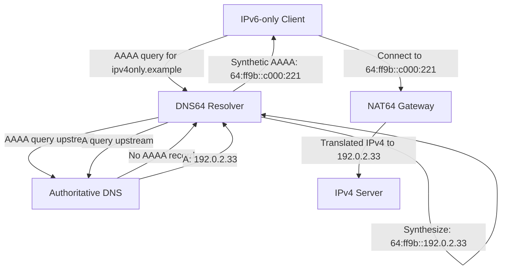

# How to Understand DNS64 and How It Synthesizes AAAA Records

Author: [nawazdhandala](https://www.github.com/nawazdhandala)

Tags: IPv6, DNS64, AAAA Records, NAT64, DNS

Description: A detailed explanation of how DNS64 works to synthesize IPv6 AAAA records for IPv4-only destinations, enabling IPv6-only clients to connect through NAT64 gateways.

## The Problem DNS64 Solves

When you have an IPv6-only client that needs to connect to an IPv4-only server (like a hypothetical `ipv4only.example` name that only has an A record), the client cannot make a TCP or UDP connection because it has no IPv4 address. NAT64 can translate the traffic, but the client first needs an IPv6 address to connect to. This is where DNS64 comes in.

DNS64 is a DNS server behavior defined in RFC 6147 that automatically synthesizes AAAA records for IPv4-only domains by embedding their IPv4 addresses into a NAT64 prefix.

## How DNS64 Synthesis Works



## The Synthesis Algorithm

Given:
- NAT64 prefix: `64:ff9b::/96`
- IPv4 address from A record: `192.0.2.33`

The synthesized AAAA is constructed by:
1. Taking the 96-bit NAT64 prefix: `64:ff9b:0000:0000:0000:0000`
2. Appending the 32-bit IPv4 address in hex: `c000:0221` (192=0xc0, 0=0x00, 2=0x02, 33=0x21)
3. Result: `64:ff9b::c000:221`

## When Does DNS64 Synthesize?

DNS64 only synthesizes a AAAA record when ALL of the following are true:

1. The client requested a AAAA record (query type AAAA)
2. The domain has **no** non-excluded real AAAA record (no usable native IPv6)
3. The domain **does** have at least one A record

If a real, non-excluded AAAA record exists, DNS64 returns it unchanged by default - it does **not** override usable native IPv6 records.

## When Does DNS64 NOT Synthesize?

- Domains with non-excluded real AAAA records: DNS64 returns the native records as-is
- Validating DNS64 with a client requesting end-to-end validation (`DO=1`, `CD=1`): the resolver must not synthesize and must return the data for the client to validate
- Queries for `PTR` records: DNS64 does not synthesize AAAA data, but it may answer reverse lookups for its `Pref64::/n` space using local `PTR` data or a synthesized `CNAME` to `IN-ADDR.ARPA`
- With the Well-Known Prefix `64:ff9b::/96`, non-global IPv4 addresses such as `127.0.0.0/8` or `10.0.0.0/8` must not be represented using that prefix

## Example: Comparing Normal vs DNS64 Resolution

Normal DNS resolution (IPv4-capable client):
```text
; Query: AAAA ipv4only.example
;; ANSWER SECTION:
; (empty - no AAAA record)

; Query: A ipv4only.example
;; ANSWER SECTION:
ipv4only.example. 3600 IN A 192.0.2.33
```

DNS64 resolution (IPv6-only client using DNS64 server):
```text
; Query: AAAA ipv4only.example → DNS64 synthesizes
;; ANSWER SECTION:
ipv4only.example. 60 IN AAAA 64:ff9b::c000:221
```

Note: The TTL of a synthesized AAAA record is not fixed at 60 seconds. RFC 6147 specifies using the smaller of the original A record TTL and the zone's SOA TTL from the negative AAAA response; if that SOA TTL is unavailable, the DNS64 should use the A TTL or 600 seconds, whichever is shorter.

## Custom Prefix Support

DNS64 supports custom NAT64 prefixes, not just the well-known `64:ff9b::/96`. Your DNS64 server must be configured with the same prefix as your NAT64 gateway. Under RFC 6052, valid prefix lengths are `/32`, `/40`, `/48`, `/56`, `/64`, and `/96`:

- `/96` prefix: IPv4 address occupies bits 96–127
- `/64` prefix: bits 64–71 are zero (reserved), IPv4 is at bits 72–103
- `/56`, `/48`, `/40`, `/32` prefixes: similar placement rules apply, with the reserved zero octet still at bits 64–71 (RFC 6052)

## DNS64 and DNSSEC Compatibility

DNS64 changes the AAAA answer, so a client trying to validate the synthesized AAAA record end-to-end will not be able to validate it as authoritative data from the zone. The recommended approach:

- A validating DNS64 resolver can validate the negative AAAA response and the A response before synthesizing
- If a client sets both `DO=1` and `CD=1` to validate locally, a validating DNS64 must not synthesize
- Clients that perform local DNSSEC validation need to be DNS64-aware or rely on a trusted validating DNS64

## Summary

DNS64 is the DNS companion to NAT64. It intercepts AAAA queries, checks for usable native IPv6, and synthesizes AAAA records from A records using the NAT64 prefix when no usable native IPv6 exists. This gives IPv6-only clients an IPv6 address to connect to, which the NAT64 gateway then translates to the real IPv4 destination. Together, NAT64 and DNS64 provide seamless IPv4 internet access for IPv6-only networks.
