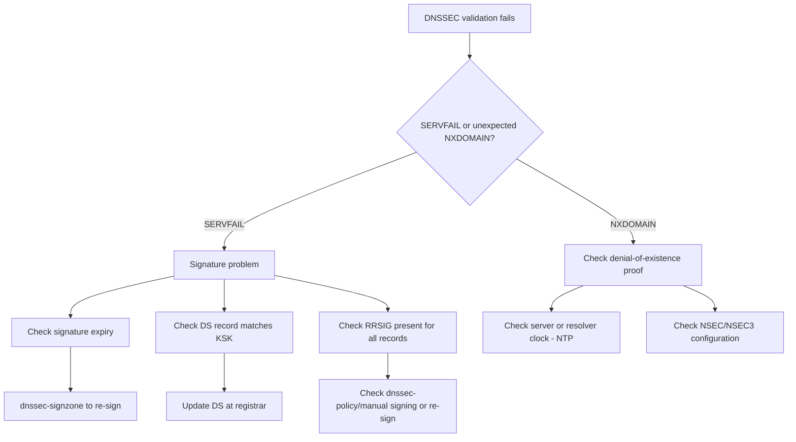

# How to Troubleshoot DNSSEC for IPv6 Zones

Author: [nawazdhandala](https://www.github.com/nawazdhandala)

Tags: DNSSEC, Troubleshooting, DNS, IPv6, Debugging, BIND, Validation

Description: Diagnose and fix common DNSSEC problems including SERVFAIL responses, signature expiry, DS mismatches, and validation failures for IPv6 zones.

## Common DNSSEC Problems

| Symptom | Likely Cause |
|---|---|
| SERVFAIL for valid name | Signature expired or invalid |
| SERVFAIL after zone update | Unsigned zone pushed over signed |
| SERVFAIL after nameserver change | DS record not updated |
| SERVFAIL for AAAA only | Missing RRSIG for AAAA records |
| SERVFAIL on negative answer | Broken NSEC/NSEC3 proof or clock skew |
| Works without validation (+cdflag) | Bogus/expired signatures |

## Diagnostic Flowchart



## Step 1: Identify the Problem with dig

```bash
#!/bin/bash
# diagnose-dnssec.sh - DNSSEC diagnostic

ZONE=${1:-"example.com"}
RECORD_TYPE=${2:-"AAAA"}
NAME=${3:-"www.${ZONE}"}
RESOLVER=${4:-"8.8.8.8"}

echo "=== DNSSEC Diagnostic: ${NAME} (${RECORD_TYPE}) ==="
echo ""

# 1. Check with validation

echo "1. Query WITH validation:"
RESULT=$(dig +dnssec +noall +answer +authority +comments "${NAME}" "${RECORD_TYPE}" @"${RESOLVER}" 2>&1)
echo "${RESULT}" | grep -E "status:|flags:|IN[[:space:]]+${RECORD_TYPE}[[:space:]]|IN[[:space:]]+RRSIG[[:space:]]|IN[[:space:]]+NSEC3?[[:space:]]" | head -10

# 2. Check without validation (bypass)
echo ""
echo "2. Query WITHOUT validation (+cdflag):"
BYPASS=$(dig +dnssec +cdflag +noall +answer +authority +comments "${NAME}" "${RECORD_TYPE}" @"${RESOLVER}" 2>&1)
echo "${BYPASS}" | grep -E "status:|flags:|IN[[:space:]]+${RECORD_TYPE}[[:space:]]|IN[[:space:]]+RRSIG[[:space:]]|IN[[:space:]]+NSEC3?[[:space:]]" | head -10

# 3. Check signatures at authoritative server
echo ""
echo "3. Query authoritative server directly:"
AUTH_NS=$(dig +short NS "${ZONE}" @"${RESOLVER}" | head -1)
if [ -n "${AUTH_NS}" ]; then
    dig +dnssec +norecurse +noall +answer +authority +comments "${NAME}" "${RECORD_TYPE}" @"${AUTH_NS}" | \
        grep -E "status:|flags:|IN[[:space:]]+${RECORD_TYPE}[[:space:]]|IN[[:space:]]+RRSIG[[:space:]]|IN[[:space:]]+NSEC3?[[:space:]]" | head -10
fi
```

## Step 2: Check Signature Expiry

```bash
ZONE="example.com"

# Verify the signed zone; expired signatures fail validation
dnssec-verify -o "${ZONE}" /var/named/"${ZONE}".zone.signed 2>&1 | \
    grep -i "expired\|signature\|warning\|error"

# Show DNSKEY RRset signature expiration returned by the server
dig +dnssec +noall +answer "${ZONE}" DNSKEY @localhost | \
    awk '$4 == "RRSIG" {print $5, $9}' | \
    while read rtype expiry; do
        DATE=$(date -d "${expiry:0:8} ${expiry:8:6}" "+%Y-%m-%d %H:%M" 2>/dev/null || echo "${expiry}")
        echo "${rtype}: expires ${DATE}"
    done

# Parse RRSIG expiration from zone file
grep " RRSIG " /var/named/"${ZONE}".zone.signed | \
    awk '{print $5, $9}' | \
    while read rtype expiry; do
        # Convert YYYYMMDDHHMMSS to readable
        DATE=$(date -d "${expiry:0:8} ${expiry:8:6}" "+%Y-%m-%d %H:%M" 2>/dev/null || echo "${expiry}")
        echo "${rtype}: expires ${DATE}"
    done | sort -u

# Quick check: find signatures expiring in next 7 days
CUTOFF=$(date -d "+7 days" +%Y%m%d%H%M%S)
grep " RRSIG " /var/named/"${ZONE}".zone.signed | \
    awk '{print $9, $5}' | \
    awk -v cutoff="${CUTOFF}" '$1 < cutoff {print "EXPIRING SOON: " $2 " expires " $1}'
```

## Step 3: Check DS Record Matches

```bash
# Compare DS record at parent with local KSK
ZONE="example.com"
KEY_DIR="/var/named/keys/${ZONE}"
RESOLVER="8.8.8.8"

# Get published DS
PUBLISHED_DS=$(dig +short DS "${ZONE}" @"${RESOLVER}" 2>/dev/null | sort -u)
echo "Published DS at parent:"
echo "${PUBLISHED_DS}"
echo ""

# Get local DS from KSK (generate the common digest types)
LOCAL_DS=$(
    for keyfile in "${KEY_DIR}"/K"${ZONE}".+*.key; do
        [ -e "${keyfile}" ] || continue
        dnssec-dsfromkey -2 "${keyfile}"
        dnssec-dsfromkey -a SHA-384 "${keyfile}"
    done | sort -u
)

echo "Local KSK DS records:"
printf '%s\n' "${LOCAL_DS}"

# Compare
if [ -z "${PUBLISHED_DS}" ]; then
    echo "ERROR: No DS record published at parent!"
    echo "ACTION: Submit DS record to registrar"
elif [ -z "${LOCAL_DS}" ]; then
    echo "ERROR: No local KSK-derived DS records found!"
    echo "ACTION: Check that the KSK files are present in ${KEY_DIR}"
elif ! grep -Fxf <(printf '%s\n' "${LOCAL_DS}") <(printf '%s\n' "${PUBLISHED_DS}") >/dev/null; then
    echo "ERROR: Published DS does not match local KSK!"
    echo "ACTION: Update DS record at registrar"
else
    echo "OK: DS record matches local KSK"
fi
```

## Step 4: Re-Sign an Expired Zone

```bash
#!/bin/bash
# re-sign-zone.sh - Emergency re-signing

ZONE="example.com"
ZONE_FILE="/var/named/${ZONE}.zone"
KEY_DIR="/var/named/keys/${ZONE}"

# Re-sign using the keys in KEY_DIR
dnssec-signzone \
    -S \
    -K "${KEY_DIR}" \
    -N INCREMENT \
    -o "${ZONE}" \
    -f "${ZONE_FILE}.signed" \
    "${ZONE_FILE}"

# Verify
dnssec-verify -o "${ZONE}" "${ZONE_FILE}.signed" && echo "Zone verified OK"

# Reload BIND
rndc reload "${ZONE}"
```

## Step 5: Common Fixes

```bash
# Fix 1: Zone file was replaced without re-signing
# Symptom: Queries return data but without RRSIG
# Fix: Re-sign the zone
dnssec-signzone -S -K /var/named/keys/example.com -N INCREMENT -o example.com \
    -f /var/named/example.com.zone.signed /var/named/example.com.zone

# Fix 2: Clock skew - signatures not yet valid
# Symptom: SERVFAIL but zone looks fine
# Check server time
timedatectl status | grep "Local time\|NTP"
# Fix: sync NTP
chronyc makestep

# Fix 3: AAAA RRset added after signing
# Symptom: AAAA queries SERVFAIL, A queries work
dig +dnssec AAAA www.example.com @localhost | grep RRSIG
# If no RRSIG for the AAAA RRset - the signed zone is stale or incomplete
# Fix: re-sign with all record types

# Fix 4: BIND not using signed zone
# Symptom: Queries don't have signatures
grep "file" /etc/named.conf | grep example.com
# Should point to .zone.signed, not .zone

# Fix 5: Large DNS response fragmented
# IPv6 + DNSSEC can exceed UDP 1232 bytes (IPv6 safe MTU)
# Test with TCP
dig +tcp +dnssec AAAA www.example.com @localhost
```

## Automated Signature Monitoring

```bash
#!/bin/bash
# check-sig-expiry.sh - Run from cron, alert before expiry

ZONE="example.com"
WARN_DAYS=14  # Alert 14 days before expiry

# Get earliest RRSIG expiry from zone
EARLIEST=$(grep " RRSIG " /var/named/${ZONE}.zone.signed | \
    awk '{print $9}' | sort | head -1)

EARLIEST_EPOCH=$(date -d "${EARLIEST:0:8} ${EARLIEST:8:6}" +%s 2>/dev/null)
NOW_EPOCH=$(date +%s)
DAYS_LEFT=$(( (EARLIEST_EPOCH - NOW_EPOCH) / 86400 ))

if [ "${DAYS_LEFT}" -lt "${WARN_DAYS}" ]; then
    echo "WARNING: ${ZONE} signatures expire in ${DAYS_LEFT} days (${EARLIEST})"
    logger -p local0.warning "DNSSEC: ${ZONE} signatures expire in ${DAYS_LEFT} days"
    exit 1
fi

echo "OK: ${ZONE} signatures valid for ${DAYS_LEFT} days"
```

## Conclusion

DNSSEC troubleshooting starts with `dig +dnssec` (with validation) vs `dig +dnssec +cdflag` (without validation). If the `+cdflag` query succeeds but normal validation fails, signatures are present but invalid - check expiry dates and DS record matching. If both fail, the problem is not validation-only - check whether the authoritative server is serving the expected signed zone and whether RRSIG records are present for the RRset you queried. Always verify after re-signing with `dnssec-verify`. Monitor signature expiry with a cron job alerting 14 days before expiry. For IPv6 zones, pay special attention to AAAA RRsets - validation failures often appear after the unsigned zone was updated without re-signing or the server loaded an unsigned or stale copy of the zone.
