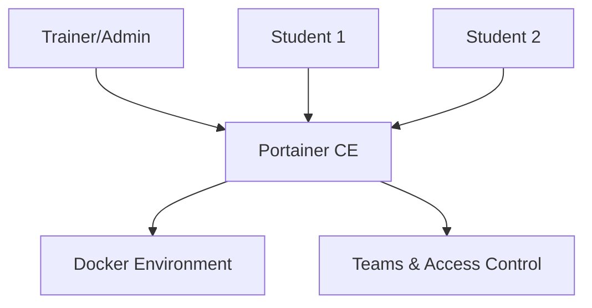

# How to Set Up a Docker Learning Lab with Portainer

Author: [nawazdhandala](https://www.github.com/nawazdhandala)

Tags: Portainer, Docker, Education, Training, DevOps, Container

Description: Configure a Docker learning environment using Portainer to give students and developers a safe, browser-based interface for experimenting with containers, networks, and volumes.

---

Portainer's web UI makes Docker approachable for teams new to containers. A dedicated learning lab on a shared server lets multiple users work through browser-based exercises without needing local Docker installations or command-line knowledge. This guide walks through setting up a multi-user Docker learning lab using Portainer with teams, access control, and guided templates.

## Architecture



## Step 1: Install Portainer for the Lab

Deploy Portainer on a dedicated VM or cloud instance sized for the number of concurrent learners and the workloads in your exercises.

```bash
# Install Docker Engine
curl -fsSL https://get.docker.com -o get-docker.sh
sudo sh get-docker.sh

# Deploy Portainer CE
sudo docker volume create portainer_data
sudo docker run -d \
  --name portainer \
  --restart=always \
  -p 9443:9443 \
  -v /var/run/docker.sock:/var/run/docker.sock \
  -v portainer_data:/data \
  portainer/portainer-ce:lts
```

## Step 2: Create Teams for Student Access Control

In Portainer, expand **User-related** and use **Teams** to create a team for each class or cohort:

1. Create a team: `docker-101-students`
2. Add student accounts to the team
3. Grant the team access to the lab environment and use Portainer access control on the resources students deploy

## Step 3: Configure App Templates for Exercises

Pre-load learning templates via Portainer's **App Templates** so students can deploy exercises with one click:

```json
{
  "version": "2",
  "templates": [
    {
      "type": 1,
      "title": "Exercise 1: Hello World Nginx",
      "description": "Deploy your first container - Nginx serving a static page",
      "image": "nginx:alpine",
      "name": "exercise1-nginx",
      "ports": ["8080:80/tcp"],
      "volumes": []
    },
    {
      "type": 1,
      "title": "Exercise 2: PostgreSQL Database",
      "description": "Run a PostgreSQL database and connect to it",
      "image": "postgres:16-alpine",
      "name": "exercise2-postgres",
      "env": [
        {"name": "POSTGRES_PASSWORD", "label": "Database Password", "default": "training123"}
      ]
    }
  ]
}
```

Save this as a JSON file accessible via URL, then add the URL under **Settings > App Templates**.

## Step 4: Prepare Lab Exercises

Structure exercises so students progress through core Docker concepts:

| Exercise | Topic | Portainer Feature Used |
|----------|-------|----------------------|
| 1 | Run first container | App Templates |
| 2 | Environment variables | Container environment editor |
| 3 | Volume persistence | Volumes UI |
| 4 | Container networking | Networks UI |
| 5 | Multi-container stack | Stacks |
| 6 | Custom Dockerfile build | Images > Build |

## Step 5: Resource Limits and Safety

Set CPU and memory limits on the containers or stacks students deploy to prevent runaway workloads. For example, a simple exercise container might use a 512 MB memory limit and 0.5 CPUs.

For Docker environments, teams and access control determine who can see and manage resources, but they do not create Kubernetes-style namespaces or per-team quotas. For additional safety, use Portainer's Docker security settings to disable options such as bind mounts, privileged mode, host PID 1, and device mappings for non-administrators where appropriate.

## Summary

Portainer turns Docker learning from a CLI-centric experience into an approachable visual workflow. By combining teams, access control, app templates, and pre-structured exercises, instructors can run hands-on Docker workshops with zero local installation requirements for students.
