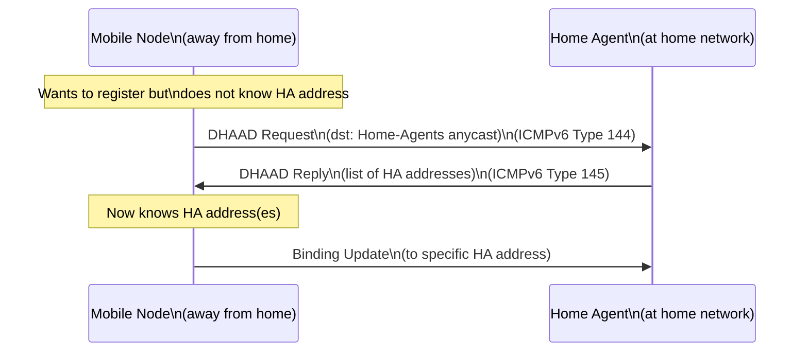

# How to Understand Dynamic Home Agent Address Discovery

Author: [nawazdhandala](https://www.github.com/nawazdhandala)

Tags: Mobile IPv6, DHAAD, Home Agent, Discovery, RFC 3775, Networking

Description: Understand the Dynamic Home Agent Address Discovery (DHAAD) mechanism that allows Mobile Nodes to discover their Home Agent's address when away from the home network.

## Introduction

When a Mobile Node is away from home and needs to register its Care-of Address, it must know the Home Agent's address. Dynamic Home Agent Address Discovery (DHAAD), defined in RFC 3775 and updated in RFC 6275, enables this discovery using anycast addressing.

## The Discovery Problem

```text
Home Network: 2001:db8:1:1::/64

Mobile Node knows:
  - Its Home Address: 2001:db8:1:1::100
  - Its home prefix: 2001:db8:1:1::/64

Mobile Node does NOT know:
  - The HA's specific address (e.g., 2001:db8:1:1::1)
  - Whether multiple HAs exist
  - Which HA to use
```

## DHAAD Using the Home Agents Anycast Address

RFC 2526 reserves a well-known anycast identifier for Mobile IPv6 Home Agents. For a /64 home prefix, the Home-Agents anycast address is formed by appending the reserved interface identifier to the home prefix.

```text
Home prefix:            2001:db8:1:1::/64
HA Anycast Address:     2001:db8:1:1:fdff:ffff:ffff:fffe
                        (Mobile IPv6 Home-Agents anycast address
                         per RFC 2526, anycast ID 126)
```

## DHAAD Procedure



## DHAAD Message Format

### DHAAD Request (ICMPv6 Type 144)

```text
ICMPv6 Home Agent Address Discovery Request:
  Type: 144
  Code: 0
  Reserved: 0
  Identifier: 0x1234  (random, used to match reply)
  Source Address: MN's Care-of Address
  Destination Address: 2001:db8:1:1:fdff:ffff:ffff:fffe
```

### DHAAD Reply (ICMPv6 Type 145)

```text
ICMPv6 Home Agent Address Discovery Reply:
  Type: 145
  Code: 0
  Reserved: 0
  Identifier: 0x1234  (matches request)
  Source Address: 2001:db8:1:1::1
  HA Addresses:
    2001:db8:1:1::1   (primary HA)
    2001:db8:1:1::2   (secondary HA, if present)
```

## Computing the Home-Agents Anycast Address

If the MN does not have the HA's address configured, it sends DHAAD to the Mobile IPv6 Home-Agents anycast address for its home /64 prefix.

```python
import ipaddress

def compute_ha_anycast_address(home_prefix: str) -> str:
    """
    Compute the Mobile IPv6 Home-Agents anycast address for a /64 home prefix.
    Per RFC 2526: interface identifier = 0xFDFFFFFFFFFFFFFE for /64.
    """
    network = ipaddress.IPv6Network(home_prefix)

    if network.prefixlen != 64:
        raise ValueError("This example expects a /64 home prefix")

    # Mobile IPv6 Home-Agents anycast IID for a /64 prefix
    anycast_iid = 0xFDFFFFFFFFFFFFFE

    # Convert network address to integer, add IID
    network_int = int(network.network_address)
    anycast_int = network_int | anycast_iid
    return str(ipaddress.IPv6Address(anycast_int))


# Example usage

prefix = "2001:db8:1:1::/64"
anycast = compute_ha_anycast_address(prefix)
print(f"HA Anycast Address: {anycast}")
# Output: HA Anycast Address: 2001:db8:1:1:fdff:ffff:ffff:fffe
```

## Configuring HA to Respond to DHAAD

In the UMIP mip6d configuration, the documented HA requirement is to enable HA mode and list the home-link interface:

```bash
# /etc/mip6d.conf - HA configuration for DHAAD
NodeConfig HA;
Interface "eth0";
```

UMIP's documentation also notes that the home link needs Router Advertisements with the Home Agent bit and Home Agent Information Option set on HA interfaces.

## DNS-Based HA Discovery (Alternative)

```bash
# In Mobile IPv6 bootstrapping, HA discovery can also use DNS SRV records
# The SRV service name is "mip6" and the protocol name is "ipv6"

# Example DNS zone:
# _mip6._ipv6.home.example.com. IN SRV 10 0 0 ha1.home.example.com.
# ha1.home.example.com.         IN AAAA 2001:db8:1:1::1

# MN queries:
dig SRV _mip6._ipv6.home.example.com
```

## Conclusion

DHAAD enables Mobile Nodes to discover Home Agents dynamically using anycast addressing, removing the need for static HA configuration on the MN. For /64 home prefixes, the Mobile IPv6 Home-Agents anycast address is deterministically derived from the home prefix. Ensure your Home Agent is properly responding to DHAAD requests - monitor this with OneUptime's UDP/ICMP probes.
