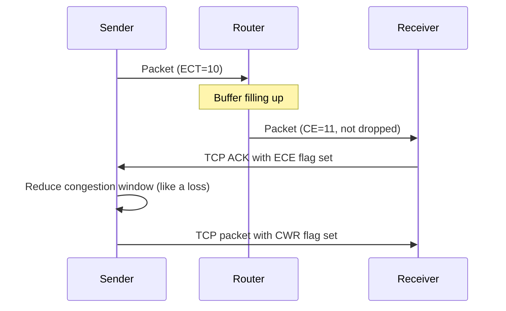

# How to Understand the ECN Bits in the IPv4 Header

Author: [nawazdhandala](https://www.github.com/nawazdhandala)

Tags: IPv4, ECN, Networking, Congestion Control, TCP/IP, QoS

Description: The two ECN bits in the IPv4 ToS byte allow routers to signal congestion without dropping packets, enabling endpoints to reduce transmission rates and improve network efficiency.

## What Is ECN?

Explicit Congestion Notification (ECN), defined in RFC 3168, uses the last 2 bits of the IPv4 DS field (historically the ToS byte) for congestion signaling:

| ECN Codepoint | Value | Meaning |
|---------------|-------|---------|
| Not-ECT | 00 | Packet is not using ECN |
| ECT(1) | 01 | ECN-capable transport |
| ECT(0) | 10 | ECN-capable transport (use this when only one ECT codepoint is needed) |
| CE | 11 | Congestion Experienced |

## ECN Flow



## Enabling ECN on Linux

```bash
# Check current ECN setting (current kernels also define 3-5 for AccECN)
# 0=off, 1=ECN on incoming and outgoing TCP connections, 2=ECN on incoming only

cat /proc/sys/net/ipv4/tcp_ecn

# Request ECN on outgoing connections and accept it on incoming ones
sudo sysctl -w net.ipv4.tcp_ecn=1

# Accept ECN on incoming connections but do not request it on outgoing ones
sudo sysctl -w net.ipv4.tcp_ecn=2

# Persist the setting
echo "net.ipv4.tcp_ecn = 1" | sudo tee -a /etc/sysctl.conf
```

## Checking ECN in Python

```python
import socket

# Set ECT(0) in the socket's IPv4 DS field
sock = socket.socket(socket.AF_INET, socket.SOCK_DGRAM)
sock.setsockopt(socket.IPPROTO_IP, socket.IP_TOS, 0x02)

# Read back the current IP_TOS setting
tos = sock.getsockopt(socket.IPPROTO_IP, socket.IP_TOS)
ecn = tos & 0x03  # Bottom 2 bits
print(f"ToS/DS field=0x{tos:02X}  ECN bits={ecn:02b}")
sock.close()
```

## Reading ECN from Captured Packets

```bash
# Show ECN bits with tshark
tshark -i eth0 -T fields -e ip.dsfield.ecn -Y "ip"

# Filter for CE-marked packets (congestion experienced)
tshark -r capture.pcap -Y "ip.dsfield.ecn == 3"

# Show TCP packets carrying the ECE or CWR flags
tcpdump -i eth0 -n 'tcp[tcpflags] & (tcp-ece|tcp-cwr) != 0'
```

## ECN and UDP

ECN is transport-agnostic at the IP level. For UDP-based transports (QUIC, WebRTC, DTLS), a userspace transport implementation must set an ECT codepoint on outgoing packets and read ECN markings from received packets explicitly, often using `IP_TOS` / `IP_RECVTOS` socket options.

```bash
# Verify ECN marking on QUIC traffic
tcpdump -i eth0 -v 'udp port 443' | grep 'tos 0x'
```

## Key Takeaways

- ECN uses 2 bits of the IPv4 DS field (historically the ToS byte) to signal congestion without packet drops.
- CE (11) is set by a congested router; endpoints use TCP ECE/CWR flags to act on it.
- Enable ECN on Linux with `net.ipv4.tcp_ecn=1` to request ECN on outgoing connections and accept it on incoming ones; `=2` accepts ECN on incoming connections but does not request it on outgoing ones.
- ECN reduces retransmission-induced latency spikes while maintaining throughput.
