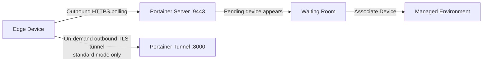

# How to Use the Edge Environment Waiting Room in Portainer

Author: [nawazdhandala](https://www.github.com/nawazdhandala)

Tags: Portainer, Edge, Waiting Room, Onboarding, Management

Description: Use Portainer's Edge waiting room to review and approve new edge agent connections before granting environment access.

---

Portainer's Edge Environment Waiting Room in Business Edition lets you review edge devices that connect using the auto-onboarding pre-deploy script before they are associated with managed environments. Edge Agents still establish outbound connections back to Portainer, so the waiting room adds an association step without requiring inbound firewall rules on the edge network.

## How Edge Agent Works



The Edge Agent polls the Portainer API on the UI/API port (typically `9443`). In standard mode, Portainer can request an outbound TLS tunnel to port `8000` for interactive management. Devices that connect using Portainer's auto-onboarding pre-deploy script can appear in the Waiting Room until an administrator associates them. Async mode does not use the tunnel port and is available only in Portainer Business Edition.

## Generate Edge Deployment Script

```bash
# In Portainer Business Edition:
# 1. Go to Settings -> Edge Compute and enable Edge Compute features
# 2. Enable "Enable Edge Environment Waiting Room"
# 3. Set the Portainer API server URL and, for standard mode, the tunnel server address
# 4. Go to Environment-related -> Auto onboarding
# 5. Select Edge Agent Standard or Edge Agent Async and copy the generated script
# Set EDGE_INSECURE_POLL=1 if Portainer uses a self-signed certificate.

# A generated Linux command follows this pattern:
PORTAINER_EDGE_ID=$(uuidgen)

docker run -d \
  -v /var/run/docker.sock:/var/run/docker.sock \
  -v /var/lib/docker/volumes:/var/lib/docker/volumes \
  -v /:/host \
  -v portainer_agent_data:/data \
  --restart always \
  -e EDGE=1 \
  -e EDGE_ID="${PORTAINER_EDGE_ID}" \
  -e EDGE_KEY="your_auto_onboarding_edge_key" \
  -e EDGE_INSECURE_POLL=0 \
  --name portainer_edge_agent \
  portainer/agent:2.39.1
```

## Standard Mode Installation

```bash
# Standard mode - real-time management with an on-demand outbound tunnel
PORTAINER_EDGE_ID=$(uuidgen)

docker run -d \
  -v /var/run/docker.sock:/var/run/docker.sock \
  -v /var/lib/docker/volumes:/var/lib/docker/volumes \
  -v /:/host \
  -v portainer_agent_data:/data \
  --restart always \
  -e EDGE=1 \
  -e EDGE_ID="${PORTAINER_EDGE_ID}" \
  -e EDGE_KEY="your_auto_onboarding_edge_key" \
  -e EDGE_INSECURE_POLL=0 \
  --name portainer_edge_agent \
  portainer/agent:2.39.1
```

## Async Mode Installation

```bash
# Async mode (Portainer Business Edition) - snapshot-based management over the API port only
PORTAINER_EDGE_ID=$(uuidgen)

docker run -d \
  -v /var/run/docker.sock:/var/run/docker.sock \
  -v /var/lib/docker/volumes:/var/lib/docker/volumes \
  -v /:/host \
  -v portainer_agent_data:/data \
  --restart always \
  -e EDGE=1 \
  -e EDGE_ID="${PORTAINER_EDGE_ID}" \
  -e EDGE_KEY="your_auto_onboarding_edge_key" \
  -e EDGE_INSECURE_POLL=0 \
  -e EDGE_ASYNC=1 \
  --name portainer_edge_agent \
  portainer/agent:2.39.1
```

## ARM / Windows Variations

```bash
# ARM64 (Raspberry Pi 4, Apple M1)
docker pull portainer/agent:2.39.1  # Multi-arch: automatically uses ARM64
```

```powershell
# Windows containers mode (Docker Desktop or Docker Engine for Windows)
# Set EDGE_INSECURE_POLL=1 if Portainer uses a self-signed certificate.
$Env:PORTAINER_EDGE_ID = [guid]::NewGuid().ToString()

docker run -d `
  --mount type=npipe,src=\\.\pipe\docker_engine,dst=\\.\pipe\docker_engine `
  --mount type=bind,src=C:\ProgramData\docker\volumes,dst=C:\ProgramData\docker\volumes `
  --mount type=volume,src=portainer_agent_data,dst=C:\data `
  --restart always `
  -e EDGE=1 `
  -e EDGE_ID=$Env:PORTAINER_EDGE_ID `
  -e EDGE_KEY="your_auto_onboarding_edge_key" `
  -e EDGE_INSECURE_POLL=0 `
  --name portainer_edge_agent `
  portainer/agent:2.39.1
```

## Verify Edge Agent Connection

```bash
# Check agent is running
docker logs portainer_edge_agent 2>&1 | tail -20

# On the Portainer server, list devices still waiting for association
TOKEN=$(curl -s -X POST \
  https://portainer.example.com:9443/api/auth \
  -H "Content-Type: application/json" \
  -d '{"username":"admin","password":"yourpassword"}' \
  --insecure | python3 -c "import sys,json; print(json.load(sys.stdin)['jwt'])")

curl -s "https://portainer.example.com:9443/api/endpoints?edgeDeviceUntrusted=true&types=4,7&excludeSnapshots=true" \
  -H "Authorization: Bearer $TOKEN" \
  --insecure | python3 -c "
import sys, json, datetime
devices = json.load(sys.stdin)
for d in devices:
    last = d.get('LastCheckInDate')
    when = datetime.datetime.fromtimestamp(last, tz=datetime.timezone.utc).isoformat() if last else 'unknown'
    print(f'Waiting: {d.get(\"Name\", \"unnamed\")} | Edge ID: {d.get(\"EdgeID\", \"unknown\")} | Last check-in: {when}')
"
```

In the Portainer UI, go to **Edge Compute** -> **Waiting Room** and click **Associate Device** to move a pending device into the managed environment list.

---

*Monitor edge device health and connectivity with [OneUptime](https://oneuptime.com).*
