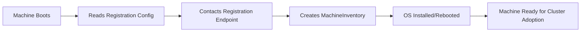

# How to Register Elemental Machines with Rancher

Author: [nawazdhandala](https://www.github.com/nawazdhandala)

Tags: Elemental, Rancher, Kubernetes, Edge, Bare Metal

Description: Learn the complete workflow for registering Elemental-managed machines with Rancher, from booting nodes to verifying their presence in the machine inventory.

## Introduction

Registering Elemental machines with Rancher is the process by which bare metal or edge nodes boot an Elemental OS image, connect to the Rancher management cluster, and add themselves to the machine inventory. Once registered, these machines can be provisioned into Kubernetes clusters through the Rancher UI or via GitOps workflows.

## Prerequisites

- Elemental Operator installed on the Rancher management cluster
- A MachineRegistration resource created
- A base Elemental ISO image that can be used to build a SeedImage
- Physical or virtual machines to register

## Registration Workflow Overview



## Step 1: Prepare the Registration Configuration

Wait for the MachineRegistration to become ready, then extract the registration URL:

```bash
kubectl wait --for=condition=Ready machineregistration/my-nodes \
  -n fleet-default --timeout=5m

REG_URL=$(kubectl get machineregistration my-nodes \
  -n fleet-default \
  -o jsonpath='{.status.registrationURL}')

echo "Registration URL: $REG_URL"
```

If Rancher uses a private CA, download the same CA bundle Rancher serves to its agents:

```bash
RANCHER_SERVER=$(printf '%s\n' "$REG_URL" | sed -E 's#(https?://[^/]+).*#\1#')
curl -fsSL "${RANCHER_SERVER}/cacerts" -o rancher-ca.pem
```

## Step 2: Build the Registration ISO

```bash
cat <<'EOF' | kubectl apply -f -
apiVersion: elemental.cattle.io/v1beta1
kind: SeedImage
metadata:
  name: elemental-registration
  namespace: fleet-default
spec:
  type: iso
  baseImage: registry.suse.com/suse/sl-micro/6.0/baremetal-iso-image:2.1.1-3.36
  registrationRef:
    apiVersion: elemental.cattle.io/v1beta1
    kind: MachineRegistration
    name: my-nodes
    namespace: fleet-default
EOF

# Wait for the SeedImage pod to become ready, then fetch the download URL
kubectl wait --for=condition=ready pod/elemental-registration \
  -n fleet-default --timeout=30m

kubectl get seedimage -n fleet-default elemental-registration \
  -o jsonpath='{.status.downloadURL}{"\n"}'
```

## Step 3: Boot the Machine

Boot the target machine from the registration ISO. The machine will:

1. Boot into the live Elemental environment
2. Read the embedded registration configuration
3. Contact the Rancher registration endpoint and create a MachineInventory
4. Install the OS to the target device using the MachineRegistration settings
5. Reboot into the installed OS
6. Become ready for cluster adoption once provisioning completes

## Step 4: Monitor the Registration

```bash
# Watch for new machines appearing in inventory
kubectl get machineinventory -n fleet-default --watch

# Once a machine appears, describe it for details
kubectl describe machineinventory -n fleet-default <machine-name>

# Check machine labels and annotations
kubectl get machineinventory -n fleet-default \
  <machine-name> -o yaml
```

## Step 5: Verify Registration Success

```bash
# List all registered machines
kubectl get machineinventory -n fleet-default

# Filter machines by label
kubectl get machineinventory -n fleet-default \
  -l location=datacenter-1

# Check Ready and AdoptionReady conditions
kubectl get machineinventory -n fleet-default \
  -o jsonpath='{range .items[*]}{.metadata.name}{"\t"}{range .status.conditions[*]}{.type}={.status}{" "}{end}{"\n"}{end}'
```

Registration is successful when the machine has a `MachineInventory` and its `Ready` condition is `True`. `AdoptionReady` becomes `True` only after a matching selector or cluster adopts the machine.

## Troubleshooting Registration Issues

### Machine Not Appearing in Inventory

```bash
# Check operator logs for registration attempts
kubectl logs deploy/elemental-operator \
  -n cattle-elemental-system \
  --since=1h

# Verify the MachineRegistration is ready
kubectl get machineregistration -n fleet-default my-nodes \
  -o jsonpath='{.status.conditions}'
```

### Certificate Errors

```bash
# Inspect the CA bundle served by Rancher
openssl x509 -in rancher-ca.pem -noout -subject -issuer -dates

# Test connectivity to registration endpoint
curl -v --cacert rancher-ca.pem "${REG_URL}"
```

## Viewing Machines in Rancher UI

After successful registration:

1. Log into Rancher UI
2. Navigate to **OS Management** > **Inventory of Machines**
3. You should see the registered machines listed with their labels and status

## Conclusion

The Elemental machine registration process automates the onboarding of bare metal and edge nodes into your Rancher-managed infrastructure. Once machines are registered in the MachineInventory, they can be matched by MachineInventorySelectors and provisioned into Kubernetes clusters through Rancher.
