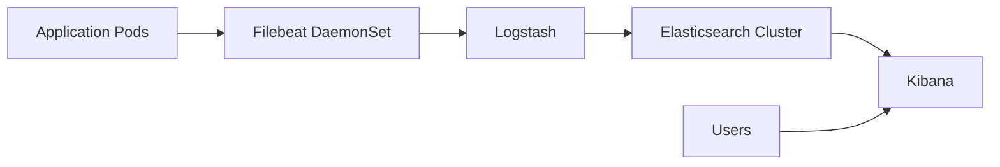

# How to Deploy the ELK Stack with OpenTofu

Author: [nawazdhandala](https://www.github.com/nawazdhandala)

Tags: OpenTofu, ELK Stack, Elasticsearch, Logstash, Kibana, Kubernetes, Helm, Infrastructure as Code

Description: Learn how to deploy the ELK Stack (Elasticsearch, Logstash, Kibana) on Kubernetes using OpenTofu and the Elastic Helm charts for centralized log aggregation and analysis.

---

The ELK Stack provides centralized logging, search, and visualization for distributed systems. Deploying it with OpenTofu via Helm ensures consistent configuration across environments and makes it easy to tune resource limits and storage per environment. The snippets below target the final published Elastic Helm chart release, 8.5.1.

## ELK Architecture



## Elasticsearch Cluster

```hcl
# elasticsearch.tf

resource "helm_release" "elasticsearch" {
  name             = "elasticsearch"
  repository       = "https://helm.elastic.co"
  chart            = "elasticsearch"
  version          = "8.5.1"
  namespace        = "logging"
  create_namespace = true

  values = [
    yamlencode({
      replicas = var.environment == "production" ? 3 : 1

      resources = {
        requests = {
          cpu    = var.environment == "production" ? "1000m" : "250m"
          memory = var.environment == "production" ? "2Gi" : "1Gi"
        }
        limits = {
          cpu    = var.environment == "production" ? "2000m" : "500m"
          memory = var.environment == "production" ? "4Gi" : "2Gi"
        }
      }

      # Keep JVM heap at or below 50% of the memory available to the container
      esJavaOpts = var.environment == "production" ? "-Xmx2g -Xms2g" : "-Xmx1g -Xms1g"

      volumeClaimTemplate = {
        accessModes = ["ReadWriteOnce"]
        resources = {
          requests = {
            storage = var.environment == "production" ? "100Gi" : "10Gi"
          }
        }
        storageClassName = var.storage_class_name
      }

      # Security
      protocol = "https"
      createCert = true
    })
  ]
}
```

## Kibana

```hcl
resource "helm_release" "kibana" {
  name       = "kibana"
  repository = "https://helm.elastic.co"
  chart      = "kibana"
  version    = "8.5.1"
  namespace  = "logging"

  values = [
    yamlencode({
      elasticsearchHosts = "https://elasticsearch-master:9200"

      resources = {
        requests = { cpu = "100m", memory = "512Mi" }
        limits   = { cpu = "500m", memory = "1Gi" }
      }

      ingress = {
        enabled = true
        className = "nginx"
        pathtype  = "ImplementationSpecific"
        annotations = {
          "cert-manager.io/cluster-issuer"           = "letsencrypt-prod"
          "nginx.ingress.kubernetes.io/ssl-redirect" = "true"
        }
        hosts = [{ host = "kibana.${var.domain}", paths = [{ path = "/" }] }]
        tls   = [{ secretName = "kibana-tls", hosts = ["kibana.${var.domain}"] }]
      }
    })
  ]

  depends_on = [helm_release.elasticsearch]
}
```

## Logstash Pipeline

```hcl
resource "helm_release" "logstash" {
  name       = "logstash"
  repository = "https://helm.elastic.co"
  chart      = "logstash"
  version    = "8.5.1"
  namespace  = "logging"

  values = [
    yamlencode({
      logstashPipeline = {
        "logstash.conf" = <<-EOT
          input {
            beats {
              port => 5044
            }
          }

          filter {
            if [kubernetes][namespace] == "apps" {
              json {
                source => "message"
                target => "app"
              }
            }
          }

          output {
            elasticsearch {
              hosts    => ["https://elasticsearch-master:9200"]
              index    => "logs-%{[kubernetes][namespace]}-%{+YYYY.MM.dd}"
              user     => "$${ELASTICSEARCH_USERNAME}"
              password => "$${ELASTICSEARCH_PASSWORD}"
              ssl_enabled => true
              ssl_certificate_authorities => ["/usr/share/logstash/config/certs/ca.crt"]
            }
          }
        EOT
      }

      extraEnvs = [
        {
          name = "ELASTICSEARCH_USERNAME"
          valueFrom = {
            secretKeyRef = {
              name = "elasticsearch-master-credentials"
              key  = "username"
            }
          }
        },
        {
          name = "ELASTICSEARCH_PASSWORD"
          valueFrom = {
            secretKeyRef = {
              name = "elasticsearch-master-credentials"
              key  = "password"
            }
          }
        }
      ]

      secretMounts = [
        {
          name       = "elasticsearch-master-certs"
          secretName = "elasticsearch-master-certs"
          path       = "/usr/share/logstash/config/certs"
        }
      ]

      extraPorts = [
        {
          name          = "beats"
          containerPort = 5044
        }
      ]

      service = {
        type = "ClusterIP"
        ports = [
          {
            name       = "beats"
            port       = 5044
            protocol   = "TCP"
            targetPort = 5044
          }
        ]
      }

      resources = {
        requests = { cpu = "200m", memory = "1Gi" }
        limits   = { cpu = "1000m", memory = "2Gi" }
      }
    })
  ]

  depends_on = [helm_release.elasticsearch]
}
```

## Filebeat DaemonSet

```hcl
resource "helm_release" "filebeat" {
  name       = "filebeat"
  repository = "https://helm.elastic.co"
  chart      = "filebeat"
  version    = "8.5.1"
  namespace  = "logging"

  values = [
    yamlencode({
      filebeatConfig = {
        "filebeat.yml" = <<-EOT
          filebeat.inputs:
          - type: filestream
            id: kubernetes-container-logs
            prospector.scanner.symlinks: true
            parsers:
              - container:
                  stream: all
                  format: auto
            paths:
              - /var/log/containers/*.log
            processors:
              - add_kubernetes_metadata:
                  host: $${NODE_NAME}
                  matchers:
                    - logs_path:
                        logs_path: "/var/log/containers/"

          output.logstash:
            hosts: ["logstash-logstash:5044"]
        EOT
      }

      tolerations = [{ operator = "Exists" }]  # Run on all nodes
    })
  ]

  depends_on = [helm_release.logstash]
}
```

## Best Practices

- Set JVM heap to no more than 50% of the Elasticsearch container memory limit - `esJavaOpts = "-Xmx2g -Xms2g"` when the memory limit is 4Gi.
- On AWS, `gp3` is a good default storage class for Elasticsearch because it offers more predictable performance and up to 20% lower cost per GiB than `gp2`.
- Deploy 3 Elasticsearch nodes in production with an odd number to maintain quorum.
- Set index lifecycle management (ILM) policies in Kibana to automatically delete old indices and control storage costs.
- Use separate Logstash nodes for parsing heavy-volume logs rather than having Filebeat write directly to Elasticsearch.
