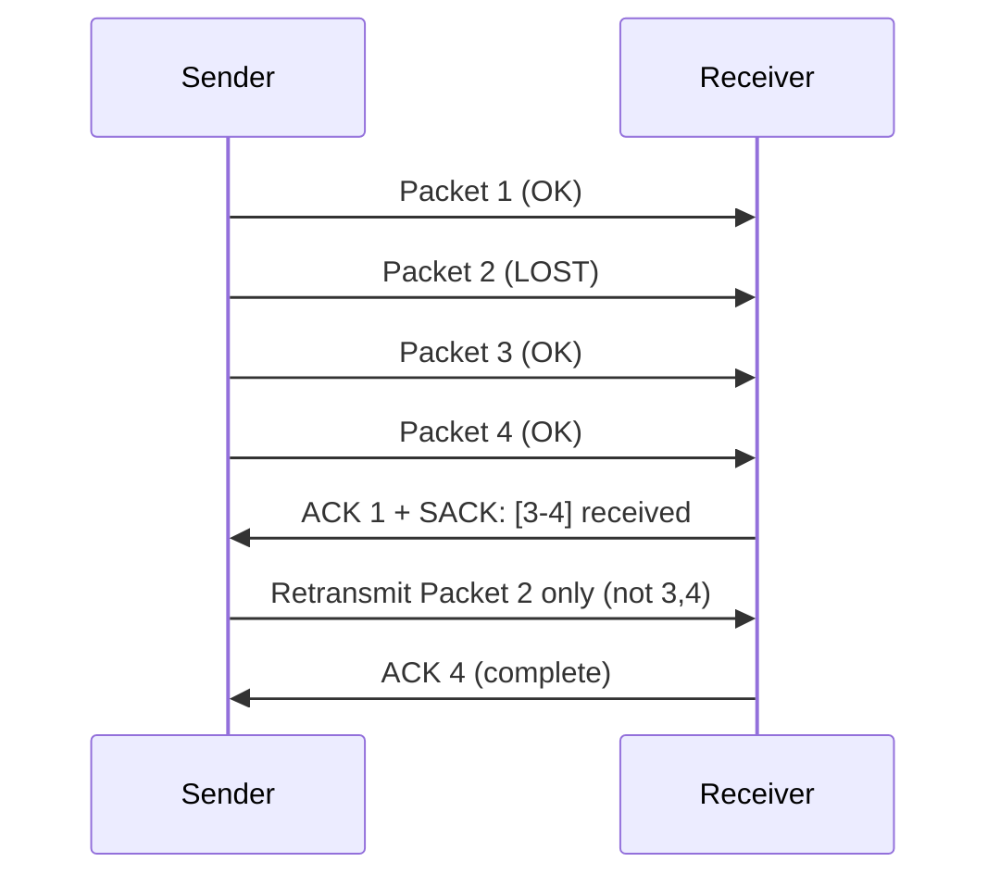

# How to Enable and Verify TCP SACK (Selective Acknowledgment)

Author: [nawazdhandala](https://www.github.com/nawazdhandala)

Tags: TCP, SACK, Selective Acknowledgment, Linux, Performance, Network Tuning

Description: Learn how to enable and verify TCP Selective Acknowledgment (SACK) on Linux, and understand how it improves recovery from packet loss compared to basic TCP retransmission.

## What Is TCP SACK?

Without SACK, TCP relies on cumulative acknowledgments, so the sender can usually identify only one lost segment per round trip and may retransmit data less efficiently. With Selective Acknowledgment (RFC 2018), the receiver tells the sender exactly which packets were received (even out-of-order), so the sender only retransmits what's actually missing.



SACK reduces the number of retransmissions significantly on lossy links.

## Step 1: Check If SACK Is Enabled

```bash
# Check SACK status (should be 1/enabled by default)

sysctl net.ipv4.tcp_sack

# Expected: net.ipv4.tcp_sack = 1

# Also check a related SACK option
sysctl net.ipv4.tcp_dsack    # Duplicate SACK (D-SACK)
```

## Step 2: Enable SACK If Disabled

```bash
# Enable SACK
sudo sysctl -w net.ipv4.tcp_sack=1

# Enable D-SACK (duplicate SACK - helps detect spurious retransmissions)
sudo sysctl -w net.ipv4.tcp_dsack=1

# Make persistent
sudo tee -a /etc/sysctl.d/99-tcp-tuning.conf > /dev/null << 'EOF'
net.ipv4.tcp_sack = 1
net.ipv4.tcp_dsack = 1
EOF
```

## Step 3: Verify SACK Is Negotiated in TCP Handshake

Capture a TCP connection handshake to verify SACK is negotiated. Start a new TCP connection while the capture is running:

```bash
# Capture SYN and SYN-ACK packets
sudo tcpdump -i any -c 2 -w /tmp/tcp-sack.pcap \
  'tcp[tcpflags] & tcp-syn != 0'

# Analyze the capture
tshark -r /tmp/tcp-sack.pcap -T fields \
  -e tcp.flags.ack \
  -e tcp.option_kind \
  -Y "tcp.flags.syn == 1"

# Look for option kind 4 (SACK permitted) in both lines:
# tcp.flags.ack = 0 is the SYN, tcp.flags.ack = 1 is the SYN-ACK
# This means both sides support SACK
```

Or inspect with tcpdump directly:

```bash
# Show SACK option in TCP handshake
sudo tcpdump -i any -nn -v -c 2 'tcp[tcpflags] & tcp-syn != 0'

# Look for "Flags [S]" and "Flags [S.]" lines with "options [..., sackOK,...]"
```

## Step 4: Verify SACK Is Used During Recovery

To see SACK blocks in action, you need a connection with some packet loss. Simulate with `tc netem`:

```bash
# Simulate 5% packet loss on the loopback
sudo tc qdisc add dev lo root netem loss 5%

# Start iperf3 server
iperf3 -s -1 &

# Run client and capture
sudo tcpdump -i lo -w /tmp/sack-test.pcap port 5201 &
iperf3 -c 127.0.0.1 -t 10

# Stop capture
sudo pkill tcpdump

# Analyze for SACK blocks in the capture
tshark -r /tmp/sack-test.pcap -Y "tcp.options.sack.count > 0" \
  -T fields -e ip.src -e tcp.seq -e tcp.options.sack.count \
  -e tcp.options.sack_le -e tcp.options.sack_re

# Clean up
sudo tc qdisc del dev lo root netem
```

## Step 5: Monitor SACK Statistics

```bash
# View TCP statistics including SACK-related counters
nstat -az TcpExtTCPSack* TcpExtTCPSACK* TcpExtTCPDSACK*

# Or use netstat -s
netstat -s | grep -Ei 'sack|dsack'

# Look for counters such as:
#     TcpExtTCPSackRecovery
#     TcpExtTCPDSACKRecv
#     TCPSACKReneging
```

## Step 6: Disable SACK for Specific Troubleshooting

Some applications or middleboxes have issues with SACK. Temporarily disable for testing:

```bash
# Disable SACK (for testing only)
sudo sysctl -w net.ipv4.tcp_sack=0

# Test if issue goes away
# Re-enable after testing
sudo sysctl -w net.ipv4.tcp_sack=1
```

## SACK, D-SACK, and RACK Comparison

| Feature | Purpose | Enabled by Default |
|---|---|---|
| SACK | Selective retransmission of lost packets | Yes |
| D-SACK | Report duplicate packets received | Yes |
| RACK | Recent ACK algorithm for faster loss detection | Yes (current Linux kernels) |

## Conclusion

TCP SACK is enabled by default on Linux and should usually remain enabled. Verify with `sysctl net.ipv4.tcp_sack`, confirm negotiation in TCP handshake captures by looking for the `sackOK` option in the SYN and SYN-ACK packets, and monitor SACK usage with `nstat` or `netstat -s`. SACK is particularly valuable on lossy or high-latency links where cumulative ACK-based recovery is slower.
