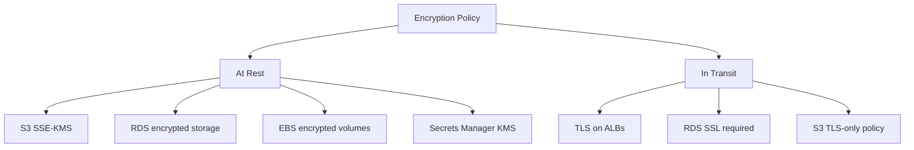

# How to Enforce Encryption Policies with OpenTofu

Author: [nawazdhandala](https://www.github.com/nawazdhandala)

Tags: OpenTofu, Encryption, KMS, Security, Compliance, AWS, Infrastructure as Code

Description: Learn how to enforce encryption at rest and in transit for AWS resources using OpenTofu, including KMS key management, S3 bucket encryption, RDS encryption, and EBS default encryption.

---

Encryption enforcement prevents sensitive data from being stored unencrypted. OpenTofu can enforce encryption requirements through validation blocks, lifecycle preconditions, and by provisioning KMS keys and encryption configurations alongside the resources they protect.

## Encryption Coverage



## KMS Key Management

```hcl
# kms.tf

resource "aws_kms_key" "app" {
  description             = "KMS key for ${var.environment} application data"
  deletion_window_in_days = 30
  enable_key_rotation     = true  # Default automatic rotation period is 365 days

  tags = {
    Environment = var.environment
    Purpose     = "app-data-encryption"
  }
}

resource "aws_kms_alias" "app" {
  name          = "alias/${var.environment}/app"
  target_key_id = aws_kms_key.app.key_id
}
```

## S3 Encryption Enforcement

```hcl
# s3_encryption.tf
resource "aws_s3_bucket_server_side_encryption_configuration" "app" {
  bucket = aws_s3_bucket.app.id

  rule {
    apply_server_side_encryption_by_default {
      sse_algorithm     = "aws:kms"
      kms_master_key_id = aws_kms_key.app.arn
    }
    bucket_key_enabled = true  # Can reduce AWS KMS request costs by up to 99%
  }
}

# Deny non-TLS requests and uploads that don't use the expected KMS key
resource "aws_s3_bucket_policy" "enforce_tls_and_encryption" {
  bucket = aws_s3_bucket.app.id

  policy = jsonencode({
    Version = "2012-10-17"
    Statement = [
      {
        Sid       = "DenyNonTLS"
        Effect    = "Deny"
        Principal = "*"
        Action    = "s3:*"
        Resource  = ["${aws_s3_bucket.app.arn}", "${aws_s3_bucket.app.arn}/*"]
        Condition = {
          Bool = { "aws:SecureTransport" = "false" }
        }
      },
      {
        Sid       = "DenyObjectsThatAreNotSSEKMSWithSpecificKey"
        Effect    = "Deny"
        Principal = "*"
        Action    = "s3:PutObject"
        Resource  = "${aws_s3_bucket.app.arn}/*"
        Condition = {
          ArnNotEqualsIfExists = {
            "s3:x-amz-server-side-encryption-aws-kms-key-id" = aws_kms_key.app.arn
          }
        }
      }
    ]
  })
}
```

## RDS Encryption

```hcl
resource "aws_db_instance" "main" {
  identifier           = "${var.environment}-database"
  engine               = "postgres"
  engine_version       = "16"
  parameter_group_name = aws_db_parameter_group.ssl_required.name

  # Encryption at rest
  storage_encrypted = true
  kms_key_id        = aws_kms_key.app.arn
}

# Enforce SSL for RDS connections
resource "aws_db_parameter_group" "ssl_required" {
  name   = "${var.environment}-postgres-ssl"
  family = "postgres16"

  parameter {
    name  = "rds.force_ssl"
    value = "1"
  }
}
```

## EBS Default Encryption

```hcl
# Enable EBS encryption by default for the region
resource "aws_ebs_encryption_by_default" "enabled" {
  enabled = true
}

resource "aws_ebs_default_kms_key" "app" {
  key_arn = aws_kms_key.app.arn
}
```

## AWS Config Rule for Encryption Compliance

```hcl
resource "aws_config_config_rule" "s3_encryption" {
  name = "s3-bucket-server-side-encryption-enabled"
  source {
    owner             = "AWS"
    source_identifier = "S3_BUCKET_SERVER_SIDE_ENCRYPTION_ENABLED"
  }
}

resource "aws_config_config_rule" "rds_encrypted" {
  name = "rds-storage-encrypted"
  source {
    owner             = "AWS"
    source_identifier = "RDS_STORAGE_ENCRYPTED"
  }
}

resource "aws_config_config_rule" "ebs_encrypted" {
  name = "ec2-ebs-encryption-by-default"
  source {
    owner             = "AWS"
    source_identifier = "EC2_EBS_ENCRYPTION_BY_DEFAULT"
  }
}
```

## Best Practices

- Enable EBS encryption by default in each Region - it protects all new volumes and snapshot copies in that Region without per-resource configuration.
- Use customer-managed KMS keys for sensitive data so you control the key lifecycle and rotation.
- Enable `bucket_key_enabled = true` on S3 SSE-KMS to reduce AWS KMS request costs by up to 99% and lower request traffic to AWS KMS.
- Use S3 bucket policies to deny unencrypted uploads and non-TLS requests - defense in depth against misconfiguration.
- Enable automatic rotation on symmetric customer-managed KMS keys that support it - the default rotation period is 365 days and it is transparent to integrated AWS services.
