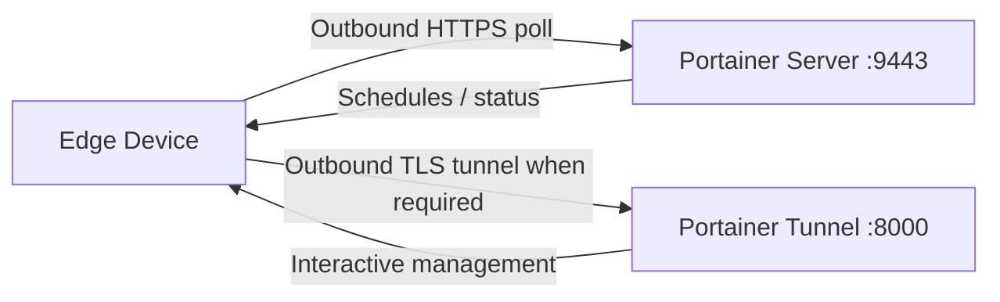

# How to Enforce Portainer-Generated Edge IDs

Author: [nawazdhandala](https://www.github.com/nawazdhandala)

Tags: Portainer, Edge Agent, Security, Edge ID, Configuration

Description: Require edge agents to use Portainer-generated edge IDs rather than custom values for improved security.

---

Portainer Edge Agents enable management of remote environments that are behind NAT, firewalls, or have limited connectivity. The Edge Agent establishes an outbound connection to the Portainer server, eliminating the need for inbound firewall rules.

To enforce Portainer-generated Edge IDs, go to **Settings** > **Edge Compute**, enable **Enforce use of Portainer generated Edge ID**, and save the change. With this enabled, the Edge ID used by an Edge Agent deployment must already exist in Portainer's database in order to connect.

## How Edge Agent Works



In standard mode, the Edge Agent polls Portainer over HTTPS on the UI/API port and opens a TLS tunnel to port 8000 only when interactive access is required. In async mode, only the UI/API port is required and no tunnel is opened. No inbound ports need to be opened on the edge network.

## Generate Edge Deployment Values

```bash
# Remove --insecure if Portainer uses a publicly trusted certificate.
TOKEN=$(curl -sS -X POST \
  https://portainer.example.com:9443/api/auth \
  -H "Content-Type: application/json" \
  -d '{"Username":"admin","Password":"yourpassword"}' \
  --insecure | python3 -c "import sys,json; print(json.load(sys.stdin)['jwt'])")

# Create a Docker Standalone Edge environment and capture the generated Edge ID / Edge Key.
# For async mode, add: --form "EdgeAsyncMode=true"

EDGE_ENV=$(curl -sS -X POST \
  https://portainer.example.com:9443/api/endpoints \
  -H "Authorization: Bearer $TOKEN" \
  --form "Name=edge-site-01" \
  --form "EndpointCreationType=4" \
  --form "URL=/var/run/docker.sock" \
  --form "ContainerEngine=docker" \
  --form "EdgeCheckinInterval=30" \
  --insecure)

EDGE_ID=$(printf '%s' "$EDGE_ENV" | python3 -c "import sys,json; print(json.load(sys.stdin)['EdgeID'])")
EDGE_KEY=$(printf '%s' "$EDGE_ENV" | python3 -c "import sys,json; print(json.load(sys.stdin)['EdgeKey'])")
```

## Standard Mode Installation

```bash
# Match the agent tag to your Portainer Server release.
PORTAINER_AGENT_TAG=lts

# Standard mode - interactive management over the reverse tunnel
# Add -e EDGE_INSECURE_POLL=1 if Portainer uses a self-signed certificate
docker run -d \
  --name portainer_edge_agent \
  --restart=always \
  -v /var/run/docker.sock:/var/run/docker.sock \
  -v /var/lib/docker/volumes:/var/lib/docker/volumes \
  -v /:/host \
  -v portainer_agent_data:/data \
  -e EDGE=1 \
  -e EDGE_ID="${EDGE_ID}" \
  -e EDGE_KEY="${EDGE_KEY}" \
  portainer/agent:${PORTAINER_AGENT_TAG}
```

## Async Mode Installation

```bash
# Async mode requires Portainer Business Edition.
PORTAINER_AGENT_TAG=lts

# Async mode - snapshot-based management for limited bandwidth
# Ping, snapshot, and command intervals are configured in Portainer
# Add -e EDGE_INSECURE_POLL=1 if Portainer uses a self-signed certificate
docker run -d \
  --name portainer_edge_agent \
  --restart=always \
  -v /var/run/docker.sock:/var/run/docker.sock \
  -v /var/lib/docker/volumes:/var/lib/docker/volumes \
  -v /:/host \
  -v portainer_agent_data:/data \
  -e EDGE=1 \
  -e EDGE_ID="${EDGE_ID}" \
  -e EDGE_KEY="${EDGE_KEY}" \
  -e EDGE_ASYNC=1 \
  portainer/agent:${PORTAINER_AGENT_TAG}
```

## ARM / Windows Variations

```bash
PORTAINER_AGENT_TAG=lts

# ARM64 (Raspberry Pi 4, Apple Silicon running Linux containers)
docker pull portainer/agent:${PORTAINER_AGENT_TAG}  # Multi-arch image

# Windows
# Use URL=//./pipe/docker_engine when creating the environment via the API, then
# use the Windows-specific deployment command generated by Portainer.
```

## Verify Edge Agent Connection

```bash
# Check agent is running
docker logs portainer_edge_agent 2>&1 | tail -20

# On Portainer server, check if environment shows as connected
curl -s https://portainer.example.com:9443/api/endpoints \
  -H "Authorization: Bearer $TOKEN" \
  --insecure | python3 -c "
import sys, json
envs = json.load(sys.stdin)
for e in envs:
    if e.get('EdgeID'):
        print(f'Edge: {e[\"Name\"]}, Status: {\"Online\" if e.get(\"Status\")==1 else \"Offline\"}')
"
```

---

*Monitor edge device health and connectivity with [OneUptime](https://oneuptime.com).*
