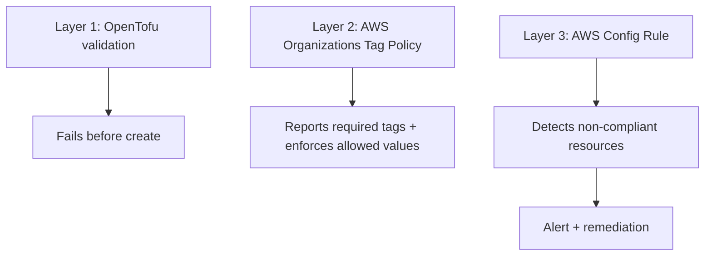

# How to Enforce Resource Tagging Policies with OpenTofu

Author: [nawazdhandala](https://www.github.com/nawazdhandala)

Tags: OpenTofu, Resource Tagging, AWS Config, Tag Policies, Compliance, Infrastructure as Code

Description: Learn how to enforce resource tagging compliance using OpenTofu validation blocks, AWS Organizations tag policies, and AWS Config rules to ensure consistent tags across all infrastructure.

---

Untagged resources make cost attribution, security audits, and compliance reporting impossible. Enforcing tags at multiple layers - OpenTofu validation, AWS Organizations tag policy compliance, and Config rule level - creates defense in depth against missing or inconsistent tags.

## Tagging Enforcement Layers



## OpenTofu Tagging Validation

```hcl
# modules/tagging/variables.tf

variable "required_tags" {
  type = object({
    Environment = string
    Team        = string
    Project     = string
    CostCenter  = string
  })

  description = "Required tags for all resources"

  validation {
    condition = contains(["dev", "staging", "production"], var.required_tags.Environment)
    error_message = "Environment tag must be dev, staging, or production"
  }

  validation {
    condition = can(regex("^[A-Z]{2}-\\d{4}$", var.required_tags.CostCenter))
    error_message = "CostCenter must follow format: XX-NNNN (e.g., IT-0042)"
  }
}

# Enforce tags at module level
locals {
  enforced_tags = merge(var.required_tags, {
    ManagedBy = "opentofu"
  })
}
```

## AWS Organizations Tag Policy

```hcl
# tag_policy.tf
provider "aws" {
  # Requires AWS provider 6.22.0+.
  tag_policy_compliance = "error"
}

resource "aws_organizations_policy" "required_tags" {
  name        = "required-resource-tags"
  description = "Report required tags and enforce allowed values on AWS resources"
  type        = "TAG_POLICY"

  content = jsonencode({
    tags = {
      Environment = {
        report_required_tag_for = {
          "@@assign" = [
            "ec2:instance",
            "rds:db",
            "s3:bucket",
          ]
        }
        tag_key = {
          "@@assign" = "Environment"
        }
        tag_value = {
          "@@assign" = ["dev", "staging", "production"]
        }
        enforced_for = {
          "@@assign" = [
            "ec2:instance",
            "rds:db",
            "s3:bucket",
          ]
        }
      }
      Team = {
        report_required_tag_for = {
          "@@assign" = [
            "ec2:instance",
            "rds:db",
            "s3:bucket",
          ]
        }
        tag_key = {
          "@@assign" = "Team"
        }
      }
      Project = {
        report_required_tag_for = {
          "@@assign" = [
            "ec2:instance",
            "rds:db",
            "s3:bucket",
          ]
        }
        tag_key = {
          "@@assign" = "Project"
        }
      }
      CostCenter = {
        report_required_tag_for = {
          "@@assign" = [
            "ec2:instance",
            "rds:db",
            "s3:bucket",
          ]
        }
        tag_key = {
          "@@assign" = "CostCenter"
        }
      }
      ManagedBy = {
        report_required_tag_for = {
          "@@assign" = [
            "ec2:instance",
            "rds:db",
            "s3:bucket",
          ]
        }
        tag_key = {
          "@@assign" = "ManagedBy"
        }
        tag_value = {
          "@@assign" = ["opentofu"]
        }
      }
    }
  })
}

resource "aws_organizations_policy_attachment" "tag_policy" {
  policy_id = aws_organizations_policy.required_tags.id
  target_id = var.root_ou_id
}
```

## AWS Config Required Tags Rule

```hcl
resource "aws_config_config_rule" "required_tags" {
  name = "required-tags-enforcement"

  source {
    owner             = "AWS"
    source_identifier = "REQUIRED_TAGS"
  }

  input_parameters = jsonencode({
    tag1Key   = "Environment"
    tag2Key   = "Team"
    tag3Key   = "Project"
    tag4Key   = "CostCenter"
    tag5Key   = "ManagedBy"
  })

  scope {
    compliance_resource_types = [
      "AWS::EC2::Instance",
      "AWS::RDS::DBInstance",
      "AWS::S3::Bucket",
      "AWS::ElasticLoadBalancingV2::LoadBalancer",
    ]
  }
}
```

## Automated Tag Remediation for EC2

```hcl
# Auto-tag EC2 instances that are missing the ManagedBy tag
resource "aws_config_config_rule" "required_tags_ec2" {
  name = "required-tags-ec2-managed-by"

  source {
    owner             = "AWS"
    source_identifier = "REQUIRED_TAGS"
  }

  input_parameters = jsonencode({
    tag1Key = "ManagedBy"
  })

  scope {
    compliance_resource_types = ["AWS::EC2::Instance"]
  }
}

# REQUIRED_TAGS needs a custom Systems Manager Automation document for remediation.
resource "aws_ssm_document" "add_managed_by_tag_ec2" {
  name            = "add-managed-by-tag-ec2"
  document_type   = "Automation"
  document_format = "JSON"

  content = jsonencode({
    schemaVersion = "0.3"
    description   = "Add ManagedBy=opentofu to EC2 instances"
    assumeRole    = "{{AutomationAssumeRole}}"
    parameters = {
      AutomationAssumeRole = {
        type        = "String"
        description = "IAM role ARN for Automation"
      }
      InstanceId = {
        type        = "String"
        description = "EC2 instance ID"
      }
    }
    mainSteps = [
      {
        name   = "addTags"
        action = "aws:createTags"
        inputs = {
          ResourceType = "EC2"
          ResourceIds  = ["{{InstanceId}}"]
          Tags = [
            {
              Key   = "ManagedBy"
              Value = "opentofu"
            }
          ]
        }
      }
    ]
  })
}

resource "aws_config_remediation_configuration" "add_managed_by_tag_ec2" {
  config_rule_name = aws_config_config_rule.required_tags_ec2.name
  target_type      = "SSM_DOCUMENT"
  target_id        = aws_ssm_document.add_managed_by_tag_ec2.name
  automatic        = false  # Review and start remediation manually

  parameter {
    name         = "AutomationAssumeRole"
    static_value = aws_iam_role.config_remediation.arn
  }

  parameter {
    name           = "InstanceId"
    resource_value = "RESOURCE_ID"
  }
}
```

## Tag Compliance Report via Lambda

```hcl
# Lambda function to generate weekly tag compliance report
resource "aws_lambda_function" "tag_compliance_report" {
  function_name = "tag-compliance-weekly-report"
  role          = aws_iam_role.reporter.arn
  filename      = data.archive_file.reporter.output_path
  handler       = "index.handler"
  runtime       = "python3.12"
  timeout       = 60

  environment {
    variables = {
      SNS_TOPIC_ARN   = aws_sns_topic.compliance_alerts.arn
      REQUIRED_TAGS   = "Environment,Team,Project,CostCenter,ManagedBy"
    }
  }
}

resource "aws_cloudwatch_event_rule" "weekly_tag_report" {
  name                = "weekly-tag-compliance"
  schedule_expression = "cron(0 9 ? * MON *)"  # Monday 9 AM UTC
}

resource "aws_cloudwatch_event_target" "weekly_tag_report" {
  rule      = aws_cloudwatch_event_rule.weekly_tag_report.name
  target_id = "tag-compliance-report"
  arn       = aws_lambda_function.tag_compliance_report.arn
}

resource "aws_lambda_permission" "allow_weekly_tag_report" {
  statement_id  = "AllowExecutionFromEventBridge"
  action        = "lambda:InvokeFunction"
  function_name = aws_lambda_function.tag_compliance_report.function_name
  principal     = "events.amazonaws.com"
  source_arn    = aws_cloudwatch_event_rule.weekly_tag_report.arn
}
```

## Best Practices

- Enforce tags at three levels: OpenTofu validation, Organizations tag policy compliance, and Config evaluation - each layer catches different gaps.
- Use `validation` blocks with regex patterns to enforce tag formats, not just presence.
- Start with tag policy reporting or `tag_policy_compliance = "warning"`, then switch to enforcement after fixing existing violations.
- Generate a weekly tag compliance report so teams see their non-compliant resources and have time to fix them.
- Use provider `default_tags` to apply mandatory tags automatically - if you rely on individual resource blocks, tags will be missed.
