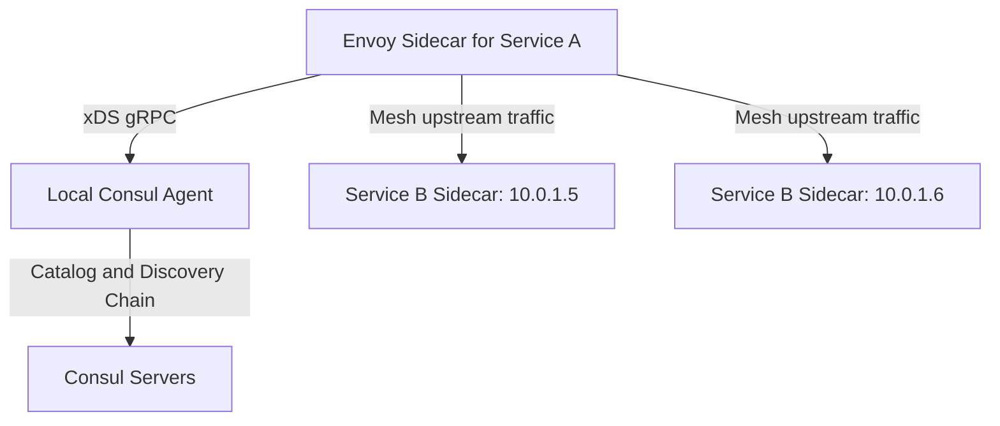

# How to Integrate Envoy with Consul for IPv4 Service Discovery

Author: [nawazdhandala](https://www.github.com/nawazdhandala)

Tags: Envoy, Consul, IPv4, Service Discovery, XDS, EDS, Configuration

Description: Learn how to integrate Envoy with HashiCorp Consul to dynamically discover IPv4 service endpoints using Consul's xDS API support.

---

Consul can act as a control plane for Envoy in Consul service mesh, exposing Envoy's xDS API from the local Consul agent. This enables dynamic load balancing across IPv4 upstream service instances that register and deregister from Consul automatically.

## Architecture



## Registering a Service in Consul

```json
{
  "service": {
    "name": "service-a",
    "id": "service-a-1",
    "address": "10.0.0.10",
    "port": 8080,
    "connect": {
      "sidecar_service": {
        "proxy": {
          "upstreams": [
            {
              "destination_name": "service-b",
              "local_bind_port": 9191
            }
          ]
        }
      }
    },
    "check": {
      "http": "http://10.0.0.10:8080/health",
      "interval": "10s",
      "timeout": "3s"
    }
  }
}
```

```bash
# Register the service with the local Consul agent

curl --request PUT \
  --data @service-a.json \
  http://127.0.0.1:8500/v1/agent/service/register
```

For xDS-based discovery, the destination service (`service-b` in this example) must also be registered in Consul service mesh so Consul can program the upstream listener and endpoints for Envoy.

## Envoy Bootstrap Configuration for Consul xDS

Consul exposes Envoy's xDS API from the local Consul client agent. Generate the bootstrap from the registered sidecar definition instead of hand-writing the xDS wiring:

```bash
# Generate bootstrap JSON for the service instance with ID service-a-1
consul connect envoy -sidecar-for=service-a-1 -bootstrap > /etc/envoy/bootstrap.json
```

## Starting Envoy with Consul Bootstrap

```bash
# Start Envoy with the generated Consul bootstrap config
envoy --config-path /etc/envoy/bootstrap.json --log-level info

# Verify Envoy received the upstream cluster for service-b
curl -s http://localhost:19000/clusters | grep service-b
```

## Static Fallback: Using Consul DNS for IPv4 Resolution

If you prefer static Envoy config with Consul DNS:

```yaml
clusters:
  - name: service_a
    cluster_type:
      name: envoy.clusters.dns
      typed_config:
        "@type": type.googleapis.com/envoy.extensions.clusters.dns.v3.DnsCluster
        dns_lookup_family: V4_PREFERRED
    connect_timeout: 5s
    load_assignment:
      cluster_name: service_a
      endpoints:
        - lb_endpoints:
            - endpoint:
                address:
                  socket_address:
                    # Consul DNS: <service>.service.<datacenter>.consul
                    address: service-a.service.dc1.consul
                    port_value: 8080
```

## Key Takeaways

- Consul exposes Envoy's xDS API from the local client agent for registered service mesh proxies, rather than using the generic service catalog as a standalone xDS feed.
- Envoy receives upstream endpoint updates for services declared in the proxy's upstream configuration, and those endpoints can use IPv4 addresses.
- When using Consul DNS instead of xDS, Envoy's DNS cluster configuration can prefer IPv4 resolution with `dns_lookup_family: V4_PREFERRED`.
- Check `curl localhost:19000/clusters` to verify Envoy has received and is using the configured Consul-discovered upstreams.
