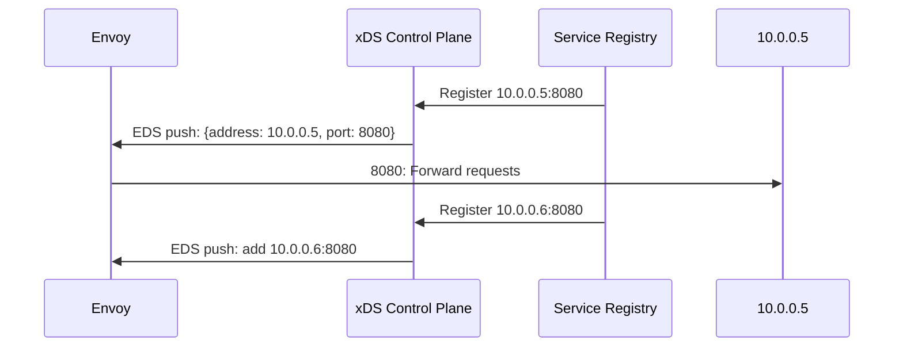

# How to Configure Envoy EDS (Endpoint Discovery) with IPv4 Addresses

Author: [nawazdhandala](https://www.github.com/nawazdhandala)

Tags: Envoy, EDS, XDS, IPv4, Service Discovery, Dynamic Configuration, Microservice

Description: Learn how to configure Envoy's Endpoint Discovery Service (EDS) to dynamically receive IPv4 endpoint addresses from a control plane.

---

EDS (Endpoint Discovery Service) is part of Envoy's xDS API. Instead of statically listing backend IPs, Envoy subscribes to a control plane (like Istio or a custom xDS server) that pushes endpoint updates dynamically. This enables zero-downtime service scaling.

## EDS Architecture



## File-Based EDS Configuration (`path_config_source`)

For testing without a gRPC control plane, define endpoints in a watched file. This still uses the EDS resource format, but the updates come from the filesystem instead of a management server.

```yaml
# envoy-config.yaml

static_resources:
  clusters:
    - name: my_service
      type: EDS              # Use EDS endpoint format
      connect_timeout: 5s
      eds_cluster_config:
        eds_config:
          # Use file-based endpoint config for testing
          resource_api_version: V3
          path_config_source:
            path: /etc/envoy/eds-endpoints.yaml
```

```yaml
# /etc/envoy/eds-endpoints.yaml
resources:
  - "@type": type.googleapis.com/envoy.config.endpoint.v3.ClusterLoadAssignment
    cluster_name: my_service
    endpoints:
      - lb_endpoints:
          # IPv4 endpoint 1
          - endpoint:
              address:
                socket_address:
                  address: 10.0.0.10
                  port_value: 8080
          # IPv4 endpoint 2
          - endpoint:
              address:
                socket_address:
                  address: 10.0.0.11
                  port_value: 8080
```

## Dynamic EDS with a gRPC xDS Control Plane

```yaml
# envoy-config.yaml
dynamic_resources:
  ads_config:
    api_type: GRPC
    transport_api_version: V3
    grpc_services:
      - envoy_grpc:
          cluster_name: xds_cluster

static_resources:
  clusters:
    - name: xds_cluster
      type: STATIC
      connect_timeout: 5s
      typed_extension_protocol_options:
        envoy.extensions.upstreams.http.v3.HttpProtocolOptions:
          "@type": type.googleapis.com/envoy.extensions.upstreams.http.v3.HttpProtocolOptions
          explicit_http_config:
            http2_protocol_options: {}
      load_assignment:
        cluster_name: xds_cluster
        endpoints:
          - lb_endpoints:
              - endpoint:
                  address:
                    socket_address:
                      # xDS control plane IPv4 address
                      address: 192.168.1.100
                      port_value: 18000

    - name: my_service
      type: EDS
      connect_timeout: 5s
      eds_cluster_config:
        service_name: my_service
        eds_config:
          resource_api_version: V3
          ads: {}           # Use ADS (Aggregated Discovery Service)

admin:
  address:
    socket_address: { address: 127.0.0.1, port_value: 9901 }
```

## Locality-Weighted EDS

To use locality-weighted load balancing, enable it on the cluster and provide locality weights in the EDS response.

```yaml
# envoy-config.yaml
static_resources:
  clusters:
    - name: my_service
      type: EDS
      connect_timeout: 5s
      eds_cluster_config:
        eds_config:
          ads: {}
      common_lb_config:
        locality_weighted_lb_config: {}
```

```yaml
# EDS response
resources:
  - "@type": type.googleapis.com/envoy.config.endpoint.v3.ClusterLoadAssignment
    cluster_name: my_service
    endpoints:
      - locality:
          region: us-east-1
          zone: us-east-1a
        load_balancing_weight: 100        # Primary zone
        lb_endpoints:
          - endpoint:
              address:
                socket_address: { address: 10.0.0.10, port_value: 8080 }
      - locality:
          region: us-east-1
          zone: us-east-1b
        load_balancing_weight: 50         # Secondary zone
        lb_endpoints:
          - endpoint:
              address:
                socket_address: { address: 10.1.0.10, port_value: 8080 }
```

## Inspecting Active Endpoints

```bash
# View all endpoints for a cluster via the admin API
curl -s http://localhost:9901/clusters | grep my_service

# Full endpoint details in JSON (includes EDS state)
curl -s 'http://localhost:9901/config_dump?include_eds' | python3 -m json.tool | grep -A 20 ClusterLoadAssignment
```

## Key Takeaways

- EDS decouples Envoy's endpoint list from its static configuration, enabling dynamic scaling.
- File-based EDS (`path_config_source`) is useful for testing without a full control plane.
- Use ADS (`ads: {}`) to receive EDS updates via an existing gRPC stream to the control plane.
- Locality weighting in EDS allows locality-aware load balancing across IPv4 endpoints.
