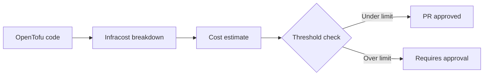

# How to Estimate Costs Before Applying with OpenTofu

Author: [nawazdhandala](https://www.github.com/nawazdhandala)

Tags: OpenTofu, Infracost, Cost Estimation, FinOps, CI/CD, Infrastructure as Code

Description: Learn how to estimate infrastructure costs before running tofu apply using Infracost, including local cost checks, CI/CD integration, and cost policy gates that block expensive changes.

---

Applying infrastructure without knowing the cost is like buying a car without checking the price. Infracost integrates with OpenTofu to show cost estimates in pull requests, local terminals, and CI/CD pipelines before a single resource is created.

## Cost Estimation Workflow



## Local Cost Estimation

```bash
# Install Infracost

brew install infracost  # or use the installer script

# Authenticate
infracost auth login

# Get cost breakdown for current directory
infracost breakdown --path .

# Save a baseline, then compare against it after changes
infracost breakdown --path . --format json --out-file /tmp/infracost-base.json
infracost diff --path . --compare-to /tmp/infracost-base.json

# Output formats
infracost breakdown --path . --format table
infracost breakdown --path . --format json --out-file /tmp/estimate.json
infracost breakdown --path . --format html --out-file /tmp/estimate.html
```

## Infracost Configuration File

```yaml
# infracost.yml
version: 0.1

projects:
  - path: environments/dev
    name: dev-environment
    terraform_var_files:
      - terraform.tfvars

  - path: environments/staging
    name: staging-environment
    terraform_var_files:
      - terraform.tfvars

  - path: environments/production
    name: production-environment
    terraform_var_files:
      - terraform.tfvars
```

## CI/CD Integration with Cost Gate

```yaml
# .github/workflows/cost-check.yml
name: Cost Check
on:
  pull_request:
    paths: ['**.tf', '**.tfvars']

jobs:
  cost:
    runs-on: ubuntu-latest
    permissions:
      contents: read
      pull-requests: write

    steps:
      - uses: actions/checkout@v4

      - name: Setup Infracost
        uses: infracost/actions/setup@v3
        with:
          api-key: ${{ secrets.INFRACOST_API_KEY }}

      - name: Checkout base branch for comparison
        uses: actions/checkout@v4
        with:
          ref: ${{ github.event.pull_request.base.ref }}
          path: base

      - name: Generate base cost
        run: |
          infracost breakdown \
            --path base/environments/production \
            --format json \
            --out-file /tmp/base.json

      - name: Generate PR cost
        run: |
          infracost breakdown \
            --path environments/production \
            --format json \
            --out-file /tmp/pr.json

      - name: Check cost increase threshold
        run: |
          infracost diff \
            --path /tmp/pr.json \
            --compare-to /tmp/base.json \
            --format json \
            --out-file /tmp/infracost.json

          # Get the monthly cost change
          DIFF=$(jq -r '.diffTotalMonthlyCost' /tmp/infracost.json)

          echo "Monthly cost change: $DIFF"

          # Fail if monthly cost increases by more than $500
          if (( $(echo "$DIFF > 500" | bc -l) )); then
            echo "ERROR: Cost increase exceeds $500/month threshold"
            exit 1
          fi

      - name: Post cost comment to PR
        run: |
          infracost comment github \
            --path /tmp/infracost.json \
            --repo ${{ github.repository }} \
            --pull-request ${{ github.event.number }} \
            --github-token ${{ github.token }} \
            --behavior update
```

## Usage-Based Cost Estimates

```yaml
# infracost-usage.yml - define expected usage for better estimates
version: 0.1
resource_usage:
  aws_lambda_function.processor:
    monthly_requests: 10000000
    request_duration_ms: 100
```

## Best Practices

- Run `infracost breakdown` before submitting PRs - it takes seconds and surfaces surprises before reviewers see the code.
- Set cost gate thresholds in CI/CD - block PRs that increase monthly spend by more than a defined threshold without manager approval.
- Use Infracost usage files to estimate variable costs (Lambda invocations, API Gateway calls, data transfer) more accurately.
- Share cost estimates in team Slack channels for high-cost changes - visibility drives accountability.
- Compare costs across environments by generating JSON baselines for each one, then diffing them: `infracost diff --path /tmp/staging-cost.json --compare-to /tmp/production-cost.json` shows how close staging is to production costs.
