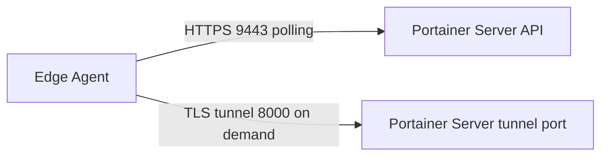

# How to Fix Edge Agent Not Connecting to Portainer Server

Author: [nawazdhandala](https://www.github.com/nawazdhandala)

Tags: Portainer, Troubleshooting, Edge Agent, Connectivity, Firewall, TLS

Description: Learn how to diagnose and fix Portainer Edge Agent connection failures, including tunnel port issues, key mismatches, and firewall configuration.

---

The Portainer Edge Agent reverses the usual connection direction: it dials out from the remote site to the Portainer server. This makes it ideal for networks without inbound port forwarding, but it requires the server to be publicly reachable on both the API port and the tunnel port.

## How Edge Agent Connections Work



The edge agent polls the Portainer server over port 9443 by default and opens a reverse tunnel to port 8000 when Portainer requires it. The server must have both ports publicly accessible.

## Step 1: Verify the Edge Key

The edge key encodes the Portainer API URL, tunnel server address, tunnel fingerprint, and environment ID. It is generated when you create a new Edge environment in Portainer. A wrong key prevents the agent from associating with the server.

```bash
# On the edge host, verify the agent container started with the correct key

docker logs portainer_edge_agent 2>&1 | head -20

# Look for edge key decode errors or TLS/connectivity failures early in startup
```

## Step 2: Test Portainer Server Accessibility

From the edge site, verify the Portainer server's API port and tunnel port are reachable:

```bash
# Test connectivity to the Portainer API port
curl -vk https://portainer-server.example.com:9443

# Test connectivity to the Portainer tunnel port
nc -zv portainer-server.example.com 8000
```

If either check fails, open ports 9443 and 8000 on the Portainer server's firewall. If Portainer is using a self-signed certificate, the Edge Agent must be deployed with `-e EDGE_INSECURE_POLL=1`.

## Step 3: Ensure Portainer Server Has Tunnel Port Exposed

When running Portainer, the API port and tunnel port must be published:

```bash
docker run -d \
  --name portainer \
  --restart=always \
  -p 9443:9443 \
  -p 8000:8000 \
  -v /var/run/docker.sock:/var/run/docker.sock \
  -v portainer_data:/data \
  portainer/portainer-ce:lts
```

If you still need legacy HTTP access, add `-p 9000:9000`.

## Step 4: Re-generate the Edge Key

If the key is suspect, delete the edge environment in Portainer, re-create it, and use the new deployment command with the fresh key on the edge host.

## Step 5: Check for Proxy Interference

If the edge site routes traffic through an HTTP proxy, make sure the proxy is not blocking or intercepting outbound connections from the Edge Agent to the Portainer server on ports 9443 and 8000. If needed, bypass the Portainer host with `NO_PROXY`.

## Step 6: Verify Agent Logs After Fix

```bash
# After correcting the configuration, watch the agent logs
docker logs -f portainer_edge_agent
```

The environment heartbeat in Portainer should return to healthy once the agent can poll successfully and establish the reverse tunnel when needed.
