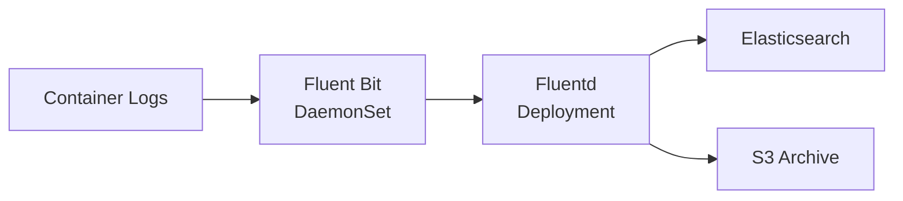

# How to Deploy Fluentd/Fluent Bit with OpenTofu

Author: [nawazdhandala](https://www.github.com/nawazdhandala)

Tags: OpenTofu, Fluentd, Fluent Bit, Log Aggregation, Kubernetes, Helm, Infrastructure as Code

Description: Learn how to deploy Fluent Bit as a log collection DaemonSet and Fluentd as a log aggregation layer on Kubernetes using OpenTofu, routing logs to multiple destinations.

---

Fluent Bit is a lightweight log forwarder ideal for edge collection on Kubernetes nodes. Fluentd is the heavy-duty aggregator with rich plugin support. Together they form a scalable log pipeline: Fluent Bit collects and forwards, Fluentd aggregates, parses, and routes to multiple backends.

## Log Pipeline Architecture



## Fluent Bit DaemonSet

```hcl
# fluent_bit.tf

resource "helm_release" "fluent_bit" {
  name             = "fluent-bit"
  repository       = "https://fluent.github.io/helm-charts"
  chart            = "fluent-bit"
  version          = "0.57.3"
  namespace        = "logging"
  create_namespace = true
  depends_on       = [helm_release.fluentd]

  values = [
    yamlencode({
      config = {
        service = <<-EOT
          [SERVICE]
              Flush         5
              Daemon        Off
              Log_Level     info
              HTTP_Server   On
              HTTP_Listen   0.0.0.0
              HTTP_Port     2020
        EOT

        inputs = <<-EOT
          [INPUT]
              Name              tail
              Path              /var/log/containers/*.log
              multiline.parser  docker, cri
              Tag               kube.*
              Mem_Buf_Limit     50MB
              Skip_Long_Lines   On
        EOT

        filters = <<-EOT
          [FILTER]
              Name                kubernetes
              Match               kube.*
              Kube_URL            https://kubernetes.default.svc:443
              Kube_CA_File        /var/run/secrets/kubernetes.io/serviceaccount/ca.crt
              Kube_Token_File     /var/run/secrets/kubernetes.io/serviceaccount/token
              Merge_Log           On
              K8S-Logging.Parser  On
              K8S-Logging.Exclude Off

          [FILTER]
              Name  record_modifier
              Match *
              Record cluster ${var.cluster_name}
              Record environment ${var.environment}
        EOT

        outputs = <<-EOT
          [OUTPUT]
              Name          forward
              Match         *
              Host          fluentd.logging
              Port          24224
              tls           off
        EOT
      }

      tolerations = [{ operator = "Exists" }]

      resources = {
        requests = { cpu = "50m", memory = "64Mi" }
        limits   = { cpu = "200m", memory = "256Mi" }
      }
    })
  ]
}
```

## Fluentd Aggregator

```hcl
resource "helm_release" "fluentd" {
  name             = "fluentd"
  repository       = "https://fluent.github.io/helm-charts"
  chart            = "fluentd"
  version          = "0.5.3"
  namespace        = "logging"
  create_namespace = true

  values = [
    yamlencode({
      kind         = "Deployment"
      replicaCount = var.environment == "production" ? 3 : 1
      plugins      = ["fluent-plugin-s3"]

      env = [
        { name = "ELASTICSEARCH_HOST", value = "elasticsearch-master.logging" }
        { name = "AWS_REGION", value = var.aws_region }
        { name = "S3_BUCKET", value = aws_s3_bucket.log_archive.id }
      ]

      service = {
        ports = [
          {
            name          = "forwarder"
            protocol      = "TCP"
            containerPort = 24224
          }
        ]
      }

      fileConfigs = {
        "01_sources.conf" = <<-EOT
          <source>
            @type forward
            port 24224
          </source>
        EOT

        "02_filters.conf" = <<-EOT
          <filter kube.**>
            @type grep
            <exclude>
              key $.kubernetes.namespace_name
              pattern ^(kube-system|logging|monitoring)$
            </exclude>
          </filter>
        EOT

        "03_outputs.conf" = <<-EOT
          <match kube.**>
            @type copy

            <store>
              @type elasticsearch
              host "#{ENV['ELASTICSEARCH_HOST']}"
              port 9200
              logstash_format true
              logstash_prefix kubernetes
              <buffer>
                flush_interval 10s
              </buffer>
            </store>

            <store>
              @type s3
              s3_bucket "#{ENV['S3_BUCKET']}"
              s3_region "#{ENV['AWS_REGION']}"
              path logs/%Y/%m/%d/
              s3_object_key_format %{path}%{time_slice}_%{index}.%{file_extension}
              <buffer tag,time>
                @type file
                path /var/log/fluent/s3
                timekey 1h
                timekey_wait 10m
                timekey_use_utc true
              </buffer>
            </store>
          </match>
        EOT
      }

      resources = {
        requests = { cpu = "200m", memory = "512Mi" }
        limits   = { cpu = "1000m", memory = "1Gi" }
      }
    })
  ]
}
```

## Best Practices

- Use Fluent Bit for node-level collection and Fluentd for aggregation - Fluent Bit has a much smaller memory footprint, which makes it a better fit as a DaemonSet.
- Set `Mem_Buf_Limit` in Fluent Bit to cap in-memory buffering during backpressure - with memory buffering, the input pauses when the limit is reached, so use filesystem buffering if you need better loss tolerance during outages.
- Filter out system namespace logs (kube-system, logging, monitoring) in Fluentd to reduce noise and storage costs.
- If you need authenticated forwarding, enable TLS and shared keys for Fluent Bit to Fluentd communication instead of using plain `forward` traffic.
- Archive logs to S3 in addition to Elasticsearch for long-term retention at low cost.
