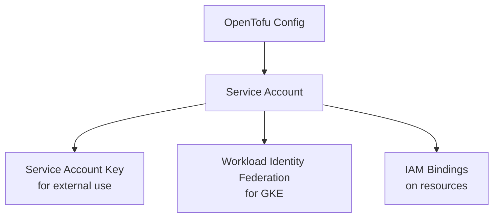

# How to Create GCP IAM Service Accounts with OpenTofu

Author: [nawazdhandala](https://www.github.com/nawazdhandala)

Tags: OpenTofu, GCP, IAM, Service Account, Google Cloud, Infrastructure as Code, Security

Description: Learn how to create and manage GCP IAM service accounts using OpenTofu to enable secure authentication for applications, VMs, and CI/CD pipelines running on Google Cloud.

---

GCP Service Accounts are special accounts used by applications and VMs to authenticate to Google APIs and services. Unlike user accounts, service accounts are owned by projects and designed for non-human identities. OpenTofu's Google provider makes managing service accounts declarative and auditable.

## Service Account Types in GCP

GCP service accounts fall into two main categories: user-managed service accounts (which you create and manage) and service agents (which Google Cloud creates and manages). Some Google Cloud services also create default service accounts automatically; these are still user-managed service accounts. This guide focuses on user-managed service accounts.



## Creating a Basic Service Account

```hcl
# main.tf

terraform {
  required_providers {
    google = {
      source  = "hashicorp/google"
      version = "~> 5.10"
    }
  }
}

provider "google" {
  project = var.project_id
  region  = var.region
}

# Create a service account for the application backend
resource "google_service_account" "app_backend" {
  account_id   = "app-backend-sa"
  display_name = "App Backend Service Account"
  description  = "Service account used by the app backend to access GCP services"
  project      = var.project_id
}
```

## Granting Project-Level IAM Roles

```hcl
# iam_bindings.tf
# Grant the service account the Storage Object Viewer role at project level
resource "google_project_iam_member" "storage_viewer" {
  project = var.project_id
  role    = "roles/storage.objectViewer"
  member  = "serviceAccount:${google_service_account.app_backend.email}"
}

# Grant Pub/Sub Publisher access
resource "google_project_iam_member" "pubsub_publisher" {
  project = var.project_id
  role    = "roles/pubsub.publisher"
  member  = "serviceAccount:${google_service_account.app_backend.email}"
}
```

## Granting Resource-Level IAM Roles

For least-privilege, prefer granting roles on specific resources rather than at the project level.

```hcl
# resource_iam.tf
# Create a Cloud Storage bucket
resource "google_storage_bucket" "app_data" {
  name     = "${var.project_id}-app-data"
  location = var.region
}

# Grant access only to this specific bucket (not all buckets in the project)
resource "google_storage_bucket_iam_member" "app_bucket_access" {
  bucket = google_storage_bucket.app_data.name
  role   = "roles/storage.objectAdmin"
  member = "serviceAccount:${google_service_account.app_backend.email}"
}

# Grant access to a specific Pub/Sub topic
resource "google_pubsub_topic" "events" {
  name = "app-events"
}

resource "google_pubsub_topic_iam_member" "events_publisher" {
  topic  = google_pubsub_topic.events.name
  role   = "roles/pubsub.publisher"
  member = "serviceAccount:${google_service_account.app_backend.email}"
}
```

## Creating Service Account Keys for External Access

Keys should only be used when you can't use Workload Identity Federation, an attached service account, or another short-lived credential flow. Also note that `google_service_account_key` stores the private key in OpenTofu state.

```hcl
# keys.tf
# Create a key for the service account (use sparingly - prefer keyless auth)
resource "google_service_account_key" "app_backend_key" {
  service_account_id = google_service_account.app_backend.name
  public_key_type    = "TYPE_X509_PEM_FILE"
}
```

Google Cloud also recommends not storing service account keys in Secret Manager or other cloud-based secret stores.

## Setting Up Workload Identity for GKE

If Workload Identity Federation for GKE is enabled on your cluster, you can let a Kubernetes service account impersonate an IAM service account without creating keys.

```hcl
# workload_identity.tf
# Allow the Kubernetes service account to impersonate the GCP service account
resource "google_service_account_iam_member" "workload_identity_binding" {
  service_account_id = google_service_account.app_backend.name
  role               = "roles/iam.workloadIdentityUser"
  member             = "serviceAccount:${var.project_id}.svc.id.goog[${var.k8s_namespace}/${var.k8s_service_account}]"
}
```

You must also annotate the Kubernetes ServiceAccount with `iam.gke.io/gcp-service-account=SERVICE_ACCOUNT_EMAIL` for this binding to work.

## Best Practices

- Avoid creating service account keys unless absolutely necessary - use attached service accounts, Workload Identity Federation, or other short-lived credential flows instead.
- Use descriptive `account_id` values that make the purpose obvious in audit logs.
- Grant roles at the resource level, not project level, wherever possible.
- Audit service accounts regularly with Policy Intelligence tools such as service account insights to find unused accounts.
- Disable and then delete service accounts rather than deleting them immediately, in case dependent services need time to migrate.
