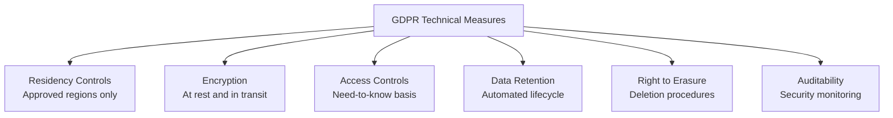

# How to Implement GDPR-Compliant Infrastructure with OpenTofu

Author: [nawazdhandala](https://www.github.com/nawazdhandala)

Tags: OpenTofu, GDPR, Compliance, Privacy, Data Residency, Personal Data, Infrastructure as Code

Description: Learn how to provision GDPR-compliant AWS infrastructure using OpenTofu, covering data residency, encryption, data retention policies, and the right to erasure.

---

GDPR requires that personal data of people in the EU is processed lawfully, stored securely, and deleted when Article 17 applies. OpenTofu can provision technical controls that support a GDPR compliance program: approved-region enforcement, encryption, access logging, and automated data lifecycle policies.

## GDPR Technical Requirements



## Data Residency Enforcement

```hcl
# providers.tf - example EU-only residency policy for personal data

provider "aws" {
  alias  = "eu"
  region = var.aws_region
}

provider "aws" {
  alias  = "eu_backup"
  region = "eu-central-1"  # Example secondary EU region for backups
}

# Prevent accidental deployment outside the approved EU regions in this example
variable "aws_region" {
  type    = string
  default = "eu-west-1"

  validation {
    condition = contains([
      "eu-west-1",       # Ireland
      "eu-west-3",       # Paris
      "eu-central-1",    # Frankfurt
      "eu-north-1",      # Stockholm
      "eu-south-1",      # Milan
      "eu-south-2",      # Spain
    ], var.aws_region)
    error_message = "This example allows EU AWS regions only. Transfers outside the EU are governed by GDPR Chapter V (Arts. 44-49)."
  }
}
```

## Personal Data Encryption

```hcl
# gdpr_encryption.tf
resource "aws_kms_key" "personal_data" {
  provider                = aws.eu
  description             = "KMS key for personal data - GDPR Art. 32"
  deletion_window_in_days = 30
  enable_key_rotation     = true

  tags = {
    DataCategory   = "PersonalData"
    GDPR           = "true"
    DataController = var.company_name
  }
}

resource "aws_s3_bucket" "personal_data" {
  provider = aws.eu
  bucket   = "${var.company}-personal-data-${var.environment}"

  tags = {
    GDPR             = "true"
    DataCategory     = "PersonalData"
    LegalBasis       = "Consent"
    RetentionYears   = "3"
  }
}

resource "aws_s3_bucket_server_side_encryption_configuration" "personal_data" {
  provider = aws.eu
  bucket = aws_s3_bucket.personal_data.id
  rule {
    apply_server_side_encryption_by_default {
      sse_algorithm     = "aws:kms"
      kms_master_key_id = aws_kms_key.personal_data.arn
    }
  }
}
```

## Data Retention Lifecycle

```hcl
# gdpr_lifecycle.tf - automated data deletion (Art. 5, 17)
resource "aws_s3_bucket_lifecycle_configuration" "personal_data" {
  provider = aws.eu
  bucket = aws_s3_bucket.personal_data.id

  rule {
    id     = "gdpr-data-retention"
    status = "Enabled"

    # Personal data expires after 3 years from creation
    expiration {
      days = 1095  # 3 years
    }

    # Applies when bucket versioning is enabled
    noncurrent_version_expiration {
      noncurrent_days = 90
    }
  }
}

# DynamoDB TTL for session data
resource "aws_dynamodb_table" "sessions" {
  provider     = aws.eu
  name         = "${var.environment}-sessions"
  billing_mode = "PAY_PER_REQUEST"
  hash_key     = "user_id"
  range_key    = "session_id"

  attribute {
    name = "user_id"
    type = "S"
  }

  attribute {
    name = "session_id"
    type = "S"
  }

  # TTL for automatic expiry of session data
  ttl {
    attribute_name = "expires_at"
    enabled        = true
  }

  tags = {
    GDPR         = "true"
    DataCategory = "SessionData"
  }
}
```

## Access Audit Logging

```hcl
# gdpr_audit.tf - audit S3 access to personal data
resource "aws_s3_bucket" "gdpr_audit_logs" {
  provider = aws.eu
  bucket   = "${var.company}-gdpr-audit-logs"
}

data "aws_caller_identity" "current" {
  provider = aws.eu
}

data "aws_partition" "current" {
  provider = aws.eu
}

data "aws_iam_policy_document" "gdpr_audit_logs" {
  provider = aws.eu

  statement {
    sid    = "AWSCloudTrailAclCheck"
    effect = "Allow"

    principals {
      type        = "Service"
      identifiers = ["cloudtrail.amazonaws.com"]
    }

    actions   = ["s3:GetBucketAcl"]
    resources = [aws_s3_bucket.gdpr_audit_logs.arn]

    condition {
      test     = "StringEquals"
      variable = "aws:SourceArn"
      values = [
        "arn:${data.aws_partition.current.partition}:cloudtrail:${var.aws_region}:${data.aws_caller_identity.current.account_id}:trail/personal-data-access"
      ]
    }
  }

  statement {
    sid    = "AWSCloudTrailWrite"
    effect = "Allow"

    principals {
      type        = "Service"
      identifiers = ["cloudtrail.amazonaws.com"]
    }

    actions = ["s3:PutObject"]
    resources = [
      "${aws_s3_bucket.gdpr_audit_logs.arn}/AWSLogs/${data.aws_caller_identity.current.account_id}/*"
    ]

    condition {
      test     = "StringEquals"
      variable = "s3:x-amz-acl"
      values   = ["bucket-owner-full-control"]
    }

    condition {
      test     = "StringEquals"
      variable = "aws:SourceArn"
      values = [
        "arn:${data.aws_partition.current.partition}:cloudtrail:${var.aws_region}:${data.aws_caller_identity.current.account_id}:trail/personal-data-access"
      ]
    }
  }
}

resource "aws_s3_bucket_policy" "gdpr_audit_logs" {
  provider = aws.eu
  bucket   = aws_s3_bucket.gdpr_audit_logs.id
  policy   = data.aws_iam_policy_document.gdpr_audit_logs.json
}

resource "aws_cloudtrail" "personal_data_access" {
  provider      = aws.eu
  depends_on    = [aws_s3_bucket_policy.gdpr_audit_logs]
  name          = "personal-data-access"
  s3_bucket_name = aws_s3_bucket.gdpr_audit_logs.id

  event_selector {
    read_write_type           = "All"
    include_management_events = true

    data_resource {
      type   = "AWS::S3::Object"
      values = ["${aws_s3_bucket.personal_data.arn}/"]
    }
  }
}
```

## Right to Erasure Support

```hcl
# Lambda for handling erasure requests (Art. 17)
resource "aws_lambda_function" "erasure_handler" {
  provider      = aws.eu
  function_name = "gdpr-erasure-handler"
  role          = aws_iam_role.erasure_handler.arn
  runtime       = "python3.12"
  handler       = "erasure.handler"
  filename      = data.archive_file.erasure.output_path
  timeout       = 300

  environment {
    variables = {
      PERSONAL_DATA_BUCKET = aws_s3_bucket.personal_data.id
      SESSIONS_TABLE       = aws_dynamodb_table.sessions.id
      AUDIT_LOG_BUCKET     = aws_s3_bucket.gdpr_audit_logs.id
    }
  }
}
```

## Best Practices

- If you enforce an EU-only residency policy through variable validation, remember that GDPR transfers outside the EU are governed by adequacy decisions or other Chapter V safeguards.
- Use S3 lifecycle policies for scheduled retention and DynamoDB TTL for eventual session expiry - DynamoDB TTL deletions are asynchronous, so use explicit deletes for time-sensitive erasure workflows.
- Tag all resources containing personal data with `GDPR = "true"` and `DataCategory` - this enables targeted audits.
- Log access to S3-stored personal data via CloudTrail data events, and add matching selectors for other stores such as DynamoDB if they contain personal data - this supports security monitoring and accountability, but it does not replace the separate Article 30 record of processing activities.
- Build erasure APIs that delete personal data from active storage systems: databases, S3, and caches - use explicit deletes for Article 17 requests rather than relying on retention policies or TTL alone.
