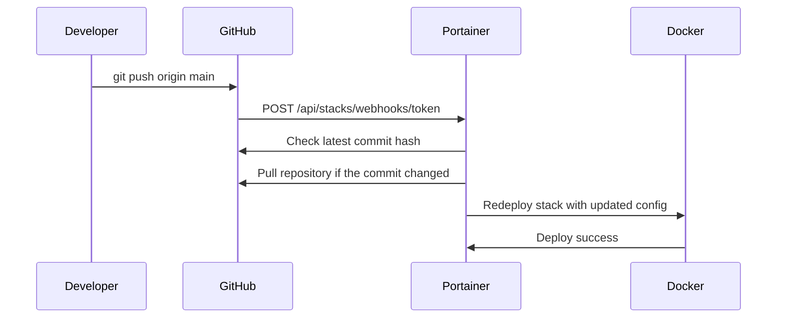

# How to Configure Git Webhooks for Auto-Updates in Portainer

Author: [nawazdhandala](https://www.github.com/nawazdhandala)

Tags: Portainer, GitOps, Webhook, GitHub, Auto-Update

Description: Learn how to configure Portainer and your Git repository to automatically redeploy stacks via webhooks on every push.

## What Is a Git Webhook Update?

Instead of Portainer polling Git for changes, webhooks let your Git provider (GitHub, GitLab, etc.) send a POST request to Portainer the moment a push happens. This gives near-instant update checks with no unnecessary polling overhead.

## Prerequisites

- Portainer is accessible from the internet (or from your Git provider's servers).
- You have admin access to the Git repository.

## Step 1: Enable Webhook Updates in Portainer

1. Create or edit a Git-backed stack in Portainer.
2. Under **GitOps updates**, select **Webhook**.
3. Portainer generates a unique webhook URL.
4. Copy the webhook URL: `https://portainer.mycompany.com/api/stacks/webhooks/abc123...`

## Step 2: Configure the Webhook in GitHub

1. Go to your GitHub repository.
2. Navigate to **Settings > Webhooks**.
3. Click **Add webhook**.
4. Set:
   - **Payload URL**: The Portainer webhook URL.
   - **Content type**: `application/json`.
   - **Secret**: Leave this blank unless you have an intermediate service validating GitHub webhook signatures. Portainer uses the token in the webhook URL itself.
   - **Events**: Select **Just the push event**.
5. Click **Add webhook**.

## Step 3: Configure the Webhook in GitLab

1. Go to your GitLab project.
2. Navigate to **Settings > Webhooks**.
3. Set:
   - **URL**: The Portainer webhook URL.
   - **Secret token**: Leave this blank unless you have an intermediate service validating GitLab webhook headers. Portainer uses the token in the webhook URL itself.
   - **Trigger**: Check **Push events**.
4. Click **Add webhook**.

## Testing the Webhook

```bash
# Test the Portainer stack webhook manually

curl -i -X POST "https://portainer.mycompany.com/api/stacks/webhooks/abc123token"
# Expect: a successful HTTP response if the webhook URL is reachable

# Or trigger from GitHub webhook test
# In GitHub: Settings > Webhooks > Recent Deliveries > Redeliver
```

## Securing Webhooks with a Secret

Portainer's webhook URL already includes the token Portainer validates. GitHub and GitLab secret or signing tokens are only useful if something in front of Portainer validates them. For additional security:

1. Use HTTPS for Portainer.
2. If you add IP allowlisting at the reverse proxy, keep GitHub's ranges synced from the GitHub Meta API and use GitLab.com's published webhook ranges.

```nginx
# Nginx: Restrict webhook endpoint to your current provider IP ranges
location /api/stacks/webhooks/ {
    # GitHub changes ranges over time, so keep these synced with:
    # https://api.github.com/meta  (use the "hooks" ranges)
    allow 140.82.112.0/20;
    allow 143.55.64.0/20;
    allow 185.199.108.0/22;
    allow 192.30.252.0/22;
    allow 2a0a:a440::/29;
    allow 2606:50c0::/32;

    # GitLab.com webhook traffic currently comes from:
    allow 34.74.90.64/28;
    allow 34.74.226.0/24;

    deny all;
    proxy_pass https://portainer:9443;
}
```

## Webhook Event Flow



## Verifying Webhook Deployments

In Portainer:
1. Go to the stack.
2. Confirm the stack now shows the updated configuration or image tag from your recent push.
3. If you need more detail, check the Portainer server logs for the redeploy request.

## Conclusion

Git webhooks provide the fastest Portainer auto-update mechanism - update checks trigger within seconds of a push, and Portainer redeploys when it detects a new commit. Combine them with your CI/CD pipeline (build image, update tag in docker-compose.yml, commit, push) for a complete automated delivery chain.
