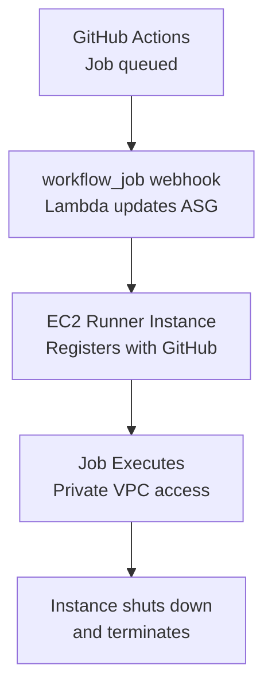

# How to Deploy GitHub Actions Runners on AWS with OpenTofu

Author: [nawazdhandala](https://www.github.com/nawazdhandala)

Tags: OpenTofu, GitHub Action, CI/CD, AWS, EC2, Auto Scaling, Runner, Infrastructure as Code

Description: Learn how to deploy self-hosted GitHub Actions runners on AWS EC2 with auto-scaling using OpenTofu, providing cost-effective and secure CI/CD compute that scales with your workload.

---

Self-hosted GitHub Actions runners on AWS give you control over compute size, network access, and cost. Auto Scaling Groups paired with `workflow_job` webhooks and scaling automation provide elastic scaling that matches your CI/CD throughput.

## Architecture



## IAM Role for Runners

```hcl
# iam.tf

resource "aws_iam_role" "runner" {
  name = "${var.prefix}-github-runner"

  assume_role_policy = jsonencode({
    Version = "2012-10-17"
    Statement = [{
      Effect    = "Allow"
      Principal = { Service = "ec2.amazonaws.com" }
      Action    = "sts:AssumeRole"
    }]
  })
}

resource "aws_iam_role_policy_attachment" "runner_ssm" {
  role       = aws_iam_role.runner.name
  policy_arn = "arn:aws:iam::aws:policy/AmazonSSMManagedInstanceCore"
}

# Additional permissions for what your CI/CD pipeline needs
resource "aws_iam_policy" "runner_ci" {
  name = "${var.prefix}-runner-ci"
  policy = jsonencode({
    Version = "2012-10-17"
    Statement = [
      {
        Effect   = "Allow"
        Action   = ["ecr:GetAuthorizationToken", "ecr:BatchGetImage", "ecr:PutImage"]
        Resource = "*"
      },
      {
        Effect   = "Allow"
        Action   = ["s3:PutObject", "s3:GetObject"]
        Resource = "${aws_s3_bucket.artifacts.arn}/*"
      },
      {
        Effect   = "Allow"
        Action   = ["secretsmanager:GetSecretValue"]
        Resource = var.github_token_secret_arn
      }
    ]
  })
}

resource "aws_iam_role_policy_attachment" "runner_ci" {
  role       = aws_iam_role.runner.name
  policy_arn = aws_iam_policy.runner_ci.arn
}

resource "aws_iam_instance_profile" "runner" {
  name = "${var.prefix}-github-runner"
  role = aws_iam_role.runner.name
}
```

## Launch Template

```hcl
# launch_template.tf
data "aws_ami" "ubuntu" {
  most_recent = true
  owners      = ["099720109477"]  # Canonical

  filter {
    name   = "name"
    values = ["ubuntu/images/hvm-ssd/ubuntu-jammy-22.04-amd64-server-*"]
  }
}

resource "aws_launch_template" "runner" {
  name_prefix                         = "${var.prefix}-runner-"
  image_id                            = data.aws_ami.ubuntu.id
  instance_initiated_shutdown_behavior = "terminate"

  iam_instance_profile {
    arn = aws_iam_instance_profile.runner.arn
  }

  network_interfaces {
    associate_public_ip_address = false
    security_groups             = [aws_security_group.runner.id]
  }

  # EBS volume for Docker layer cache
  block_device_mappings {
    device_name = "/dev/sda1"
    ebs {
      volume_size           = 100
      volume_type           = "gp3"
      delete_on_termination = true
      encrypted             = true
    }
  }

  user_data = base64encode(templatefile("${path.module}/userdata.sh", {
    github_token_secret_arn = var.github_token_secret_arn
    github_org              = var.github_org
    runner_labels           = join(",", var.runner_labels)
    runner_group            = var.runner_group
  }))

  lifecycle {
    create_before_destroy = true
  }

  tag_specifications {
    resource_type = "instance"
    tags = {
      Name        = "${var.prefix}-github-runner"
      Environment = var.environment
      ManagedBy   = "opentofu"
    }
  }
}
```

## Runner User Data Script

```bash
#!/bin/bash
# userdata.sh
set -euo pipefail

# Install dependencies
apt-get update
apt-get install -y curl jq docker.io awscli
systemctl enable --now docker
usermod -aG docker ubuntu

# Install GitHub Actions runner
cd /home/ubuntu
curl -fL -o actions-runner.tar.gz https://github.com/actions/runner/releases/download/v2.334.0/actions-runner-linux-x64-2.334.0.tar.gz
mkdir -p actions-runner
tar xzf actions-runner.tar.gz -C actions-runner
cd actions-runner
./bin/installdependencies.sh
chown -R ubuntu:ubuntu /home/ubuntu/actions-runner

# Discover the instance Region for AWS CLI calls.
imds_token=$(curl -fsSL -X PUT \
  -H "X-aws-ec2-metadata-token-ttl-seconds: 21600" \
  http://169.254.169.254/latest/api/token)

aws_region=$(curl -fsSL \
  -H "X-aws-ec2-metadata-token: ${imds_token}" \
  http://169.254.169.254/latest/dynamic/instance-identity/document \
  | jq -r '.region')

# Fetch a GitHub API token from Secrets Manager, then mint a fresh
# runner registration token. Registration tokens expire after one hour.
github_api_token=$(aws secretsmanager get-secret-value \
  --region "${aws_region}" \
  --secret-id "${github_token_secret_arn}" \
  --query SecretString \
  --output text)

github_runner_token=$(curl -fsSL -X POST \
  -H "Accept: application/vnd.github+json" \
  -H "Authorization: Bearer ${github_api_token}" \
  -H "X-GitHub-Api-Version: 2022-11-28" \
  "https://api.github.com/orgs/${github_org}/actions/runners/registration-token" \
  | jq -r '.token')

# Configure and register runner
sudo -u ubuntu ./config.sh \
  --url "https://github.com/${github_org}" \
  --token "${github_runner_token}" \
  --labels "${runner_labels}" \
  --runnergroup "${runner_group}" \
  --ephemeral \
  --unattended

# Run one job, then shut the instance down so EC2 terminates it.
sudo -u ubuntu ./run.sh
shutdown -h now
```

## Auto Scaling Group

```hcl
# asg.tf
resource "aws_autoscaling_group" "runners" {
  name                = "${var.prefix}-github-runners"
  vpc_zone_identifier = var.private_subnet_ids
  min_size            = 0
  max_size            = var.max_runners
  desired_capacity    = 0

  # Use spot instances for cost savings
  mixed_instances_policy {
    instances_distribution {
      on_demand_base_capacity                  = 0
      on_demand_percentage_above_base_capacity = 0
      spot_allocation_strategy                 = "capacity-optimized"
    }

    launch_template {
      launch_template_specification {
        launch_template_id = aws_launch_template.runner.id
        version            = "$Latest"
      }

      override {
        instance_type = "c6i.2xlarge"
      }
      override {
        instance_type = "c6a.2xlarge"
      }
      override {
        instance_type = "c5.2xlarge"
      }
    }
  }

  tag {
    key                 = "Name"
    value               = "${var.prefix}-github-runner"
    propagate_at_launch = true
  }
}
```

## Security Group

```hcl
resource "aws_security_group" "runner" {
  name        = "${var.prefix}-github-runner"
  description = "GitHub Actions runner - outbound only"
  vpc_id      = var.vpc_id

  # No inbound rules - runners connect outbound to GitHub over HTTPS.
  egress {
    from_port   = 0
    to_port     = 0
    protocol    = "-1"
    cidr_blocks = ["0.0.0.0/0"]
  }
}
```

## Best Practices

- Use `--ephemeral` flag in the runner configuration - GitHub de-registers ephemeral runners after one job, and you can shut the instance down afterward to ensure a clean environment.
- Use Spot instances with multiple instance types for non-critical CI jobs - this can significantly reduce costs compared to On-Demand pricing for interrupt-tolerant workloads.
- Restrict the security group to outbound-only - runners don't need inbound access. Self-hosted runners connect outbound to GitHub over HTTPS for job dispatch.
- Store a GitHub API token in AWS Secrets Manager and request a fresh runner registration token at boot rather than embedding a short-lived registration token in the launch template.
- Scale the ASG to zero when no jobs are queued - use the `workflow_job` webhook with Lambda or another scaler to adjust ASG capacity.
