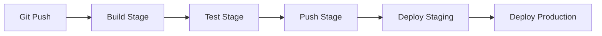

# How to Use GitLab CI to Deploy to Portainer

Author: [nawazdhandala](https://www.github.com/nawazdhandala)

Tags: Portainer, GitLab CI, CI/CD, Docker, Deployment, Automation

Description: Learn how to configure GitLab CI/CD pipelines to build Docker images and deploy them to Portainer stacks automatically.

---

GitLab CI can deploy to Portainer using the Portainer API or stack webhooks. This guide covers a complete `.gitlab-ci.yml` pipeline from build to production deployment for a Portainer stack configured for Git-based redeploys or webhooks.

## Pipeline Overview



## GitLab CI Configuration

Create `.gitlab-ci.yml` in your repository root, using a runner configured for privileged Docker-in-Docker with TLS disabled:

```yaml
stages:
  - build
  - test
  - push
  - deploy
  - cleanup

variables:
  IMAGE_NAME: $CI_REGISTRY_IMAGE
  IMAGE_TAG: $CI_COMMIT_SHORT_SHA
  DOCKER_HOST: tcp://docker:2375
  DOCKER_TLS_CERTDIR: ""

build:
  stage: build
  image: docker:24.0.5-cli
  services:
    - docker:24.0.5-dind
  script:
    - echo "$CI_REGISTRY_PASSWORD" | docker login $CI_REGISTRY --username $CI_REGISTRY_USER --password-stdin
    - docker build -t $IMAGE_NAME:$IMAGE_TAG .
    - docker push $IMAGE_NAME:$IMAGE_TAG

test:
  stage: test
  image: docker:24.0.5-cli
  services:
    - docker:24.0.5-dind
  script:
    - echo "$CI_REGISTRY_PASSWORD" | docker login $CI_REGISTRY --username $CI_REGISTRY_USER --password-stdin
    - docker pull $IMAGE_NAME:$IMAGE_TAG
    - docker run --rm $IMAGE_NAME:$IMAGE_TAG npm test

push-latest:
  stage: push
  image: docker:24.0.5-cli
  services:
    - docker:24.0.5-dind
  rules:
    - if: '$CI_COMMIT_BRANCH == $CI_DEFAULT_BRANCH'
  script:
    - echo "$CI_REGISTRY_PASSWORD" | docker login $CI_REGISTRY --username $CI_REGISTRY_USER --password-stdin
    - docker pull $IMAGE_NAME:$IMAGE_TAG
    - docker tag $IMAGE_NAME:$IMAGE_TAG $IMAGE_NAME:latest
    - docker push $IMAGE_NAME:latest

deploy-staging:
  stage: deploy
  image: alpine:3.20
  environment:
    name: staging
    url: https://staging.example.com
  rules:
    - if: '$CI_COMMIT_BRANCH == $CI_DEFAULT_BRANCH'
  before_script:
    - apk add --no-cache curl jq
  script:
    - |
      TOKEN=$(curl -fsS -X POST "$PORTAINER_URL/api/auth" \
        -H "Content-Type: application/json" \
        -d "{\"Username\":\"$PORTAINER_USER\",\"Password\":\"$PORTAINER_PASSWORD\"}" \
        | jq -r '.jwt')
      STACK_JSON=$(curl -fsS -H "Authorization: Bearer $TOKEN" \
        "$PORTAINER_URL/api/stacks" \
        | jq -ce --arg name "$PORTAINER_STAGING_STACK_NAME" 'map(select(.Name == $name)) | first')
      STACK_ID=$(printf '%s' "$STACK_JSON" | jq -r '.Id')
      ENDPOINT_ID=$(printf '%s' "$STACK_JSON" | jq -r '.EndpointId')
      curl -fsS -X PUT \
        -H "Authorization: Bearer $TOKEN" \
        -H "Content-Type: application/json" \
        -d '{"Prune":true,"RepullImageAndRedeploy":true}' \
        "$PORTAINER_URL/api/stacks/$STACK_ID/git/redeploy?endpointId=$ENDPOINT_ID"

deploy-production:
  stage: deploy
  image: alpine:3.20
  environment:
    name: production
    url: https://app.example.com
  rules:
    - if: '$CI_COMMIT_BRANCH == $CI_DEFAULT_BRANCH'
      when: manual   # Requires human approval
  before_script:
    - apk add --no-cache curl
  script:
    - curl -fsS -X POST "$PORTAINER_PROD_WEBHOOK_URL"
```

## Setting CI/CD Variables in GitLab

Store the Portainer settings as CI/CD variables:

1. Go to **Settings > CI/CD > Variables**.
2. Add `PORTAINER_URL`, `PORTAINER_USER`, and `PORTAINER_PASSWORD`.
3. Mark sensitive values as **Protected** (only available on protected branches) and **Masked** (hidden in logs).
4. Add `PORTAINER_STAGING_STACK_NAME` and `PORTAINER_PROD_WEBHOOK_URL`.

## Using GitLab Environments for Rollback

GitLab tracks deployment history per environment. To rollback, open **Operate > Environments**, select the environment, and click **Rollback environment** next to a previous successful deployment. GitLab creates a new deployment and reruns only the deploy job for that earlier commit, so that commit's image tag must still exist in the registry.

## Registry Cleanup

Remove old images from GitLab's container registry after deployment:

```yaml
cleanup-old-images:
  stage: cleanup
  image: alpine:3.20
  rules:
    - if: '$CI_COMMIT_BRANCH == $CI_DEFAULT_BRANCH'
  before_script:
    - apk add --no-cache curl jq
  script:
    - |
      # Keep the latest 10 matching tags and schedule older ones for deletion
      curl -fsS --header "JOB-TOKEN: $CI_JOB_TOKEN" \
        "$CI_API_V4_URL/projects/$CI_PROJECT_ID/registry/repositories" \
        | jq -r '.[].id' | while read -r repo_id; do
          curl -fsS --request DELETE \
            --header "JOB-TOKEN: $CI_JOB_TOKEN" \
            --data 'name_regex_delete=.*' \
            --data 'keep_n=10' \
            "$CI_API_V4_URL/projects/$CI_PROJECT_ID/registry/repositories/$repo_id/tags"
        done
```

## Notifications on Deployment Failure

Add a notification to alert the team if a deployment fails:

```yaml
.notify-failure: &notify-failure
  after_script:
    - |
      if [ "$CI_JOB_STATUS" = "failed" ]; then
        curl -X POST -H "Content-Type: application/json" \
          -d "{\"text\": \"Deployment failed: $CI_PROJECT_NAME $CI_JOB_NAME\"}" \
          $SLACK_WEBHOOK_URL
      fi

deploy-production:
  <<: *notify-failure
  # ... rest of job config
```
