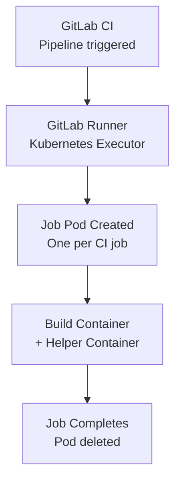

# How to Deploy GitLab Runners on Kubernetes with OpenTofu

Author: [nawazdhandala](https://www.github.com/nawazdhandala)

Tags: OpenTofu, GitLab, CI/CD, Kubernetes, Runner, Helm, Auto Scaling, Infrastructure as Code

Description: Learn how to deploy GitLab Runner on Kubernetes using the Helm chart with OpenTofu, enabling elastic CI/CD scaling with Kubernetes executor for isolated, ephemeral job pods.

---

GitLab Runner with the Kubernetes executor creates a new pod for each CI job and deletes it when complete. OpenTofu deploys the runner via Helm and can configure pod templates, resource limits, and optional horizontal scaling for the runner manager.

## Architecture



## GitLab Runner Helm Deployment

```hcl
# gitlab_runner.tf

resource "kubernetes_namespace" "gitlab_runner" {
  metadata {
    name = "gitlab-runner"
    labels = {
      "app.kubernetes.io/managed-by" = "opentofu"
    }
  }
}

# Store runner authentication token as Kubernetes secret
resource "kubernetes_secret" "runner_token" {
  metadata {
    name      = "gitlab-runner-secret"
    namespace = kubernetes_namespace.gitlab_runner.metadata[0].name
  }

  # Keep runner-registration-token present but empty for chart compatibility.
  data = {
    runner-registration-token = ""
    runner-token              = var.gitlab_runner_token
  }
}

resource "helm_release" "gitlab_runner" {
  name       = "gitlab-runner"
  namespace  = kubernetes_namespace.gitlab_runner.metadata[0].name
  repository = "https://charts.gitlab.io"
  chart      = "gitlab-runner"
  version    = "0.62.0"

  values = [
    yamlencode({
      gitlabUrl = var.gitlab_url

      rbac = {
        create             = false
        serviceAccountName = kubernetes_service_account.runner.metadata[0].name
      }

      concurrent = var.concurrent_jobs  # Max parallel jobs

      runners = {
        name   = "${var.cluster_name}-runner"
        secret = kubernetes_secret.runner_token.metadata[0].name

        config = <<-EOT
          [[runners]]
            [runners.kubernetes]
              namespace = "${kubernetes_namespace.gitlab_runner.metadata[0].name}"
              image = "ubuntu:22.04"

              # CPU and memory for the build containers
              cpu_request = "500m"
              cpu_limit = "2000m"
              memory_request = "512Mi"
              memory_limit = "2Gi"

              # Service account for runners (for IRSA/Workload Identity)
              service_account = "${kubernetes_service_account.runner.metadata[0].name}"

              # Poll interval
              poll_interval = 5
              poll_timeout = 180

              # Run jobs on dedicated CI nodes
              [runners.kubernetes.node_selector]
                "node-role" = "ci-runner"

              [runners.kubernetes.node_tolerations]
                "dedicated=ci-runners" = "NoSchedule"

            [runners.cache]
              Type = "s3"
              Shared = true

              [runners.cache.s3]
                ServerAddress = "s3.amazonaws.com"
                BucketName = "${var.cache_bucket_name}"
                BucketLocation = "${var.aws_region}"
                AuthenticationType = "iam"
        EOT
      }

      resources = {
        requests = { cpu = "100m", memory = "128Mi" }
        limits   = { cpu = "500m", memory = "512Mi" }
      }

      # Metrics for Prometheus
      metrics = {
        enabled = true
      }
    })
  ]
}
```

## Service Account with IRSA

```hcl
# service_account.tf
resource "kubernetes_service_account" "runner" {
  metadata {
    name      = "gitlab-runner"
    namespace = kubernetes_namespace.gitlab_runner.metadata[0].name

    annotations = {
      # IRSA annotation for AWS - runner pods can access AWS services
      "eks.amazonaws.com/role-arn" = aws_iam_role.runner.arn
    }
  }
}

resource "kubernetes_role" "runner" {
  metadata {
    name      = "gitlab-runner"
    namespace = kubernetes_namespace.gitlab_runner.metadata[0].name
  }

  rule {
    api_groups = [""]
    resources  = ["configmaps", "events", "pods", "pods/attach", "pods/exec", "secrets", "services"]
    verbs      = ["get", "list", "watch", "create", "patch", "update", "delete"]
  }

  rule {
    api_groups = [""]
    resources  = ["pods/log"]
    verbs      = ["get"]
  }
}

resource "kubernetes_role_binding" "runner" {
  metadata {
    name      = "gitlab-runner"
    namespace = kubernetes_namespace.gitlab_runner.metadata[0].name
  }

  role_ref {
    api_group = "rbac.authorization.k8s.io"
    kind      = "Role"
    name      = kubernetes_role.runner.metadata[0].name
  }

  subject {
    kind      = "ServiceAccount"
    name      = kubernetes_service_account.runner.metadata[0].name
    namespace = kubernetes_namespace.gitlab_runner.metadata[0].name
  }
}
```

## Custom Pod Templates

```hcl
# Example config to pass to runners.config for container image builds with Kaniko
locals {
  runner_config = <<-EOT
    [[runners]]
      [runners.kubernetes]
        namespace = "gitlab-runner"
        image = "ubuntu:22.04"

      [[runners.kubernetes.volumes.empty_dir]]
        name = "kaniko-workspace"
        mount_path = "/kaniko"

      [runners.kubernetes.pod_annotations]
        "cluster-autoscaler.kubernetes.io/safe-to-evict" = "false"
  EOT
}
```

## Horizontal Pod Autoscaler for Runner Manager

```hcl
# Requires a metrics adapter that exposes this metric through external.metrics.k8s.io
resource "kubernetes_horizontal_pod_autoscaler_v2" "runner" {
  metadata {
    name      = "gitlab-runner"
    namespace = kubernetes_namespace.gitlab_runner.metadata[0].name
  }

  spec {
    scale_target_ref {
      api_version = "apps/v1"
      kind        = "Deployment"
      name        = "gitlab-runner"
    }

    min_replicas = 1
    max_replicas = 5

    metric {
      type = "External"
      external {
        metric {
          name = "gitlab_runner_jobs"
        }
        target {
          type               = "AverageValue"
          average_value      = "10"
        }
      }
    }
  }
}
```

## Best Practices

- Use the Kubernetes executor instead of Docker+Machine on Kubernetes - it creates native pods with proper resource limits and scheduling constraints.
- Configure node selectors and tolerations for dedicated CI nodes - runner jobs consume bursty resources and shouldn't compete with production workloads.
- Use IRSA (on EKS) or Workload Identity (on GKE) to give runner pods AWS/GCP access without static credentials.
- Enable S3 cache sharing - shared caches dramatically reduce build times by sharing dependency caches across all runner pods.
- Set `concurrent` to match the maximum number of jobs your cluster can handle - without this limit, GitLab Runner will accept more jobs than the cluster can schedule.
