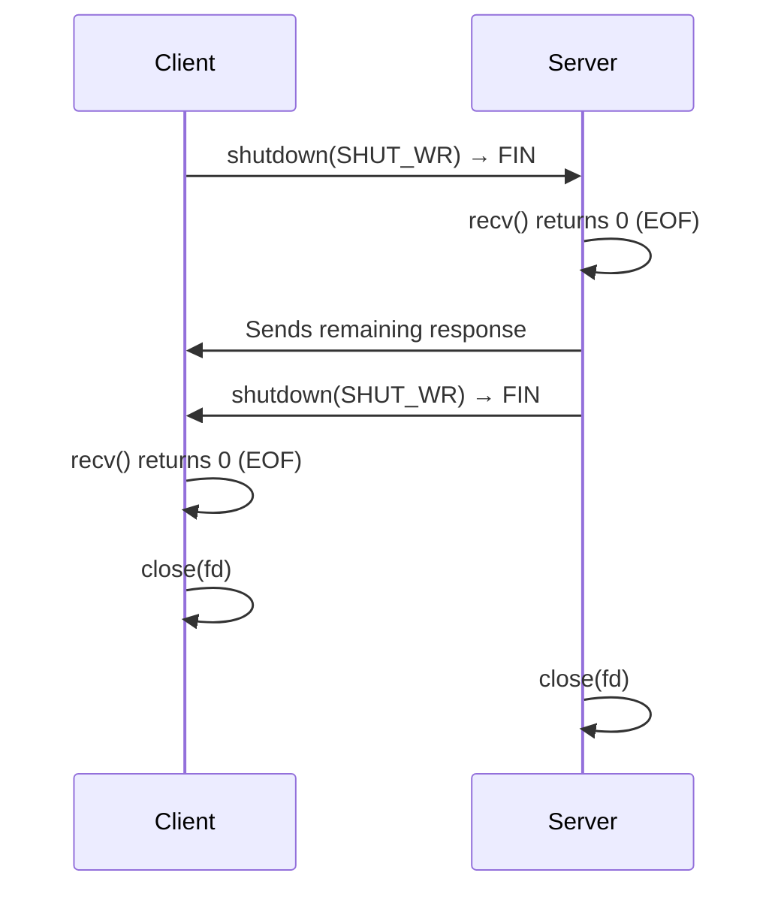

# How to Handle Graceful Socket Shutdown and Close in C

Author: [nawazdhandala](https://www.github.com/nawazdhandala)

Tags: C, IPv4, TCP, Socket, Shutdown, POSIX, Networking

Description: Learn how to gracefully shut down IPv4 TCP sockets in C using shutdown() and close(), control half-close, drain in-flight data, and handle SO_LINGER for controlled closure.

## shutdown() vs close()

| Function | Effect |
|----------|--------|
| `close(fd)` | Decrements ref count; socket destroyed only when count reaches 0 |
| `shutdown(fd, SHUT_WR)` | Disallow further sends; for TCP, queued data is sent and then the peer sees EOF |
| `shutdown(fd, SHUT_RD)` | Disallow further receives on this socket |
| `shutdown(fd, SHUT_RDWR)` | Disallow both sends and receives; the file descriptor still must be closed |

```c
#include <sys/socket.h>
#include <unistd.h>

/* Graceful half-close: signal end of writes, wait for peer to finish */
void half_close(int fd) {
    /* Stop sending - for TCP, the peer sees EOF after queued data is read */
    shutdown(fd, SHUT_WR);

    /* Drain any remaining data the peer may still send */
    char drain[4096];
    while (recv(fd, drain, sizeof(drain), 0) > 0)
        ;   /* discard */

    /* Now safe to fully close */
    close(fd);
}
```

## Graceful Client Shutdown

```c
#include <errno.h>
#include <stdio.h>
#include <string.h>
#include <unistd.h>
#include <sys/socket.h>
#include <arpa/inet.h>

static int send_all(int fd, const void *buf, size_t len) {
    const char *p = buf;

    while (len > 0) {
        ssize_t sent = send(fd, p, len, 0);
        if (sent < 0) {
            if (errno == EINTR)
                continue;
            return -1;
        }
        p += sent;
        len -= (size_t)sent;
    }

    return 0;
}

void graceful_client(void) {
    int fd = socket(AF_INET, SOCK_STREAM, 0);

    struct sockaddr_in addr = {0};
    addr.sin_family = AF_INET;
    addr.sin_port   = htons(9000);
    inet_pton(AF_INET, "127.0.0.1", &addr.sin_addr);
    connect(fd, (struct sockaddr *)&addr, sizeof(addr));

    const char *req = "GET / HTTP/1.0\r\nHost: localhost\r\n\r\n";
    if (send_all(fd, req, strlen(req)) == -1) {
        close(fd);
        return;
    }

    /* Signal that we are done writing; server sees EOF on its recv */
    shutdown(fd, SHUT_WR);

    /* Read the server response until it also closes */
    char buf[4096];
    ssize_t n;
    while ((n = recv(fd, buf, sizeof(buf), 0)) > 0) {
        fwrite(buf, 1, (size_t)n, stdout);
    }

    close(fd);
}
```

## Graceful Server Handler

```c
#include <errno.h>
#include <string.h>
#include <unistd.h>
#include <sys/socket.h>

static int send_all(int fd, const void *buf, size_t len) {
    const char *p = buf;

    while (len > 0) {
        ssize_t sent = send(fd, p, len, 0);
        if (sent < 0) {
            if (errno == EINTR)
                continue;
            return -1;
        }
        p += sent;
        len -= (size_t)sent;
    }

    return 0;
}

void handle_client(int client_fd) {
    char buf[4096];
    ssize_t n;

    /* Echo loop: recv until client signals EOF (n == 0) */
    while ((n = recv(client_fd, buf, sizeof(buf), 0)) > 0) {
        if (send_all(client_fd, buf, (size_t)n) == -1)
            break;
    }

    /* Client sent SHUT_WR or called close() - now shut down our write side */
    shutdown(client_fd, SHUT_WR);

    /* Release the descriptor; queued TCP data is handled by the OS */
    close(client_fd);
}
```

## SO_LINGER - Wait for Data to Flush on close()

```c
#include <sys/socket.h>
#include <unistd.h>

/* By default, close() returns immediately and the OS handles the close in the background.
   SO_LINGER can make close() wait until queued data is sent or the timeout expires. */
void set_linger(int fd, int timeout_sec) {
    struct linger sl;
    sl.l_onoff  = 1;           /* enable linger */
    sl.l_linger = timeout_sec; /* wait up to timeout_sec for queued data */
    setsockopt(fd, SOL_SOCKET, SO_LINGER, &sl, sizeof(sl));
}

/* On TCP, l_linger = 0 makes close() abort the connection (hard close) */
void hard_close(int fd) {
    struct linger sl = { .l_onoff = 1, .l_linger = 0 };
    setsockopt(fd, SOL_SOCKET, SO_LINGER, &sl, sizeof(sl));
    close(fd);   /* abortive close; queued data may be lost */
}
```

## Signal-Based Server Shutdown

```c
#define _POSIX_C_SOURCE 200809L
#include <errno.h>
#include <signal.h>
#include <stdio.h>
#include <sys/socket.h>
#include <unistd.h>

static volatile sig_atomic_t g_running = 1;
static int                   g_server_fd;
void handle_client(int client_fd);

/* Signal handler only sets a flag; accept() can return EINTR if SA_RESTART is not used */
void handle_signal(int sig) {
    (void)sig;
    g_running = 0;
}

int main(void) {
    struct sigaction sa = {0};
    sa.sa_handler = handle_signal;
    sigemptyset(&sa.sa_mask);
    sa.sa_flags = 0; /* no SA_RESTART */

    sigaction(SIGTERM, &sa, NULL);
    sigaction(SIGINT,  &sa, NULL);

    /* ... socket(), bind(), listen() ... */

    while (g_running) {
        int client_fd = accept(g_server_fd, NULL, NULL);
        if (client_fd < 0) {
            if (errno == EINTR && !g_running)
                break;
            continue;
        }
        handle_client(client_fd);
    }

    printf("Server shutting down...\n");
    close(g_server_fd);
    return 0;
}
```

## Shutdown Flow Diagram



## Conclusion

Use `shutdown(fd, SHUT_WR)` to begin a TCP half-close: after queued data is sent, the peer eventually sees EOF on `recv()`. After `shutdown(SHUT_WR)`, continue reading until the peer closes its write side, then call `close()` to release the file descriptor. Use `close()` alone when you are done with the socket entirely and do not need a half-close. Set `SO_LINGER` with `l_linger > 0` when you need `close()` to wait for queued data to be sent. Set `SO_LINGER` with `l_linger = 0` to perform an abortive TCP close that may send a RST and drop queued data.
