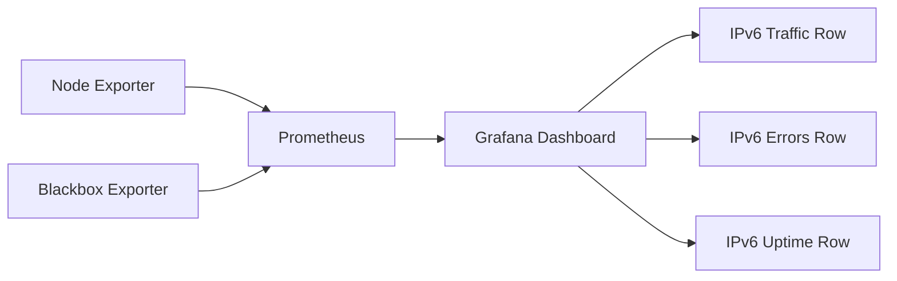

# How to Create Grafana Dashboards for IPv6 Traffic

Author: [nawazdhandala](https://www.github.com/nawazdhandala)

Tags: Grafana, IPv6, Dashboard, Prometheus, Monitoring, Visualization

Description: A guide to building Grafana dashboards that visualize IPv6 traffic metrics from Prometheus, including throughput, packet rates, and error tracking.

Grafana dashboards make IPv6 traffic metrics actionable by providing visual context for throughput trends, error spikes, and comparative IPv4/IPv6 analysis. This guide walks through building a practical IPv6 network dashboard.

## Dashboard Architecture



## Step 1: Create the Dashboard via Grafana HTTP API

```bash
# Create dashboard via Grafana API

curl -X POST http://localhost:3000/apis/dashboard.grafana.app/v1/namespaces/default/dashboards \
  -H "Authorization: Bearer $GRAFANA_TOKEN" \
  -H "Content-Type: application/json" \
  -d @ipv6-dashboard.json
```

## Step 2: Key Panels and Queries

### Panel 1: IPv6 Inbound Traffic Rate

```json
{
  "title": "IPv6 Inbound Traffic (bytes/sec)",
  "type": "timeseries",
  "targets": [
    {
      "expr": "rate(node_netstat_Ip6_InOctets{instance=~\"$instance\"}[$__rate_interval])",
      "legendFormat": "{{instance}} - IPv6 In"
    },
    {
      "expr": "rate(node_netstat_IpExt_InOctets{instance=~\"$instance\"}[$__rate_interval])",
      "legendFormat": "{{instance}} - IPv4 In"
    }
  ]
}
```

### Panel 2: IPv6 vs IPv4 Traffic Share (Pie Chart)

```promql
# PromQL for IPv6 proportion of total traffic
sum(rate(node_netstat_Ip6_InOctets{instance=~"$instance"}[$__rate_interval]))
/
(sum(rate(node_netstat_Ip6_InOctets{instance=~"$instance"}[$__rate_interval])) + sum(rate(node_netstat_IpExt_InOctets{instance=~"$instance"}[$__rate_interval])))
* 100
```

### Panel 3: ICMPv6 Traffic and Errors

```promql
# ICMPv6 inbound message rate
rate(node_netstat_Icmp6_InMsgs{instance=~"$instance"}[$__rate_interval])

# ICMPv6 error rate (should be low)
rate(node_netstat_Icmp6_InErrors{instance=~"$instance"}[$__rate_interval])
```

### Panel 4: IPv6 Uptime Probe (from Blackbox Exporter)

Configure the Blackbox Exporter module with `preferred_ip_protocol: "ip6"` and `ip_protocol_fallback: false` so the probe stays IPv6-only.

```promql
# IPv6 endpoint availability
probe_success{job="blackbox-http-ipv6"}

# IPv6 probe duration
probe_duration_seconds{job="blackbox-http-ipv6"}
```

## Step 3: Complete Dashboard JSON (Excerpt)

```json
{
  "metadata": {
    "name": "ipv6-network-monitoring"
  },
  "spec": {
    "title": "IPv6 Network Monitoring",
    "tags": ["ipv6", "networking"],
    "timezone": "browser",
    "templating": {
      "list": [
        {
          "name": "instance",
          "type": "query",
          "query": "label_values(node_netstat_Ip6_InOctets, instance)",
          "multi": true,
          "includeAll": true
        }
      ]
    },
    "panels": [
      {
        "title": "IPv6 Packet Receive Rate",
        "type": "timeseries",
        "gridPos": {"h": 8, "w": 12, "x": 0, "y": 0},
        "targets": [
          {
            "expr": "rate(node_netstat_Ip6_InOctets{instance=~\"$instance\"}[$__rate_interval])",
            "legendFormat": "{{instance}}"
          }
        ]
      },
      {
        "title": "ICMPv6 Inbound Errors",
        "type": "timeseries",
        "gridPos": {"h": 8, "w": 12, "x": 12, "y": 0},
        "targets": [
          {
            "expr": "rate(node_netstat_Icmp6_InErrors{instance=~\"$instance\"}[$__rate_interval])",
            "legendFormat": "{{instance}} errors"
          }
        ]
      }
    ]
  }
}
```

In current Grafana versions, create alert rules separately in Grafana Alerting instead of embedding an `alert` block in panel JSON.

## Step 4: Import a Community Dashboard as a Starting Point

Grafana.com includes community dashboards you can use as a starting point. For example, import dashboard ID 1860 (Node Exporter Full) through **Dashboards > New > Import**, then add the IPv6-specific panels from this guide.

## Step 5: Create an IPv6 Adoption Tracking Panel

```promql
# Track what percentage of your servers have seen IPv6 traffic since boot
count(node_netstat_Ip6_InOctets > 0)
/
count(node_uname_info)
* 100
```

Grafana IPv6 dashboards provide immediate visual insight into the health and adoption rate of IPv6 across your infrastructure, making it easy to spot routing issues, traffic anomalies, and service unavailability.
