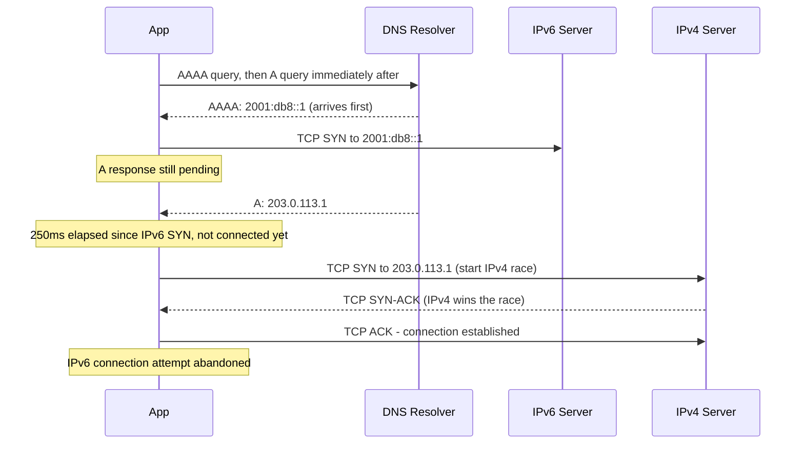

# How to Understand Happy Eyeballs Algorithm (RFC 8305)

Author: [nawazdhandala](https://www.github.com/nawazdhandala)

Tags: IPv6, Happy Eyeballs, RFC 8305, Dual-Stack, Client Networking

Description: A detailed explanation of the Happy Eyeballs v2 algorithm (RFC 8305) that enables dual-stack clients to prefer IPv6 while gracefully falling back to IPv4 without user-visible delays.

## What Is Happy Eyeballs?

Happy Eyeballs (named because it keeps the "eyes" - user experience - happy) is a connection establishment algorithm for dual-stack clients. Defined in RFC 8305, it allows clients to start IPv6 and IPv4 connection attempts with short delays between them and use whichever succeeds first, with a slight preference for IPv6.

Without Happy Eyeballs, a broken IPv6 path could cause long connection timeouts before falling back to IPv4 - an unacceptable user experience.

## The Problem It Solves

When a client has both A and AAAA records for a hostname:
- **Old behavior**: Try IPv6, wait for a long timeout, then try IPv4
- **Happy Eyeballs**: Start staggered IPv6/IPv4 attempts, use the first success

## Happy Eyeballs v2 Algorithm (RFC 8305)



## Key Algorithm Parameters

**Resolution Delay**: When an A response arrives before AAAA, wait a short time (50ms recommended) for the AAAA response. This gives IPv6 a chance to be tried first.

**Connection Attempt Delay**: After starting the first connection attempt, wait **250ms** (the "Happy Eyeballs Delay") before starting the next attempt if the first has not connected yet.

**Address Sorting**: RFC 8305 first applies RFC 6724 destination address selection, then interleaves IPv6 and IPv4 candidates so one family does not monopolize the attempt order. The recommended **First Address Family Count** is 1.

## Practical Example: curl with Happy Eyeballs

```bash
# curl implements Happy Eyeballs by default when built with IPv6 support

# Watch which address is used for connection
curl -v https://example.com 2>&1 | grep -E "Trying|Connected"

# Force IPv6 only (disable Happy Eyeballs fallback)
curl -6 https://example.com

# Force IPv4 only
curl -4 https://example.com

# Show timing information to see connection delays
curl -w "namelookup=%{time_namelookup}s connect=%{time_connect}s remote_ip=%{remote_ip}\n" -o /dev/null -s https://example.com
```

## Happy Eyeballs in Node.js

Node.js exposes automatic network family selection in the `net` module, which `http` and `https` can use through their connection options:

```javascript
// Node.js request options support socket.connect() options.
// autoSelectFamily loosely implements section 5 of RFC 8305.

const http = require('node:http');

http.get({
    host: 'example.com',
    autoSelectFamily: true,
    autoSelectFamilyAttemptTimeout: 250
}, (res) => {
    console.log(`Connected via: ${res.socket.remoteFamily}`);
    console.log(`Remote address: ${res.socket.remoteAddress}`);
    res.destroy();
});
```

## Happy Eyeballs in Python

Python's `asyncio` module supports Happy Eyeballs since Python 3.8:

```python
import asyncio

async def connect_happy_eyeballs(host, port):
    """Connect using Happy Eyeballs - prefers IPv6, falls back to IPv4"""

    # Python asyncio implements RFC 8305 Happy Eyeballs
    # create_connection starts the next address attempt after a short delay
    reader, writer = await asyncio.open_connection(
        host,
        port,
        # happy_eyeballs_delay is the 250ms delay before starting the next attempt
        happy_eyeballs_delay=0.25  # 250ms delay (RFC 8305 recommendation)
    )

    # Print which address family was used
    sock = writer.get_extra_info('socket')
    print(f"Connected via: {sock.family.name}")
    print(f"Remote address: {writer.get_extra_info('peername')}")
    writer.close()
    await writer.wait_closed()

asyncio.run(connect_happy_eyeballs('example.com', 80))
```

## Monitoring Happy Eyeballs Behavior

```bash
# Use strace to see socket/connect system calls during connection establishment
strace -e trace=connect,socket curl https://example.com 2>&1

# Use tcpdump to observe which protocol wins
tcpdump -n -i eth0 'host example.com' &
curl https://example.com
fg  # then Ctrl+C

# Check if IPv6 or IPv4 was used
curl -w "%{remote_ip}\n" -o /dev/null -s https://example.com
```

## When Happy Eyeballs Fails to Help

Happy Eyeballs cannot help when:
1. **IPv6 black hole**: SYN sent, no response, connection appears to hang for 250ms+ before IPv4 wins
2. **Very slow DNS**: AAAA query takes >1 second (longer than Happy Eyeballs delay)
3. **Application not implementing HE**: Older apps may still do sequential fallback

## Summary

Happy Eyeballs (RFC 8305) improves dual-stack connection reliability by using staggered IPv6/IPv4 connection attempts, usually giving IPv6 a short head start. It is implemented in curl builds with IPv6 support, Python asyncio, Go's net package, and recent Node.js releases through automatic network family selection. Understanding Happy Eyeballs explains why dual-stack deployments are safe from a user experience perspective even when some IPv6 paths are broken.
