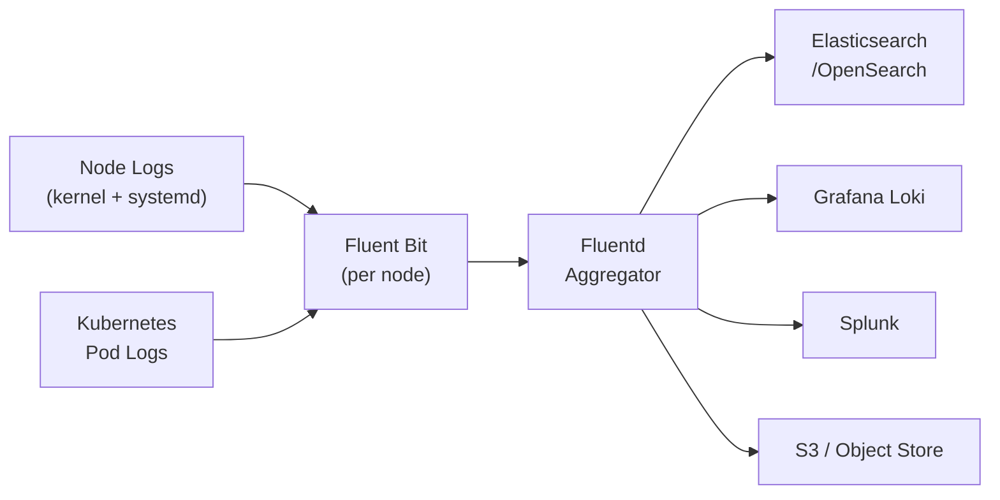

# How to Configure Harvester Logging

Author: [nawazdhandala](https://www.github.com/nawazdhandala)

Tags: Harvester, Kubernetes, Virtualization, HCI, Logging, Observability

Description: Learn how to configure centralized logging in Harvester to collect, aggregate, and forward logs from cluster components and virtual machines.

## Introduction

Centralized logging in Harvester enables you to collect logs from cluster Pods, node kernel logs, and select systemd services in one place for troubleshooting, auditing, and compliance. Harvester supports log forwarding through its integrated logging subsystem built on Logging Operator, which can send logs to various backends including Elasticsearch, Loki, Splunk, and other supported Fluentd outputs.

## Logging Architecture



## Step 1: Enable Logging in Harvester

### Via the UI

1. Navigate to **Advanced** → **Add-ons**
2. Find **rancher-logging** and click **Enable**
3. Wait until the add-on state is `DeploySuccessful`

### Via kubectl

```bash
# Enable the rancher-logging add-on

kubectl patch addons.harvesterhci.io rancher-logging \
  -n cattle-logging-system \
  --type merge \
  -p '{"spec":{"enabled":true}}'

# Verify the add-on is enabled
kubectl get addons.harvesterhci.io rancher-logging \
  -n cattle-logging-system \
  -o jsonpath='{.spec.enabled}{"\n"}'

# Verify logging pods are running
kubectl get pods -n cattle-logging-system
```

## Step 2: Configure Log Output to Elasticsearch

### Create an Elasticsearch ClusterOutput

```yaml
# elasticsearch-output.yaml
# Forward all cluster logs to Elasticsearch

apiVersion: logging.banzaicloud.io/v1beta1
kind: ClusterOutput
metadata:
  name: elasticsearch-output
  namespace: cattle-logging-system
spec:
  elasticsearch:
    # Elasticsearch cluster URL
    host: elasticsearch.monitoring.svc.cluster.local
    port: 9200
    # Index naming (adds date suffix for log rotation)
    logstash_format: true
    logstash_prefix: harvester
    # Buffer configuration for reliable delivery
    buffer:
      timekey: 1m
      timekey_wait: 30s
      timekey_use_utc: true
      flush_interval: 60s
      chunk_limit_size: 10MB
      total_limit_size: 10GB
      retry_max_interval: 30s
      retry_forever: true
    # For secured Elasticsearch:
    # scheme: https
    # ssl_verify: true
    # user: elastic
    # password:
    #   valueFrom:
    #     secretKeyRef:
    #       name: elasticsearch-credentials
    #       key: password
    # ca_file:
    #   mountFrom:
    #     secretKeyRef:
    #       name: elasticsearch-ca
    #       key: ca.crt
    # ssl_version: TLSv1_2
```

```bash
kubectl apply -f elasticsearch-output.yaml

# Verify the output was created
kubectl get clusteroutput -n cattle-logging-system
```

## Step 3: Configure Log Output to Grafana Loki

```yaml
# loki-output.yaml
# Forward logs to Grafana Loki for integration with Grafana dashboards

apiVersion: logging.banzaicloud.io/v1beta1
kind: ClusterOutput
metadata:
  name: loki-output
  namespace: cattle-logging-system
spec:
  loki:
    # Loki endpoint URL
    url: http://loki.monitoring.svc.cluster.local:3100
    # Labels to add to all log entries
    extra_labels:
      cluster: harvester-prod
      environment: production
    # Remove unneeded record keys before sending to Loki
    remove_keys:
      - kubernetes_namespace_labels
    buffer:
      timekey: 1m
      timekey_wait: 30s
      timekey_use_utc: true
      flush_interval: 30s
      chunk_limit_size: 5MB
```

```bash
kubectl apply -f loki-output.yaml
```

## Step 4: Create a ClusterFlow to Route Logs

A ClusterFlow defines which collected logs to route and which outputs to send them to:

```yaml
# all-logs-flow.yaml
# Route all collected Harvester logs to the configured outputs

apiVersion: logging.banzaicloud.io/v1beta1
kind: ClusterFlow
metadata:
  name: all-harvester-logs
  namespace: cattle-logging-system
spec:
  # Match all logs (can be filtered)
  match:
    - select: {}  # Select all logs
  # Apply filters
  filters:
    # Normalise tags before sending to the outputs
    - tag_normaliser: {}
    # Remove noisy health-check logs
    - grep:
        exclude:
          - key: message
            pattern: "health check"
    # Parse structured JSON logs when present
    - parser:
        remove_key_name_field: true
        reserve_data: true
        parse:
          type: multi_format
          patterns:
            - format: json
            - format: none
  # Send to outputs
  globalOutputRefs:
    - elasticsearch-output
    - loki-output
```

```bash
kubectl apply -f all-logs-flow.yaml
```

## Step 5: Configure Application-Specific Log Flows

For targeted log routing per namespace or application:

```yaml
# workload-logs-flow.yaml
# Collect logs specifically from workloads in the production namespace

apiVersion: logging.banzaicloud.io/v1beta1
kind: Flow
metadata:
  name: production-workload-logs
  namespace: production
spec:
  # Match pods labeled environment=production in the production namespace
  match:
    - select:
        labels:
          environment: production
  filters:
    # Add static fields for downstream routing
    - record_transformer:
        records:
          - cluster: harvester-prod
          - log_type: application
  # Output reference (must be in same namespace, or use ClusterOutput)
  globalOutputRefs:
    - elasticsearch-output
```

## Step 6: Configure Node-Level Log Routing

Harvester already collects kernel logs and select systemd service logs from each node. You can route logs from specific Harvester nodes with a ClusterFlow:

```yaml
# node-logs-flow.yaml
# Route logs from specific Harvester nodes

apiVersion: logging.banzaicloud.io/v1beta1
kind: ClusterFlow
metadata:
  name: node-logs
  namespace: cattle-logging-system
spec:
  match:
    - select:
        hosts:
          - harvester-node-1
          - harvester-node-2
  filters:
    # Add fields to identify node-scoped routes downstream
    - record_transformer:
        records:
          - log_type: node
          - cluster: harvester-prod
  globalOutputRefs:
    - elasticsearch-output
```

## Step 7: Configure Log Retention and Rotation

```yaml
# log-retention.yaml
# Example Elasticsearch ILM policy for log retention
# Also attach the policy to an index template or data stream that matches your harvester-* indices.

# Apply this in Elasticsearch (Kibana Dev Tools or API):
# PUT _ilm/policy/harvester-logs-policy
# {
#   "policy": {
#     "phases": {
#       "hot": {
#         "actions": {
#           "rollover": {
#             "max_size": "10gb",
#             "max_age": "1d"
#           }
#         }
#       },
#       "delete": {
#         "min_age": "30d",
#         "actions": {
#           "delete": {}
#         }
#       }
#     }
#   }
# }
```

## Step 8: Verify Log Collection

```bash
# Check that logging pods are running
kubectl get pods -n cattle-logging-system

# Check a Fluentd pod for any forwarding errors
kubectl logs -n cattle-logging-system \
    $(kubectl get pods -n cattle-logging-system -o name | grep fluentd | head -1) \
    --tail=50

# Verify ClusterFlows are active
kubectl get clusterflow -n cattle-logging-system

# Inspect ClusterOutput status
kubectl get clusteroutput elasticsearch-output -n cattle-logging-system -o yaml
kubectl get clusteroutput loki-output -n cattle-logging-system -o yaml

# Test by creating a log entry and checking Elasticsearch/Loki
kubectl run test-logger -n default --image=busybox --restart=Never --rm -it -- \
    sh -c 'for i in $(seq 1 10); do echo "Test log entry $i from Harvester"; sleep 1; done'
```

## Step 9: Forwarding to External Syslog

For legacy systems or compliance requirements, forward logs to a remote syslog endpoint:

```yaml
# syslog-output.yaml
apiVersion: logging.banzaicloud.io/v1beta1
kind: ClusterOutput
metadata:
  name: syslog-output
  namespace: cattle-logging-system
spec:
  syslog:
    host: syslog.company.com
    port: 6514
    transport: tls
    version: TLSv1_2
    # Provide CA and client credentials from Kubernetes secrets when required
    # trusted_ca_path:
    #   mountFrom:
    #     secretKeyRef:
    #       name: syslog-tls
    #       key: ca.crt
    # client_cert_path:
    #   mountFrom:
    #     secretKeyRef:
    #       name: syslog-tls
    #       key: tls.crt
    # private_key_path:
    #   mountFrom:
    #     secretKeyRef:
    #       name: syslog-tls
    #       key: tls.key
    buffer:
      timekey: 1m
      timekey_wait: 30s
      timekey_use_utc: true
```

## Conclusion

Centralized logging transforms Harvester from a collection of nodes and workloads into an observable system where you can trace issues across components, audit access, and prove compliance. By routing logs to Elasticsearch or Loki for real-time search and analysis, and configuring retention policies in your backend, you build a comprehensive audit trail. The Logging Operator-based pipeline in Harvester provides flexible routing and filtering so you can send different types of collected cluster logs to different backends based on your organization's requirements.
