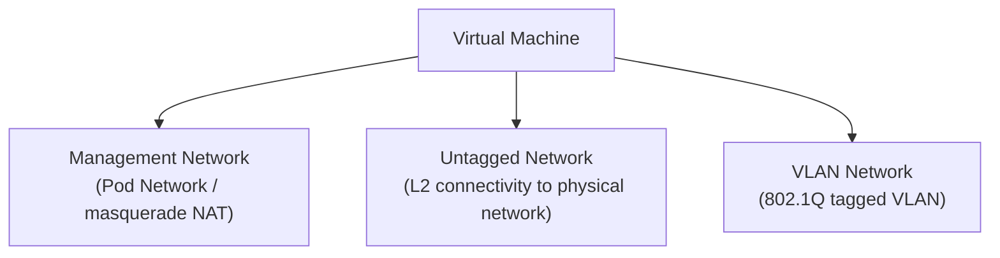

# How to Configure VM Networks in Harvester

Author: [nawazdhandala](https://www.github.com/nawazdhandala)

Tags: Harvester, Kubernetes, Virtualization, HCI, Networking, Multus

Description: A comprehensive guide to configuring virtual machine networks in Harvester using Multus CNI, bridge networks, and VLAN configurations.

## Introduction

Networking in Harvester combines the built-in management network with Multus-managed VM networks, which allows VMs to connect to multiple networks simultaneously. VMs can have a management network interface (handled by the Kubernetes pod network) and one or more additional interfaces connected to untagged or VLAN-backed networks. Understanding Harvester's network model is essential for designing VM connectivity that meets your workload requirements.

## Harvester Network Types

This guide focuses on three common Harvester VM network types:



| Network Type | Use Case | IP Assignment |
|---|---|---|
| Management (pod) | In-cluster access, initial setup, egress via pod network | NAT via masquerade |
| Untagged | Direct L2 access to physical network | DHCP or static |
| VLAN | Isolated tenant networks | DHCP or static |

## Step 1: Understand the Physical Network Configuration

Before creating VM networks, understand your physical infrastructure:

```bash
# View the current cluster networks
kubectl get clusternetworks

# View network configurations (maps cluster networks to node uplinks)
kubectl get vlanconfigs

# View VM network definitions
kubectl get network-attachment-definitions -A

# Check physical node interfaces
# SSH into a node and run:
ip link show
bridge link show
```

## Step 2: Create a Cluster Network

A custom ClusterNetwork defines the traffic-isolated path for VM traffic. A matching `VlanConfig` binds that cluster network to one or more physical NICs on selected nodes:

```yaml
# cluster-network.yaml
# Defines a custom cluster network for VM traffic

apiVersion: network.harvesterhci.io/v1beta1
kind: ClusterNetwork
metadata:
  name: vlan-network
```

```bash
kubectl apply -f cluster-network.yaml
```

### Configure the Network on Each Node

```yaml
# vlan-config-node-01.yaml
# Binds the cluster network to the physical NIC on a specific node

apiVersion: network.harvesterhci.io/v1beta1
kind: VlanConfig
metadata:
  name: vlan-network-node-01
spec:
  clusterNetwork: vlan-network
  nodeSelector:
    kubernetes.io/hostname: harvester-node-01
  uplink:
    nics:
      - eth1
    bondOptions:
      mode: active-backup
    linkAttributes:
      mtu: 1500
```

```bash
kubectl apply -f vlan-config-node-01.yaml
```

## Step 3: Create a VM Network (NetworkAttachmentDefinition)

VM Networks are Multus `NetworkAttachmentDefinition` resources:

### Untagged (Bridge) Network

```yaml
# bridge-network.yaml
# Untagged bridge network - VM connects directly to the physical L2 network

apiVersion: "k8s.cni.cncf.io/v1"
kind: NetworkAttachmentDefinition
metadata:
  name: physical-untagged
  namespace: default
  labels:
    network.harvesterhci.io/clusternetwork: vlan-network
    network.harvesterhci.io/type: UntaggedNetwork
  annotations:
    network.harvesterhci.io/route: |
      {
        "mode": "auto",
        "serverIPAddr": "",
        "cidr": "",
        "gateway": ""
      }
spec:
  config: |
    {
      "cniVersion": "0.3.1",
      "name": "physical-untagged",
      "type": "bridge",
      "bridge": "vlan-network-br",
      "promiscMode": true,
      "vlan": 0,
      "ipam": {}
    }
```

```bash
kubectl apply -f bridge-network.yaml
```

### VLAN Network

```yaml
# vlan-100-network.yaml
# VLAN 100 network for application workloads

apiVersion: "k8s.cni.cncf.io/v1"
kind: NetworkAttachmentDefinition
metadata:
  name: vlan-100
  namespace: default
  labels:
    network.harvesterhci.io/clusternetwork: vlan-network
    network.harvesterhci.io/type: L2VlanNetwork
  annotations:
    network.harvesterhci.io/route: |
      {
        "mode": "auto",
        "serverIPAddr": "",
        "cidr": "",
        "gateway": ""
      }
spec:
  config: |
    {
      "cniVersion": "0.3.1",
      "name": "vlan-100",
      "type": "bridge",
      "bridge": "vlan-network-br",
      "promiscMode": true,
      "vlan": 100,
      "ipam": {}
    }
```

```bash
kubectl apply -f vlan-100-network.yaml
```

## Step 4: Create a VM Network via the UI

1. Navigate to **Networks** → **VM Networks**
2. Click **Create**
3. Fill in:
   - **Name**: `vlan-100`
   - **Namespace**: `default`
   - **Type**: `L2VlanNetwork`
   - **Mode**: `Access`
   - **Cluster Network**: select `vlan-network`
   - **VLAN ID**: `100`
4. Click **Create**

## Step 5: Attach a Network to a VM

### Via the UI

When creating or editing a VM:
1. Go to the **Networks** tab
2. Click **Add Network**
3. Select the network from the dropdown
4. Configure the MAC address (optional - auto-generated if left blank)

### Via kubectl

```yaml
# vm-with-networks.yaml
# VM with management network + VLAN network

apiVersion: kubevirt.io/v1
kind: VirtualMachine
metadata:
  name: app-server-01
  namespace: default
spec:
  running: true
  template:
    spec:
      domain:
        cpu:
          cores: 4
        resources:
          requests:
            memory: 8Gi
        machine:
          type: q35
        devices:
          disks:
            - name: rootdisk
              disk:
                bus: virtio
            - name: cloudinit
              disk:
                bus: virtio
          interfaces:
            # Primary interface - management network (NAT)
            - name: default
              model: virtio
              masquerade: {}
            # Secondary interface - VLAN 100 (bridge)
            - name: vlan100
              model: virtio
              bridge: {}
      # Network definitions must match interfaces
      networks:
        - name: default
          pod: {}
        - name: vlan100
          multus:
            # References the NetworkAttachmentDefinition
            networkName: default/vlan-100
      volumes:
        - name: rootdisk
          persistentVolumeClaim:
            claimName: app-server-01-root
        - name: cloudinit
          cloudInitNoCloud:
            userData: |
              #cloud-config
              hostname: app-server-01
```

The secondary interface still needs an IP address from DHCP on VLAN 100 or a static configuration inside the guest OS.

## Step 6: Verify VM Network Connectivity

```bash
# Access the VM console (requires virtctl)
virtctl console app-server-01 -n default

# Inside the VM, check network interfaces
ip addr show
ip route show

# Test connectivity on each network
ping -c 3 8.8.8.8               # Test management NAT
ping -c 3 10.100.0.1             # Test VLAN 100 gateway
```

## Network Troubleshooting

```bash
# Check if NetworkAttachmentDefinition is correctly configured
kubectl get network-attachment-definitions -n default -o yaml

# Check the VM pod's network annotations
kubectl get pod -n default -l vm.kubevirt.io/name=app-server-01 \
    -o jsonpath='{.items[0].metadata.annotations}' | jq .

# Find the Multus pods
kubectl get pods -A | grep -i multus

# Then inspect one of the returned pods
kubectl logs -n <namespace> <multus-pod-name> --tail=50
```

## Conclusion

Harvester's network model combines the Kubernetes-managed management network with Multus-backed VM networks, providing the flexibility to connect VMs to both cluster and physical networks simultaneously. By creating ClusterNetworks and their VlanConfigs for your physical uplinks, and NetworkAttachmentDefinitions for your VM networks, you can design a network topology that meets the isolation, performance, and connectivity requirements of your workloads. The Kubernetes-native approach means network configurations can be version-controlled and deployed through GitOps workflows.
