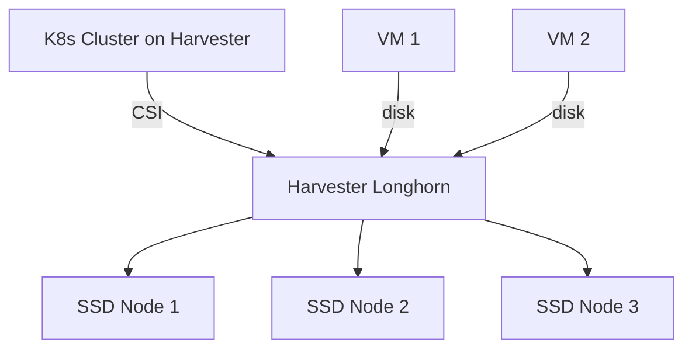

# How to Set Up Harvester Storage for Kubernetes

Author: [nawazdhandala](https://www.github.com/nawazdhandala)

Tags: Harvester, Kubernetes, Storage, Longhorn, CSI, PVC, SUSE Rancher

Description: Learn how to configure Harvester's built-in Longhorn storage for Kubernetes clusters running on Harvester, including StorageClasses, PVC provisioning, and cross-cluster storage access.

---

Harvester uses Longhorn as its built-in storage system. Kubernetes clusters provisioned on Harvester can provision volumes from Harvester's Longhorn-backed storage pool through the Harvester CSI driver, giving VMs and containers access to the same distributed storage pool.

---

## Storage Architecture on Harvester



---

## Option 1: Longhorn on the Guest Cluster

For Kubernetes clusters running on Harvester VMs, install Longhorn directly inside the guest cluster after ensuring the guest cluster meets Longhorn's installation requirements. This gives the cluster its own independent Longhorn instance backed by the guest nodes' disks:

```bash
# In the guest K8s cluster

helm repo add longhorn https://charts.longhorn.io
helm repo update
helm install longhorn longhorn/longhorn \
  --namespace longhorn-system \
  --create-namespace \
  --set defaultSettings.defaultDataPath=/var/lib/longhorn
```

This is the standard approach and provides full isolation between clusters.

---

## Option 2: Using Harvester CSI Driver

Harvester provides a CSI driver that allows guest clusters to provision volumes directly from Harvester's storage pool. This is the preferred approach for Kubernetes clusters managed via Rancher on Harvester.

When you provision an RKE2 cluster through Rancher on Harvester and select the Harvester cloud provider, the CSI driver is deployed automatically. Otherwise, install it from the Rancher marketplace or via Helm.

```bash
# Verify Harvester CSI driver is installed in the guest cluster
kubectl get pods -n kube-system -l app.kubernetes.io/name=harvester-csi-driver

# List available StorageClasses from Harvester
kubectl get storageclasses
```

---

## Step 1: Configure Harvester StorageClass in Guest Cluster

Harvester CSI driver creates a default `harvester` StorageClass in the guest cluster. If you want a guest-cluster StorageClass that maps to a specific host-cluster StorageClass, create one like this:

```yaml
# harvester-sc.yaml
apiVersion: storage.k8s.io/v1
kind: StorageClass
metadata:
  name: harvester-custom
provisioner: driver.harvesterhci.io
allowVolumeExpansion: true
reclaimPolicy: Delete
volumeBindingMode: Immediate
parameters:
  hostStorageClass: harvester-longhorn
```

Replace `harvester-longhorn` with the name of the StorageClass on the host Harvester cluster if you are not using the default.

---

## Step 2: Create a PVC Using Harvester Storage

Assuming the `production` namespace already exists:

```yaml
# test-pvc.yaml
apiVersion: v1
kind: PersistentVolumeClaim
metadata:
  name: app-data
  namespace: production
spec:
  accessModes:
    - ReadWriteOnce
  storageClassName: harvester-custom
  resources:
    requests:
      storage: 20Gi
```

---

## Step 3: Verify Volume Provisioning

```bash
# In the guest cluster, check the PVC is bound
kubectl get pvc app-data -n production

# On the Harvester cluster, inspect the backing Longhorn volume
kubectl get volumes.longhorn.io -n longhorn-system

# Check in Harvester UI: Volumes section should show the new volume
```

---

## Step 4: Configure Snapshot Support

Volume snapshots require Harvester v1.7+ and Harvester CSI Driver v0.1.25+. RKE2 deploys the CSI snapshot controller by default. If you need to create the guest-cluster `VolumeSnapshotClass` manually, use:

```yaml
# harvester-snapshotclass.yaml
apiVersion: snapshot.storage.k8s.io/v1
kind: VolumeSnapshotClass
metadata:
  name: harvester-snapshot
  annotations:
    snapshot.storage.kubernetes.io/is-default-class: "true"
driver: driver.harvesterhci.io
deletionPolicy: Delete
```

---

## Best Practices

- Use Harvester CSI for clusters provisioned by Rancher on Harvester - it integrates volume lifecycle with VM lifecycle.
- For critical production databases, consider running Longhorn inside the guest cluster for additional storage isolation.
- If guest-cluster volumes must remain compatible with VM live migration, enable `Migratable` on the host Harvester StorageClass used by the Harvester CSI driver.
- Back up Harvester storage data separately from your Kubernetes backup strategy.
