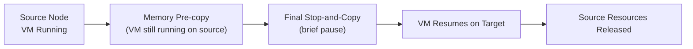

# How to Live Migrate VMs in Harvester

Author: [nawazdhandala](https://www.github.com/nawazdhandala)

Tags: Harvester, Kubernetes, Virtualization, HCI, Live Migration, KubeVirt

Description: A detailed guide to live migrating virtual machines in Harvester with zero downtime, covering prerequisites, configuration, and troubleshooting.

## Introduction

Live migration transfers a running virtual machine from one physical host to another without interrupting the VM's operation. During migration, the VM's memory is copied to the destination node while the VM continues to run. Once the memory copy is nearly complete, the VM briefly pauses (typically milliseconds to seconds), completes the final memory transfer, and resumes on the destination node. This results in zero or near-zero downtime for the VM's workloads.

## How Live Migration Works



The migration process:
1. A migration pod starts on the target node
2. VM memory is pre-copied to the target in iterative rounds while the VM keeps running on the source node
3. When the remaining dirty pages can be transferred during a short switchover window, a final stop-and-copy occurs
4. The VM resumes on the target node
5. Source VM resources are released

## Prerequisites for Live Migration

Live migration requires:
- At least 2 nodes with sufficient resources and compatible CPU settings
- Migratable storage for the VM's disks (for example, Harvester-backed volumes that are not single-replica `ReadWriteOnce`)
- Network connectivity between nodes for memory transfer
- The VM must not have non-migratable devices or volumes such as PCI/vGPU passthrough, SR-IOV interfaces, `CD-ROM` disks, or `Container Disk` volumes

## Step 1: Verify Live Migration Capability

```bash
# Check if a VM is migratable

kubectl get vmi ubuntu-web-01 -n default \
    -o json | jq '.status.conditions[] | select(.type=="LiveMigratable")'

# If .status is "True", the VM can be live migrated
# If .status is "False", inspect .reason and .message for the blocker
```

Common reasons a VM cannot be live migrated:
- Has host devices (PCI passthrough or vGPU)
- Uses SR-IOV interfaces
- Has `CD-ROM`, `Container Disk`, or single-replica `ReadWriteOnce` volumes
- Has node selectors or scheduling rules that only match one node
- Has CPU pinning enabled but CPU Manager is not enabled on enough nodes

## Step 2: Configure Live Migration Bandwidth

Control migration bandwidth to avoid impacting running workloads:

```yaml
# kubevirt-migration-config.yaml
# Configure global migration settings

apiVersion: kubevirt.io/v1
kind: KubeVirt
metadata:
  name: kubevirt
  namespace: harvester-system
spec:
  configuration:
    migrations:
      # Maximum bandwidth for a single migration
      # 64MiB/s is a conservative setting to avoid saturating the network
      bandwidthPerMigration: "64Mi"
      # Maximum number of concurrent migrations per cluster
      parallelMigrationsPerCluster: 5
      # Maximum migrations per node
      parallelOutboundMigrationsPerNode: 2
      # Completion timeout in seconds per GiB of data to migrate
      completionTimeoutPerGiB: 800
      # Abort if migration makes no progress for this many seconds
      progressTimeout: 150
      # Keep post-copy disabled unless you explicitly want that behavior
      allowPostCopy: false
```

```bash
kubectl apply -f kubevirt-migration-config.yaml
```

## Step 3: Perform a Live Migration

### Via the UI

1. Navigate to **Virtual Machines**
2. Find the running VM
3. Click the **⋮** menu → **Migrate**
4. Choose the target node and click **Apply** to start the migration

### Via kubectl

```yaml
# live-migration.yaml
apiVersion: kubevirt.io/v1
kind: VirtualMachineInstanceMigration
metadata:
  name: live-mig-ubuntu-web-01
  namespace: default
spec:
  vmiName: ubuntu-web-01
```

```bash
kubectl apply -f live-migration.yaml

# Track detailed migration progress
kubectl get vmim live-mig-ubuntu-web-01 \
    -n default -o yaml | grep -A 30 "status:"
```

### Using virtctl

```bash
# Migrate using virtctl
virtctl migrate ubuntu-web-01 -n default

# Track the VMI's migration state
kubectl get vmi ubuntu-web-01 -n default \
    -o json | jq '.status.migrationState'
```

## Step 4: Monitor Migration Progress

```bash
# Watch migration objects
watch -n 2 kubectl get vmim -n default

# Get the current migration state from the VMI
kubectl get vmi ubuntu-web-01 -n default \
    -o json | jq '.status.migrationState | {
        mode: .mode,
        startTimestamp: .startTimestamp,
        endTimestamp: .endTimestamp,
        targetNodeAddress: .targetNodeAddress,
        targetNode: .targetNode,
        sourceNode: .sourceNode
    }'

# Watch the migration bandwidth consumption
# SSH into a node and monitor network
sar -n DEV 1 60 | grep eth0
```

## Step 5: Set Up a Dedicated Migration Network

For production clusters, use a dedicated network for migration traffic to avoid impacting VM networking. In Harvester, configure this through the `vm-migration-network` setting instead of editing KubeVirt directly:

```yaml
# vm-migration-network.yaml
# Dedicated migration network configuration in Harvester

apiVersion: harvesterhci.io/v1beta1
kind: Setting
metadata:
  name: vm-migration-network
value: '{"vlan":100,"clusterNetwork":"vm-migration","range":"192.168.1.0/24","exclude":["192.168.1.100/32"]}'
```

```bash
kubectl apply -f vm-migration-network.yaml
```

Harvester creates the required `NetworkAttachmentDefinition` and updates KubeVirt automatically.

```bash
# Verify the setting is configured
kubectl get settings.harvesterhci.io vm-migration-network -o yaml
```

## Step 6: Cancel a Migration

```bash
# Cancel a running migration
kubectl delete vmim live-mig-ubuntu-web-01 -n default

# Confirm which node the VM is running on after the abort request
kubectl get vmi ubuntu-web-01 -n default \
    -o jsonpath='{.status.nodeName}'
```

## Step 7: Validate After Migration

```bash
# Verify VM is running on the new node
kubectl get vmi ubuntu-web-01 -n default \
    -o custom-columns='NAME:.metadata.name,NODE:.status.nodeName,PHASE:.status.phase'

# Check VM responsiveness
VM_IP=$(kubectl get vmi ubuntu-web-01 -n default \
    -o jsonpath='{.status.interfaces[0].ipAddress}')

# Ping the VM
ping -c 5 $VM_IP

# Test application availability
curl -sf http://$VM_IP/healthz && echo "App healthy after migration"

# Optionally attach to the serial console for an application-level sanity check
virtctl console ubuntu-web-01 -n default
```

## Performance Tuning for Large Memory VMs

For VMs with large amounts of RAM (e.g., 256 GB), migrations can take a long time:

```bash
# Check how long the last migration took
kubectl get vmi ubuntu-web-01 -n default \
    -o json | jq '.status.migrationState | {
        start: .startTimestamp,
        end: .endTimestamp,
        mode: .mode
    }'

# For large VM migrations, increase the timeout
kubectl patch kubevirts.kubevirt.io kubevirt -n harvester-system --type json \
-p '[{
    "op": "replace",
    "path": "/spec/configuration/migrations/completionTimeoutPerGiB",
    "value": 1200
}]'

# Increase bandwidth limit for faster migration
kubectl patch kubevirts.kubevirt.io kubevirt -n harvester-system --type json \
-p '[{
    "op": "replace",
    "path": "/spec/configuration/migrations/bandwidthPerMigration",
    "value": "256Mi"
}]'
```

## Conclusion

Live migration is one of Harvester's most valuable features for maintaining service availability during infrastructure operations. By transferring running VMs between nodes without downtime, you can perform hardware maintenance, apply security patches to nodes, and rebalance workloads without impacting users. The key to successful live migrations is proper planning: adequate network bandwidth, sufficient resources on target nodes, and a dedicated migration network to prevent interference with production traffic.
