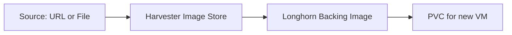

# How to Manage VM Images in Harvester

Author: [nawazdhandala](https://www.github.com/nawazdhandala)

Tags: Harvester, Kubernetes, Virtualization, HCI, VM Image

Description: A guide to managing virtual machine images in Harvester, including importing, organizing, and maintaining images for VM deployments.

## Introduction

VM images in Harvester are the base disks from which virtual machines are created. Harvester stores images as Kubernetes custom resources (`VirtualMachineImage`) and, by default, keeps the underlying image data as Longhorn backing images. Images can be imported from URLs, uploaded from local files, or exported from existing VM volumes. Proper image management ensures you always have up-to-date, secure base images for your VMs.

## Understanding VM Image Storage

When you import an image into Harvester:



By default, images are stored as Longhorn backing images and use parameters inherited from the selected StorageClass, such as replica count. Each time you create a VM or volume from an image, Harvester creates a new PVC with its own independent copy.

## Listing and Viewing Images

```bash
# List all VM images via kubectl

kubectl get virtualmachineimages -A

# Get detailed info about a specific image
kubectl describe virtualmachineimage ubuntu-22-04-lts -n default

# Check whether the image import is complete (should show "True" when ready)
kubectl get virtualmachineimage ubuntu-22-04-lts -n default \
    -o jsonpath='{.status.conditions[?(@.type=="Imported")].status}'
```

## Importing Images from a URL

### Via the UI

1. Navigate to **Images** in the Harvester dashboard
2. Click **Create**
3. Provide:
   - **Name**: `ubuntu-22-04-lts`
   - **URL**: The download URL of the image
   - **Namespace**: Select the target namespace

### Via kubectl

```yaml
# ubuntu-image.yaml
# Import Ubuntu 22.04 cloud image into Harvester

apiVersion: harvesterhci.io/v1beta1
kind: VirtualMachineImage
metadata:
  name: ubuntu-22-04-lts
  namespace: default
spec:
  displayName: "Ubuntu 22.04 LTS"
  # Source URL for the image
  url: "https://cloud-images.ubuntu.com/releases/jammy/release/ubuntu-22.04-server-cloudimg-amd64.img"
  sourceType: download
```

```bash
# Apply the image import
kubectl apply -f ubuntu-image.yaml

# Watch the import progress
kubectl get virtualmachineimage ubuntu-22-04-lts -n default -w

# Wait until the image is ready
kubectl wait virtualmachineimage/ubuntu-22-04-lts \
    -n default \
    --for=condition=Imported=True \
    --timeout=600s
```

### Common Cloud Image URLs

```bash
# Ubuntu 22.04 LTS
https://cloud-images.ubuntu.com/releases/jammy/release/ubuntu-22.04-server-cloudimg-amd64.img

# Ubuntu 20.04 LTS
https://cloud-images.ubuntu.com/releases/focal/release/ubuntu-20.04-server-cloudimg-amd64.img

# Debian 12 (Bookworm)
https://cloud.debian.org/images/cloud/bookworm/latest/debian-12-genericcloud-amd64.qcow2

# CentOS Stream 9
https://cloud.centos.org/centos/9-stream/x86_64/images/CentOS-Stream-GenericCloud-9-latest.x86_64.qcow2

# Rocky Linux 9
https://download.rockylinux.org/pub/rocky/9/images/x86_64/Rocky-9-GenericCloud.latest.x86_64.qcow2

# Windows Server 2022 (typically requires manual upload rather than a public cloud-image URL)
# Use the Upload method instead
```

## Uploading Images from Local Files

For images that aren't available via public URL (e.g., Windows, custom builds):

### Via the UI

1. Navigate to **Images** → **Create**
2. Select **Upload** instead of URL
3. Set the **Name** and **Namespace**
4. Click **Choose File** and select the `.qcow2`, `.img`, or `.iso` file
5. Click **Create** - the upload begins immediately

### Via the Harvester API

```bash
IMAGE_NAME="windows-server-2022"
NAMESPACE="default"
HARVESTER_URL="https://harvester.example.com"
API_TOKEN="your-api-token"

# Create the image resource first
kubectl apply -f - <<EOF
apiVersion: harvesterhci.io/v1beta1
kind: VirtualMachineImage
metadata:
  name: ${IMAGE_NAME}
  namespace: ${NAMESPACE}
spec:
  sourceType: upload
  displayName: "Windows Server 2022"
EOF

# Upload the file using the Harvester API action
curl -X POST \
    "${HARVESTER_URL}/v1/harvester/harvesterhci.io.virtualmachineimages/${NAMESPACE}/${IMAGE_NAME}?action=upload" \
    -H "Authorization: Bearer ${API_TOKEN}" \
    -H "Content-Type: application/octet-stream" \
    --data-binary @windows-server-2022.qcow2

# Wait until the upload/import finishes
kubectl wait virtualmachineimage/${IMAGE_NAME} \
    -n ${NAMESPACE} \
    --for=condition=Imported=True \
    --timeout=600s
```

## Organizing Images with Labels

Use Kubernetes labels to organize images by OS, version, or environment:

```bash
# Apply labels to an existing image
kubectl label virtualmachineimage ubuntu-22-04-lts -n default \
    os=ubuntu \
    version=22.04 \
    environment=production \
    team=platform

# List images filtered by label
kubectl get virtualmachineimage -n default -l os=ubuntu

# List all production images across namespaces
kubectl get virtualmachineimage -A -l environment=production
```

## Exporting Images

Export a VM's root disk as a reusable image:

```bash
# First, stop the VM if it's running
kubectl patch vm my-vm -n default --type merge -p '{"spec":{"running":false}}'

# Find the root PVC name
kubectl get pvc -n default | grep my-vm

# Create an image from the PVC
kubectl apply -f - <<EOF
apiVersion: harvesterhci.io/v1beta1
kind: VirtualMachineImage
metadata:
  name: my-custom-image
  namespace: default
spec:
  sourceType: export-from-volume
  pvcName: my-vm-root-disk
  pvcNamespace: default
  displayName: "My Custom Ubuntu Image"
EOF
```

## Deleting Images

```bash
# Delete an image after confirming nothing still references it
kubectl delete virtualmachineimage ubuntu-20-04-lts -n default

# Check for volumes that were created from the image before deleting
kubectl get pvc -A -o json | jq -r '.items[] |
    select(.metadata.annotations["harvesterhci.io/imageId"] == "default/ubuntu-20-04-lts") |
    .metadata.namespace + "/" + .metadata.name'
```

## Image Maintenance Best Practices

**Regular Updates:**
```bash
# Script to check image age and flag old images
kubectl get virtualmachineimage -A -o json | jq '
.items[] | {
    name: .metadata.name,
    namespace: .metadata.namespace,
    created: .metadata.creationTimestamp,
    size: .status.size
}'
```

**Naming Convention:**
```text
{os}-{version}-{variant}-{date}
Examples:
  ubuntu-22-04-server-20240101
  rocky-9-minimal-20240215
  windows-2022-datacenter-20240301
```

## Conclusion

Effective VM image management in Harvester ensures that your virtual machines are always built from known-good, up-to-date base images. By importing images from trusted sources, applying consistent labels, and regularly updating images with security patches, you maintain a healthy image library. The Kubernetes-native approach to image storage means you can automate image lifecycle management using standard Kubernetes tools and GitOps workflows.
