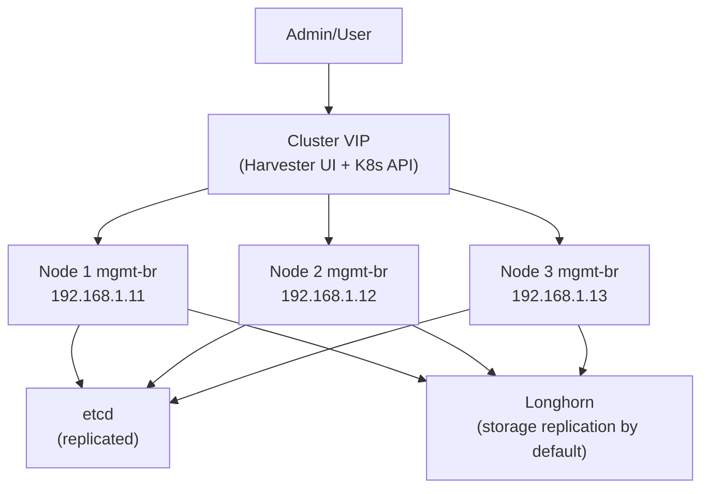

# How to Configure Management Network in Harvester

Author: [nawazdhandala](https://www.github.com/nawazdhandala)

Tags: Harvester, Kubernetes, Virtualization, HCI, Networking, Management Network

Description: Learn how to configure and manage the Harvester management network, including bonding, static IP assignment, and DNS settings for cluster nodes.

## Introduction

The management network in Harvester carries control plane traffic such as Kubernetes API communication, etcd replication, Harvester UI access, and by default Longhorn storage traffic unless you configure a dedicated storage network. Proper management network configuration is critical for cluster stability and performance. This guide covers configuring the management network during installation and post-installation adjustments.

## Management Network Architecture



## Configuration Options During Installation

During Harvester installation, you configure the management network and related node settings interactively:

### Static IP Configuration

```text
Interface:    eth0
Method:       Static
IP Address:   192.168.1.11/24
Gateway:      192.168.1.1
DNS Servers:  8.8.8.8, 8.8.4.4
NTP Servers:  pool.ntp.org
```

### DHCP Configuration

```text
Interface:    eth0
Method:       DHCP
```

**Note:** For production clusters, use static IPs or DHCP reservations because Harvester node IPs must remain stable for the life of the cluster. If you use DHCP, ensure the server also provides the `option routers` default route.

## Using a Configuration File for Management Network

For automated deployments, define the management network in the Harvester config:

```yaml
# harvester-config.yaml

scheme_version: 1

os:
  dns_nameservers:
    - 8.8.8.8
    - 8.8.4.4
  ntp_servers:
    - 0.suse.pool.ntp.org
    - 1.suse.pool.ntp.org

install:
  mode: create
  management_interface:
    interfaces:
      - name: eth0
        hwAddr: "aa:bb:cc:dd:ee:ff"  # Optional: specify MAC for deterministic NIC selection
      - name: eth1   # Second NIC for failover
    method: static
    ip: 192.168.1.11
    subnet_mask: 255.255.255.0
    gateway: 192.168.1.1
    bond_options:
      mode: active-backup
      miimon: 100
    mtu: 1500
```

## Configuring NIC Bonding for Redundancy

For high availability, configure NIC bonding on the management network:

### Active-Backup Bonding (Simple Failover)

```bash
# Check current bond configuration on a node
cat /proc/net/bonding/mgmt-bo

# Expected output shows:
# Bonding Mode: fault-tolerance (active-backup)
# Active Slave: eth0
# Slave Interface: eth0
#   MII Status: up
# Slave Interface: eth1
#   MII Status: up
```

### LACP (802.3ad) Bonding for Higher Throughput

To configure LACP bonding, update the network configuration:

```yaml
# For LACP bonding, the switch must also be configured for LACP
install:
  management_interface:
    interfaces:
      - name: eth0
      - name: eth1
    method: static
    ip: 192.168.1.11
    subnet_mask: 255.255.255.0
    gateway: 192.168.1.1
    bond_options:
      mode: 802.3ad
      miimon: 100
    mtu: 1500
```

**Switch configuration for LACP:**
```text
! Cisco IOS example
interface Port-channel1
  description Harvester-Node-01-Bond
  switchport mode trunk
  switchport trunk allowed vlan 10,20,30

interface GigabitEthernet0/1
  description Harvester-Node-01-eth0
  channel-group 1 mode active
  no shutdown

interface GigabitEthernet0/2
  description Harvester-Node-01-eth1
  channel-group 1 mode active
  no shutdown
```

## Changing Management Network IP After Installation

Harvester does not support changing a node's management IP after installation. Plan node addresses up front and use static IPs or DHCP reservations so each node keeps the same address for the life of the cluster.

**Warning:** If a node IP changes, the node may fail to rejoin the cluster and can break cluster operations. To move a node to a different management IP, plan a node replacement or reinstallation with the desired address.

## Changing DNS Configuration

```bash
# Log in to the node and become root
sudo -i

# View current DNS configuration
cat /etc/resolv.conf

# If the management network is not using a VLAN:
nmcli con modify bridge-mgmt ipv4.dns 8.8.8.8,1.1.1.1 && nmcli device reapply mgmt-br

# If the management network is using a VLAN, update vlan-mgmt instead:
# nmcli con modify vlan-mgmt ipv4.dns 8.8.8.8,1.1.1.1 && nmcli device reapply mgmt-br.VLAN_ID

# Verify the updated resolver configuration
cat /etc/resolv.conf

# Restart CoreDNS so cluster DNS picks up the change
kubectl rollout restart deployment/rke2-coredns-rke2-coredns -n kube-system
kubectl rollout status deployment/rke2-coredns-rke2-coredns -n kube-system
```

## Updating NTP Configuration

Accurate time synchronization is critical for etcd and distributed systems. Beginning with Harvester v1.2.0, update NTP servers through the Harvester setting instead of editing `/etc/chrony.conf` on each node:

```bash
# Edit the cluster-wide NTP setting
kubectl edit settings.harvesterhci.io ntp-servers

# Set the value field to:
# value: '{"ntpServers":["0.suse.pool.ntp.org","1.suse.pool.ntp.org"]}'

# Verify the applied NTP settings on a node
kubectl get nodes <node-name> -o yaml | yq -e '.metadata.annotations.["node.harvesterhci.io/ntp-service"]'

# Optional node-local check
chronyc tracking
```

## Verifying Management Network Health

```bash
# Check all nodes can communicate on the management network
for NODE_IP in 192.168.1.11 192.168.1.12 192.168.1.13; do
    echo -n "Ping ${NODE_IP}: "
    ping -c 1 -W 2 ${NODE_IP} > /dev/null && echo "OK" || echo "FAILED"
done

# Check cluster VIP is reachable
ping -c 3 192.168.1.100

# Verify node readiness and management IPs
export KUBECONFIG=/etc/rancher/rke2/rke2.yaml
kubectl get nodes -o wide

# Verify Kubernetes API readiness (includes an etcd readiness check)
kubectl get --raw='/readyz?verbose'
```

## Monitoring Management Network Performance

```bash
# Check bridge-level statistics for the management network
ip -s link show mgmt-br

# Check bond health and the active slave
cat /proc/net/bonding/mgmt-bo

# Optional live bandwidth view if iftop is installed
iftop -i mgmt-br
```

## Conclusion

The management network is the backbone of your Harvester cluster - all cluster communication flows through it. Configuring it with redundancy (bonding), correct static IPs, proper DNS, and synchronized NTP ensures a stable and reliable cluster. While some management-network changes can be made post-installation, node IPs must be planned carefully because Harvester does not support changing them later. For production deployments, invest in proper switch configuration with LACP bonding and dedicated management VLANs to isolate management traffic from VM traffic.
