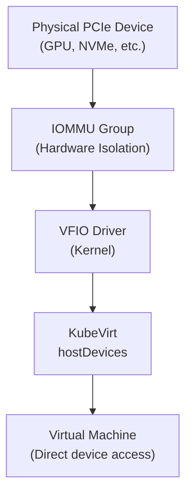

# How to Configure Harvester PCI Passthrough

Author: [nawazdhandala](https://www.github.com/nawazdhandala)

Tags: Harvester, Kubernetes, Virtualization, HCI, PCI Passthrough, GPU, IOMMU

Description: Learn how to configure PCI passthrough in Harvester to give virtual machines direct access to physical PCIe devices like GPUs, NVMe controllers, and network cards.

## Introduction

PCI passthrough allows a virtual machine to directly own and use a physical PCIe device - bypassing the hypervisor and achieving near-native device performance. Common use cases include assigning NVIDIA/AMD GPUs for AI/ML workloads, NVMe storage controllers for ultra-low latency, and specialized networking cards. In Harvester, PCI passthrough is exposed through the `pcidevices-controller` add-on, which prepares devices for KubeVirt-managed virtual machines by binding them to `vfio-pci`.

## How PCI Passthrough Works



**Important limitations:**
- A VM with PCI passthrough devices CANNOT be live migrated
- The device is exclusively owned by the VM (no sharing)
- The host OS loses access to the passed-through device

## Prerequisites

- Harvester v1.1.0 or later
- Server with PCIe device to pass through
- IOMMU enabled in BIOS/UEFI (Intel VT-d or AMD IOMMU)
- Device is not a host-owned device such as a management or VLAN NIC

## Step 1: Enable IOMMU on Harvester Nodes

```bash
# SSH into a Harvester node

ssh rancher@192.168.1.11

# Check whether IOMMU is already active
dmesg | grep -Ei 'DMAR|IOMMU'

# Harvester uses an immutable OS. Do not edit /etc/default/grub directly.
# Instead, make sure the node boots with the correct kernel argument in the
# Harvester OS configuration:
#
# os:
#   additionalKernelArguments: "intel_iommu=on"
#
# or
#
# os:
#   additionalKernelArguments: "amd_iommu=on"
#
# On existing nodes, update the persistent Harvester OS configuration rather
# than editing GRUB files directly, then reboot the node.

# After reboot, verify IOMMU initialization messages again
dmesg | grep -Ei 'DMAR|IOMMU'
```

## Step 2: Enable the PCI Devices Add-on and Identify the Device

```bash
# After enabling the pcidevices-controller add-on from Advanced > Add-ons
# in the Harvester UI, verify that it is running:
kubectl get addons.harvesterhci.io -A | grep pcidevices
kubectl -n harvester-system get pods | grep pcidevices-controller

# List PCI devices discovered by Harvester
kubectl get pcidevices.devices.harvesterhci.io \
  -o custom-columns=NAME:.metadata.name,NODE:.status.nodeName,ADDRESS:.status.address,RESOURCE:.status.resourceName,DRIVER:.status.kernelDriverInUse
```

If a device shares an IOMMU group with host-critical devices, safe passthrough may not be possible until the group is properly isolated.

## Step 3: Enable Passthrough on the Device

```yaml
# pcideviceclaim.yaml
apiVersion: devices.harvesterhci.io/v1beta1
kind: PCIDeviceClaim
metadata:
  name: gpu-claim
spec:
  address: "01:00.0"
  nodeName: "harvester-node-01"
  userName: "<your-user>"
```

```bash
kubectl apply -f pcideviceclaim.yaml

# Verify Harvester rebound the device to vfio-pci
kubectl get pcidevices.devices.harvesterhci.io \
  -o custom-columns=NAME:.metadata.name,ADDRESS:.status.address,DRIVER:.status.kernelDriverInUse | grep '01:00.0'
```

Harvester's `pcidevices-controller` loads `vfio-pci`, unbinds the original driver, and binds the claimed device for passthrough. You do not need to perform the VFIO rebinding manually on Harvester.
The `PCIDeviceClaim` is a request object, so verify success on the corresponding `PCIDevice` and its `kernelDriverInUse` field.

## Step 4: Attach the PCI Device to a VM

In the Harvester UI:
- Go to **Virtual Machines**
- Create a VM or edit an existing VM
- Open the **PCI Devices** section
- Select the enabled device from **Available PCI Devices**
- If the cluster contains multiple identical PCI devices, use **Run VM on specific node** and select the node that owns the device
- Save the VM configuration and start the VM

## Step 5: Install NVIDIA Drivers in the VM

```bash
# SSH into the GPU VM
ssh ubuntu@<vm-ip>

# Install NVIDIA drivers (Ubuntu 22.04)
sudo apt-get update
sudo apt-get install -y ubuntu-drivers-common
sudo ubuntu-drivers autoinstall

# Reboot
sudo reboot

# After reboot, verify GPU is detected
nvidia-smi

# Expected output shows the GPU model, driver version, and memory
```

## Step 6: Verify PCI Passthrough

```bash
# Inside the VM, verify the GPU is visible
lspci | grep -i nvidia

# Check GPU details with nvidia-smi
nvidia-smi

# Run a quick CUDA test
# Install nvidia-cuda-toolkit if needed
sudo apt-get install -y nvidia-cuda-toolkit
nvcc --version

# Test CUDA with a simple program
cat > test_cuda.cu << 'EOF'
#include <stdio.h>
#include <cuda_runtime.h>

int main(void) {
    int count = 0;
    cudaError_t err = cudaGetDeviceCount(&count);
    if (err != cudaSuccess) {
        fprintf(stderr, "cudaGetDeviceCount failed: %s\n", cudaGetErrorString(err));
        return 1;
    }
    printf("CUDA devices: %d\n", count);
    return 0;
}
EOF
nvcc test_cuda.cu -o test_cuda && ./test_cuda
```

## Conclusion

PCI passthrough in Harvester unlocks the full performance of physical PCIe devices for virtual machines. For AI/ML workloads requiring GPU acceleration, high-frequency trading requiring ultra-low latency NICs, or database workloads requiring NVMe performance, passthrough is the solution. The key requirements are IOMMU support in both the CPU/chipset and BIOS, Harvester booted with IOMMU enabled, and the Harvester PCI Devices workflow that binds the device to `vfio-pci`. While passthrough prevents live migration, the performance benefits often far outweigh this limitation for specialized workloads.
