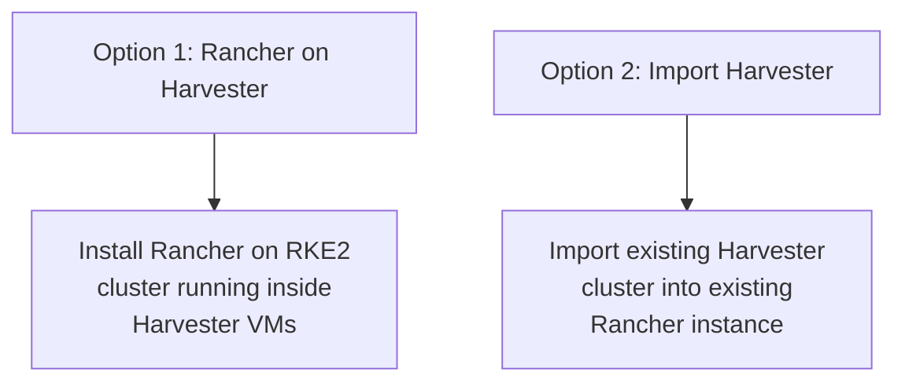

# How to Integrate Harvester with Rancher

Author: [nawazdhandala](https://www.github.com/nawazdhandala)

Tags: Harvester, Kubernetes, Rancher, Virtualization, HCI, Integration

Description: A complete guide to integrating Harvester HCI with Rancher for unified management of virtual machines and Kubernetes clusters.

## Introduction

Integrating Harvester with Rancher unlocks a unified management experience where you can manage both virtual machines (through Harvester) and Kubernetes clusters (through Rancher) from a single control plane. Rancher can be installed directly on Harvester VMs, or an existing Rancher instance can import Harvester as a managed cluster. This guide covers both approaches.

## Integration Approaches



Both approaches end with the same result: Rancher managing Harvester. After the Harvester node driver is active in Rancher, you can also provision Kubernetes clusters on Harvester infrastructure.

## Option 1: Install Rancher on Harvester

Use a dedicated management cluster for Rancher rather than installing Rancher into the Harvester management cluster itself.

### Step 1: Create a Dedicated RKE2 Cluster for Rancher

First, create three Linux cloud-image VMs in Harvester for the dedicated RKE2 management cluster. Use a cloud image rather than an ISO, allocate at least 4 vCPU and 8 GiB RAM per VM, attach the management network, and inject cloud-init data for SSH access and `qemu-guest-agent`.

### Step 2: Bootstrap RKE2 on the VMs

```bash
# Install RKE2 on each VM
curl -sfL https://get.rke2.io | sh -

# On rancher-node-01 (first node), configure the initial server
mkdir -p /etc/rancher/rke2
cat > /etc/rancher/rke2/config.yaml <<EOF
token: my-rancher-cluster-token
tls-san:
  - 192.168.1.200  # VIP / fixed registration address for the Rancher cluster
  - rancher.company.com
EOF

systemctl enable --now rke2-server

# On rancher-node-02 and rancher-node-03 (additional server nodes)
mkdir -p /etc/rancher/rke2
cat > /etc/rancher/rke2/config.yaml <<EOF
server: https://192.168.1.200:9345
token: my-rancher-cluster-token
tls-san:
  - 192.168.1.200
  - rancher.company.com
EOF

systemctl enable --now rke2-server
```

### Step 3: Install cert-manager and Rancher

```bash
# Set kubeconfig for the Rancher cluster
export KUBECONFIG=/etc/rancher/rke2/rke2.yaml

helm repo add jetstack https://charts.jetstack.io
helm repo update

helm install cert-manager jetstack/cert-manager \
    --namespace cert-manager \
    --create-namespace \
    --set crds.enabled=true

# Wait for cert-manager to be ready
kubectl wait deployment --all -n cert-manager \
    --for=condition=available --timeout=300s

# Add the Rancher Helm repository
helm repo add rancher-stable https://releases.rancher.com/server-charts/stable
helm repo update

# Install Rancher
helm install rancher rancher-stable/rancher \
    --namespace cattle-system \
    --create-namespace \
    --set hostname=rancher.company.com \
    --set replicas=3 \
    --set bootstrapPassword=InitialPassword123!

# Wait for Rancher to be fully deployed
kubectl wait deployment rancher -n cattle-system \
    --for=condition=available --timeout=600s
```

### Step 4: Configure Rancher to Manage Harvester

Once Rancher is running, import the Harvester cluster:

If you are using Harvester v1.7 or earlier, ensure only authorized administrators can modify `cluster-registration-url`, or upgrade to v1.8+, before using this registration flow.

```bash
# In the Rancher UI:
# 1. Navigate to Virtualization Management
# 2. Click Import Existing
# 3. Give it a name (e.g., "local-harvester")
# 4. Click Create and copy the registration manifest URL shown by Rancher

# On a Harvester management node, set the registration URL
export KUBECONFIG=/etc/rancher/rke2/rke2.yaml
kubectl apply -f - <<EOF
apiVersion: harvesterhci.io/v1beta1
kind: Setting
metadata:
  name: cluster-registration-url
value: https://rancher.company.com/v3/import/XXXXX.yaml
EOF
```

## Option 2: Import Existing Harvester into Existing Rancher

If you already have both Rancher and Harvester running:

### Step 1: Generate the Registration URL in Rancher

1. In Rancher, navigate to **Virtualization Management**
2. Click **Import Existing**
3. Enter a cluster name
4. Click **Create**
5. Copy the registration manifest URL shown in the guide

### Step 2: Apply the Registration URL on Harvester

```bash
# SSH into a Harvester node
ssh rancher@192.168.1.11

# Set kubeconfig
export KUBECONFIG=/etc/rancher/rke2/rke2.yaml

# Set the Rancher registration URL on the Harvester cluster
kubectl apply -f - <<EOF
apiVersion: harvesterhci.io/v1beta1
kind: Setting
metadata:
  name: cluster-registration-url
value: https://rancher.company.com/v3/import/XXXXX.yaml
EOF

# Wait for the cattle-cluster-agent to connect to Rancher
kubectl get pods -n cattle-system -w
```

### Step 3: Verify the Integration

After the import:

```bash
# In Rancher, the Harvester cluster should appear in Virtualization Management
# Status should show "Active"

# Verify from the Harvester side
kubectl get pods -n cattle-system
# All pods should be Running

# Check the Rancher cluster agent is connected
kubectl get deployment cattle-cluster-agent -n cattle-system
```

## Post-Integration Configuration

### Configure the Harvester Cloud Provider

For RKE2 clusters created with the Harvester node driver in Rancher, select **Harvester** as the cloud provider during cluster creation. Rancher deploys the Harvester cloud provider and CSI driver automatically.

If the Harvester node driver is not active in your Rancher version, enable it first from **Cluster Management** → **Drivers** → **Node Drivers**.

For existing RKE2 clusters already running inside Harvester VMs, import the cluster into Rancher first, then install **Harvester Cloud Provider** and **Harvester CSI Driver** from the cluster's **Apps** → **Charts** page.

### Set Up VM Images in Rancher

After integration, VM images in Harvester are accessible from Rancher's cluster provisioning:

1. Navigate to the Harvester cluster in Rancher
2. Go to **Virtualization Management** → **Images**
3. Images are synchronized from Harvester automatically

## Troubleshooting Integration Issues

```bash
# Rancher agent can't connect to Rancher:
# Check network connectivity from Harvester node to Rancher
curl -k https://rancher.company.com/ping

# Check cluster agent logs
kubectl logs -n cattle-system \
    $(kubectl get pods -n cattle-system -l app=cattle-cluster-agent -o name)

# Certificate issues:
# If using self-signed certs, add the CA to Harvester nodes
# Or use Rancher's built-in CA and configure trust on Harvester
```

## Conclusion

Integrating Harvester with Rancher creates a powerful unified management platform for your entire infrastructure. From a single Rancher interface, you can manage VMs through Harvester, provision Kubernetes clusters on VM infrastructure, apply policies across all clusters, and gain unified monitoring and alerting. This integration is particularly valuable for organizations running both legacy VM workloads and modern containerized applications - it enables a gradual migration path while maintaining operational visibility across both paradigms.
