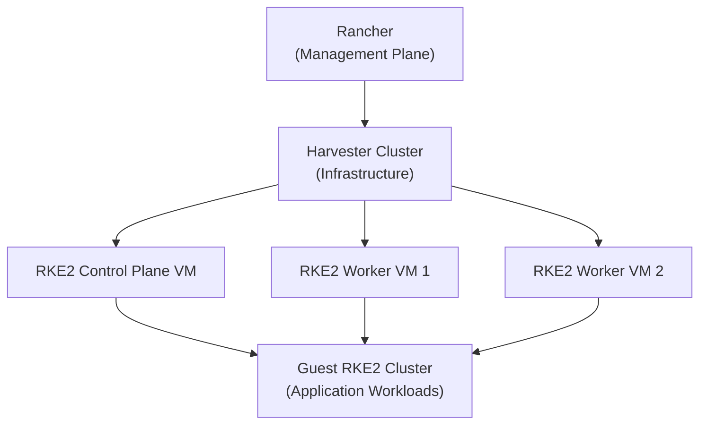

# How to Create RKE2 Clusters on Harvester

Author: [nawazdhandala](https://www.github.com/nawazdhandala)

Tags: Harvester, Kubernetes, RKE2, Rancher, Virtualization, HCI

Description: A guide to provisioning RKE2 Kubernetes clusters on Harvester virtual machines using Rancher's cluster provisioning capabilities.

## Introduction

Harvester can serve as the infrastructure provider for Kubernetes clusters, allowing you to provision RKE2 clusters that run as VMs on your HCI platform. This creates a "nested Kubernetes" architecture where Harvester hosts guest RKE2 clusters for application workloads. Rancher provides the management plane for this configuration through its Harvester node driver.

## Architecture Overview



## Prerequisites

- A running Harvester cluster imported into Rancher through **Virtualization Management**
- A Rancher version supported by the Harvester-Rancher support matrix, with the Harvester node driver available
- Cloud images uploaded to Harvester (for example, a supported Ubuntu 22.04 cloud image)
- Sufficient Harvester cluster resources for the guest VMs
- A VLAN VM network configured in Harvester for the guest cluster, with DHCP or Managed DHCP available for the guest VMs

## Step 1: Configure Rancher Integration

First, ensure Harvester is imported into Rancher:

1. In Rancher, navigate to **Virtualization Management**
2. Confirm your Harvester cluster is listed there as a Harvester cluster
3. If it is not imported yet, use **Virtualization Management** → **Import Existing**

## Step 2: Create a Cloud Credential for Harvester

In Rancher:

1. Go to **Cluster Management** → **Cloud Credentials**
2. Click **Create**
3. Select **Harvester**
4. Fill in:

```sql
Name:                      harvester-infra-creds
Harvester Cluster Type:    Imported Harvester Cluster
Harvester Cluster:         [Select your Harvester cluster]
```

5. Click **Create**

## Step 3: Create an RKE2 Cluster via Rancher UI

1. Navigate to **Cluster Management** → **Clusters**
2. Click **Create**
3. Select **RKE2/K3s**
4. Select the **Harvester** node driver

### Configure the Cluster

```text
Cluster Name:       production-rke2
Kubernetes Version: [A version supported by your Rancher and Harvester support matrix]
Cloud Provider:     Harvester
CNI:                Canal
```

### Configure Node Pools

**Control Plane Pool:**
```text
Machine Count:      3 (for HA)
Node Roles:         etcd, Control Plane
VM CPU:             4 cores
VM Memory:          8 GB
VM Image:           ubuntu-22-04-lts
VM Network:         default/vlan-100
VM Disk Size:       50 GB
```

**Worker Pool:**
```text
Machine Count:      3
Node Roles:         Worker
VM CPU:             8 cores
VM Memory:          16 GB
VM Image:           ubuntu-22-04-lts
VM Network:         default/vlan-100
VM Disk Size:       100 GB
```

If your image does not already include `qemu-guest-agent`, install it through **Show Advanced** → **User Data**. If you use Canal or Calico, ensure `iptables` or `xtables-nft` is also present on the guest image.

4. Click **Create** - Rancher will provision the VMs in Harvester, and selecting **Harvester** as the cloud provider will also deploy the Harvester cloud provider and CSI driver for the guest cluster.

## Step 4: Create an RKE2 Cluster via Rancher Terraform

For GitOps-friendly cluster creation against Rancher, use the Rancher Terraform Provider.

Before you apply Terraform:

- Create a Rancher API key from **Account & API Keys**
- In **Virtualization Management**, locate the imported Harvester cluster and select **⋮** → **Download KubeConfig**. Save that file as `production-rke2-kubeconfig`.

```hcl
# provider.tf
terraform {
  required_providers {
    rancher2 = {
      source  = "rancher/rancher2"
      version = "7.6.1"
    }
  }
}

provider "rancher2" {
  api_url    = "<api_url>"
  access_key = "<access_key>"
  secret_key = "<secret_key>"
  insecure   = true
}
```

```hcl
# main.tf
data "rancher2_cluster_v2" "harv" {
  name = "<harvester_cluster_name_in_rancher>"
}

resource "rancher2_cloud_credential" "harv_cred" {
  name = "harvester-infra-creds"
  harvester_credential_config {
    cluster_id         = data.rancher2_cluster_v2.harv.cluster_v1_id
    cluster_type       = "imported"
    kubeconfig_content = data.rancher2_cluster_v2.harv.kube_config
  }
}

resource "rancher2_machine_config_v2" "control_plane" {
  generate_name = "production-rke2-control-plane"
  harvester_config {
    vm_namespace = "default"
    cpu_count    = "4"
    memory_size  = "8"
    disk_info = <<EOF
    {
      "disks": [{
        "imageName": "default/ubuntu-22-04-lts",
        "size": 50,
        "bootOrder": 1
      }]
    }
    EOF
    network_info = <<EOF
    {
      "interfaces": [{
        "networkName": "default/vlan-100"
      }]
    }
    EOF
    ssh_user = "ubuntu"
    user_data = <<EOF
    #cloud-config
    package_update: true
    packages:
      - qemu-guest-agent
      - iptables
    runcmd:
      - - systemctl
        - enable
        - '--now'
        - qemu-guest-agent.service
    EOF
  }
}

resource "rancher2_machine_config_v2" "worker" {
  generate_name = "production-rke2-worker"
  harvester_config {
    vm_namespace = "default"
    cpu_count    = "8"
    memory_size  = "16"
    disk_info = <<EOF
    {
      "disks": [{
        "imageName": "default/ubuntu-22-04-lts",
        "size": 100,
        "bootOrder": 1
      }]
    }
    EOF
    network_info = <<EOF
    {
      "interfaces": [{
        "networkName": "default/vlan-100"
      }]
    }
    EOF
    ssh_user = "ubuntu"
    user_data = <<EOF
    #cloud-config
    package_update: true
    packages:
      - qemu-guest-agent
      - iptables
    runcmd:
      - - systemctl
        - enable
        - '--now'
        - qemu-guest-agent.service
    EOF
  }
}

resource "rancher2_cluster_v2" "production_rke2" {
  name               = "production-rke2"
  # Replace with a version supported by your Rancher and Harvester support matrix
  kubernetes_version = "<supported-rke2-version>"

  rke_config {
    machine_pools {
      name                         = "control-plane"
      cloud_credential_secret_name = rancher2_cloud_credential.harv_cred.id
      control_plane_role           = true
      etcd_role                    = true
      worker_role                  = false
      quantity                     = 3
      machine_config {
        kind = rancher2_machine_config_v2.control_plane.kind
        name = rancher2_machine_config_v2.control_plane.name
      }
    }

    machine_pools {
      name                         = "workers"
      cloud_credential_secret_name = rancher2_cloud_credential.harv_cred.id
      control_plane_role           = false
      etcd_role                    = false
      worker_role                  = true
      quantity                     = 3
      machine_config {
        kind = rancher2_machine_config_v2.worker.kind
        name = rancher2_machine_config_v2.worker.name
      }
    }

    machine_selector_config {
      config = yamlencode({
        "cloud-provider-config" = file("${path.module}/production-rke2-kubeconfig")
        "cloud-provider-name"   = "harvester"
      })
    }

    machine_global_config = <<EOF
    cni: "canal"
    EOF

    chart_values = <<EOF
    harvester-cloud-provider:
      clusterName: production-rke2
      cloudConfigPath: /var/lib/rancher/rke2/etc/config-files/cloud-provider-config
    EOF

    upgrade_strategy {
      control_plane_concurrency = "1"
      worker_concurrency        = "1"
    }
  }
}
```

```bash
terraform init
terraform apply
```

## Step 5: Monitor Cluster Provisioning

```bash
# Watch provisioning objects on the Rancher management cluster
kubectl get clusters.provisioning.cattle.io -A -w
kubectl get machines -A -o wide

# Once provisioned, download the guest cluster kubeconfig from Rancher
# Cluster Management -> production-rke2 -> ⋮ -> Download KubeConfig
# Save it as production-rke2.kubeconfig

# Connect to the guest cluster
export KUBECONFIG=production-rke2.kubeconfig
kubectl get nodes
```

## Step 6: Configure Storage for the Guest Cluster

The guest RKE2 cluster needs the Harvester CSI driver. If you selected **Harvester** as the cloud provider during cluster creation, Rancher deploys the Harvester cloud provider and CSI driver automatically. If not, install the CSI driver manually before creating PVCs.

```bash
# In the guest cluster, verify Harvester CSI is installed
kubectl get storageclass

# The harvester storage class should be present
# Create a test PVC to verify
kubectl apply -f - <<EOF
apiVersion: v1
kind: PersistentVolumeClaim
metadata:
  name: test-pvc
spec:
  accessModes:
    - ReadWriteOnce
  storageClassName: harvester
  resources:
    requests:
      storage: 10Gi
EOF

kubectl get pvc test-pvc
```

## Conclusion

Running RKE2 clusters on Harvester creates a powerful, flexible infrastructure where VM-based Kubernetes clusters can be provisioned and managed programmatically through Rancher. This architecture is ideal for environments that need to support multiple isolated Kubernetes clusters while maintaining central visibility and management through Rancher. The VM-based approach provides strong workload isolation, independent upgrade paths, and the ability to right-size each cluster for its specific workload requirements.
