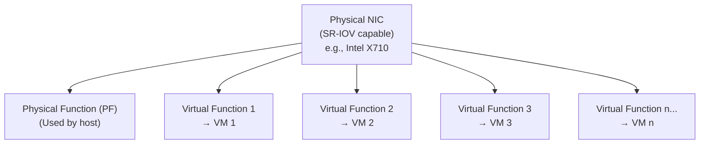

# How to Configure Harvester SR-IOV for Network Performance

Author: [nawazdhandala](https://www.github.com/nawazdhandala)

Tags: Harvester, Kubernetes, Virtualization, HCI, SR-IOV, Networking, Performance

Description: Learn how to configure SR-IOV (Single Root I/O Virtualization) in Harvester for high-performance, low-latency VM networking.

## Introduction

SR-IOV (Single Root I/O Virtualization) allows a single physical NIC to be partitioned into multiple virtual functions (VFs), each of which can be assigned directly to a VM. This bypasses the virtio/software datapath, providing near-bare-metal network performance with low latency and reduced CPU overhead. In Harvester, SR-IOV VFs are surfaced through the `pcidevices-controller` add-on and attached to VMs as passed-through PCI devices. SR-IOV is ideal for VMs running network-intensive workloads like NFV (Network Functions Virtualization), high-performance databases, or trading systems.

## SR-IOV Architecture



**Benefits:**
- Near-line-rate performance on supported hardware
- Lower latency than virtio networking
- Reduced CPU overhead
- Hardware-based VLAN and QoS on supported NICs

**Limitations:**
- VMs with SR-IOV VFs attached as passed-through PCI devices CANNOT be live migrated
- Requires SR-IOV capable hardware
- Requires IOMMU enabled in BIOS/UEFI
- Do not use Harvester host-owned NICs (management or VLAN uplink NICs) for SR-IOV passthrough

## Prerequisites

- Harvester v1.2.0 or later
- SR-IOV capable NIC (Intel X710, Mellanox ConnectX-4/5/6, etc.)
- IOMMU enabled in BIOS/UEFI (VT-d for Intel, AMD-Vi for AMD)
- SR-IOV feature enabled on the NIC
- Harvester nodes with the `pcidevices-controller` add-on enabled

## Step 1: Enable IOMMU in BIOS/UEFI

In the server BIOS/UEFI:
- Intel: Enable **VT-d** (Intel Virtualization Technology for Directed I/O)
- AMD: Enable **AMD-Vi** or **IOMMU**
- If your platform or NIC firmware exposes an **SR-IOV** option, enable it as well

## Step 2: Enable IOMMU in the Kernel

```bash
# SSH into a Harvester node

ssh rancher@192.168.1.11
sudo -i

# Check if IOMMU is enabled
dmesg | grep -Ei 'DMAR|IOMMU'

# Harvester uses an immutable OS, so /etc/default/grub is not the
# persistent path for kernel arguments.
#
# For new installations, add the kernel parameters in the Harvester config:
#
# os:
#   additionalKernelArguments: "intel_iommu=on iommu=pt"
#
# or
#
# os:
#   additionalKernelArguments: "amd_iommu=on iommu=pt"

# On an existing node, update the persistent GRUB config as documented by Harvester
mount -o remount,rw "$(blkid -L COS_STATE)" /run/initramfs/cos-state
vi /run/initramfs/cos-state/grub2/grub.cfg

# Append one of the following to the linux (...) line:
# intel_iommu=on iommu=pt
# amd_iommu=on iommu=pt

# Reboot the node
reboot
```

## Step 3: Identify the SR-IOV-Capable NIC

```bash
# Find the SR-IOV capable NIC
lspci -nn | grep -i ethernet

# Check if the NIC exposes SR-IOV capability
lspci -vv -s <PCI-ADDRESS> | grep -i "SR-IOV"

# Important: do not choose a host-owned NIC that Harvester uses for
# management traffic or VM VLAN/untagged networks.
```

## Step 4: Enable the PCI Devices Add-on

Harvester manages SR-IOV network devices through the built-in `pcidevices-controller` add-on. You do **not** manually apply the upstream `sriov-cni` or `sriov-network-device-plugin` DaemonSets on Harvester.

```bash
# After enabling the add-on from Advanced > Add-ons in the Harvester UI,
# verify that it is deployed:

kubectl get addons.harvesterhci.io -A | grep pcidevices
kubectl get pods -n harvester-system | grep pcidevices
```

## Step 5: Create VFs on the SRIOVNetworkDevice

Configure the number of VFs on the SR-IOV-capable interface discovered by Harvester:

```bash
# List SR-IOV-capable network devices discovered by Harvester
kubectl get sriovnetworkdevices.devices.harvesterhci.io

# Inspect one device
kubectl get sriovnetworkdevices.devices.harvesterhci.io <device-name> -o yaml

# Enable 16 VFs by updating spec.numVFs
kubectl patch sriovnetworkdevices.devices.harvesterhci.io <device-name> \
  --type merge \
  -p '{"spec":{"numVFs":16}}'

# Verify the controller reported the VF PCI addresses
kubectl get sriovnetworkdevices.devices.harvesterhci.io <device-name> -o yaml
```

## Step 6: Enable Passthrough on the VF PCI Devices

Harvester creates `PCIDevice` objects for the new VFs on the next re-scan. This can take up to 1 minute.

```bash
# List the VF PCI devices created by Harvester
kubectl get pcidevices.devices.harvesterhci.io \
  -o custom-columns=NAME:.metadata.name,NODE:.status.nodeName,RESOURCE:.status.resourceName,DRIVER:.status.kernelDriverInUse
```

After the VF devices appear, go to **Advanced > PCI Devices** in the Harvester UI and enable passthrough on the specific VF devices you want to use.

## Step 7: Attach the SR-IOV VF to a VM

Create or edit a VM in Harvester, keep a standard management NIC if you still need normal VM access, and under **PCI Devices** select one of the enabled VF devices from Step 6.

If the cluster contains multiple identical PCI devices, pin the VM to a specific node to avoid incorrect scheduling.

**Important Note:** VMs with SR-IOV VFs attached as passed-through PCI devices cannot be live migrated. The VM must be stopped and restarted (cold migration) to move it between nodes.

## Step 8: Verify SR-IOV Performance

```bash
# SSH into the VM and verify that the passed-through NIC is present
lspci | grep -i ethernet
ip link show
ethtool -i <vf-interface>

# Run a network performance test
# Install iperf3 on both the VM and a test machine
iperf3 -s  # On the server side
iperf3 -c <server-ip> -P 4 -t 60  # On the client side

# Expect lower CPU overhead and better throughput/latency than virtio,
# but actual results depend on NIC model, guest driver, MTU, NUMA
# placement, switch configuration, and the test path.
```

## Conclusion

SR-IOV configuration in Harvester provides a path to near-bare-metal network performance for VMs that need it. The trade-off is the loss of live migration capability, which means SR-IOV is best reserved for workloads where raw network performance is more critical than operational flexibility. For most general-purpose workloads, virtio networking provides excellent performance without the complexity and migration limitations of SR-IOV. Consider SR-IOV for NFV workloads, high-performance databases, real-time applications, and HPC clusters where every microsecond of latency matters.
