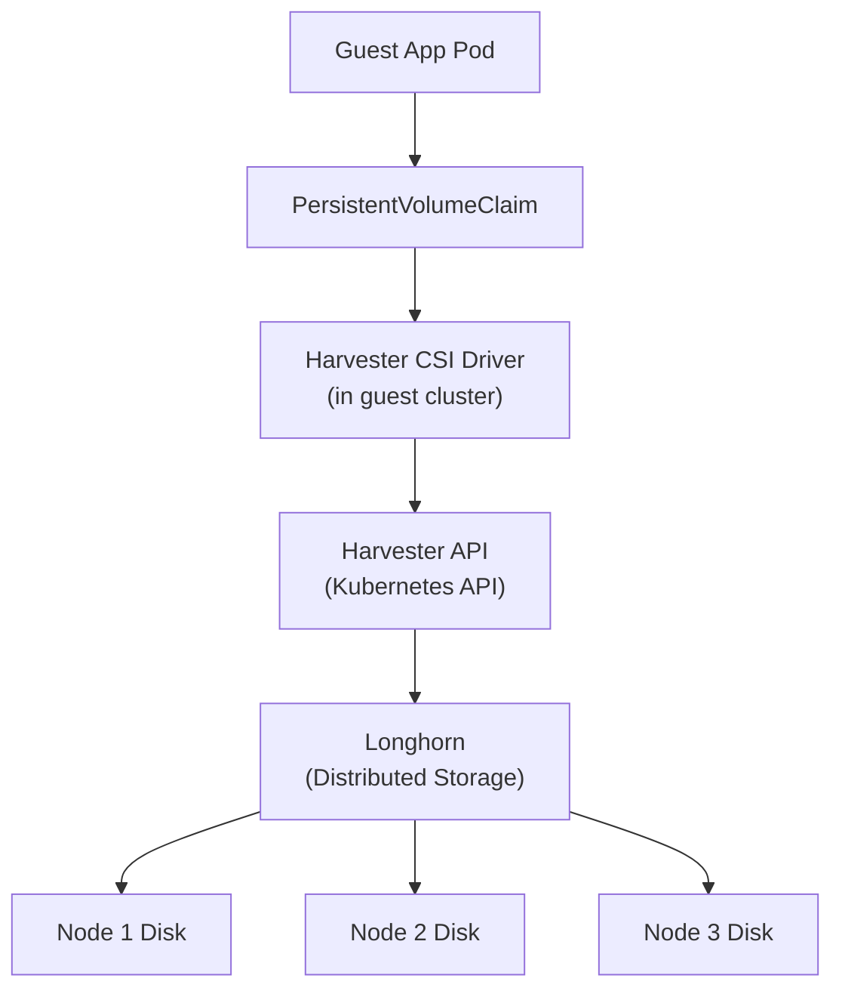

# How to Set Up Harvester Storage for Kubernetes - For

Author: [nawazdhandala](https://www.github.com/nawazdhandala)

Tags: Harvester, Kubernetes, Virtualization, HCI, Storage, Longhorn, CSI

Description: Learn how to configure Harvester's built-in Longhorn storage for use by guest Kubernetes clusters through the Harvester CSI driver.

## Introduction

Guest Kubernetes clusters running on Harvester VMs can leverage Harvester's built-in Longhorn storage for persistent volumes through the Harvester CSI (Container Storage Interface) driver. This integration means applications in guest clusters can dynamically provision persistent volumes that are backed by Longhorn's distributed, replicated storage - without needing to deploy a separate storage solution.

## Architecture



When a PVC is created in the guest cluster, the CSI driver calls the Harvester API to create a Longhorn volume and attach it to the appropriate VM.

## Prerequisites

- Harvester cluster running with Longhorn storage
- A guest Kubernetes cluster (RKE2 or K3s) running on Harvester VMs
- The guest cluster's VMs must be in the same Harvester namespace
- The guest cluster's VMs must have the `open-iscsi` package installed (required for Longhorn iSCSI)
- Harvester cluster API access from the guest cluster (network connectivity)

## Step 1: Prepare Guest VM Nodes

Guest cluster nodes need iSCSI support for Longhorn volume attachment:

```yaml
# Add to cloud-init for guest cluster nodes

# This ensures iSCSI is available when nodes boot

#cloud-config
packages:
  - open-iscsi

runcmd:
  # Load the iSCSI TCP kernel module
  - modprobe iscsi_tcp
  # Persist the module load
  - echo 'iscsi_tcp' > /etc/modules-load.d/iscsi.conf
  # Enable and start the iSCSI initiator
  - systemctl enable --now iscsid
```

## Step 2: Generate the Harvester CSI Cloud Config

For manual installs, use Harvester's helper script to create the host-cluster service account and RBAC, then generate the `cloud-provider-config` used by the CSI driver:

```bash
# On a Harvester management node
# Requires kubectl, jq, and curl
export KUBECONFIG=/etc/rancher/rke2/rke2.yaml

curl -LO https://raw.githubusercontent.com/harvester/harvester-csi-driver/master/deploy/generate_addon_csi.sh
chmod +x generate_addon_csi.sh

# <serviceaccount name> is usually the guest cluster name.
# <namespace> must match the Harvester namespace that contains the guest VMs.
./generate_addon_csi.sh <serviceaccount name> <namespace> RKE2

# For K3s clusters, use:
# ./generate_addon_csi.sh <serviceaccount name> <namespace> k3s
```

Copy the `cloud-init user data` output from the script into the guest cluster node template or cloud-init configuration. For RKE2 nodes, this writes the `cloud-provider-config` file to `/var/lib/rancher/rke2/etc/config-files/cloud-provider-config`.

## Step 3: Install the Harvester CSI Driver

```bash
# In the guest cluster:
export KUBECONFIG=/path/to/guest-cluster.kubeconfig

# Add the Harvester Helm repository
helm repo add harvester https://charts.harvesterhci.io/
helm repo update

# Install the CSI driver
helm install harvester-csi-driver harvester/harvester-csi-driver \
    --namespace kube-system

# Verify the CSI driver pods are running
kubectl get pods -n kube-system

# Expected pods:
# harvester-csi-driver-controllers-xxxxx   Running
# harvester-csi-driver-xxxxx (on each node)  Running
```

## Step 4: Verify the StorageClass

After installing the CSI driver, a default `harvester` StorageClass is created:

```bash
# Check available storage classes
kubectl get storageclass

# Expected output includes:
# NAME                   PROVISIONER            RECLAIMPOLICY  VOLUMEBINDINGMODE  ALLOWVOLUMEEXPANSION
# harvester (default)    driver.harvesterhci.io Delete         Immediate          true
```

## Step 5: Test Persistent Volume Provisioning

```yaml
# test-pvc.yaml
# Test PVC using the Harvester storage class

apiVersion: v1
kind: PersistentVolumeClaim
metadata:
  name: test-harvester-pvc
  namespace: default
spec:
  accessModes:
    - ReadWriteOnce
  storageClassName: harvester
  resources:
    requests:
      storage: 10Gi
```

```bash
kubectl apply -f test-pvc.yaml

# Watch the PVC get bound
kubectl get pvc test-harvester-pvc -w

# It should quickly move to Bound state:
# NAME                  STATUS   VOLUME   CAPACITY   ACCESS MODES   STORAGECLASS
# test-harvester-pvc    Bound    pvc-xxx  10Gi       RWO            harvester

# Capture the CSI volume ID from the guest cluster
VOLUME_ID=$(kubectl get pv "$(kubectl get pvc test-harvester-pvc -o jsonpath='{.spec.volumeName}')" \
  -o jsonpath='{.spec.csi.volumeHandle}')
echo "$VOLUME_ID"

# Verify the backing PVC was created in Harvester
# (on the Harvester cluster)
kubectl get pvc -A | grep "$VOLUME_ID"
```

## Step 6: Deploy a Stateful Application

Test with a real stateful workload:

```yaml
# postgres-with-harvester-storage.yaml
# PostgreSQL with Harvester-backed storage

apiVersion: v1
kind: Namespace
metadata:
  name: production
---
apiVersion: v1
kind: Secret
metadata:
  name: postgres-secret
  namespace: production
type: Opaque
stringData:
  password: change-me
---
apiVersion: v1
kind: Service
metadata:
  name: postgres
  namespace: production
spec:
  clusterIP: None
  selector:
    app: postgres
  ports:
    - port: 5432
      targetPort: 5432
---
apiVersion: apps/v1
kind: StatefulSet
metadata:
  name: postgres
  namespace: production
spec:
  serviceName: postgres
  replicas: 1
  selector:
    matchLabels:
      app: postgres
  template:
    metadata:
      labels:
        app: postgres
    spec:
      containers:
        - name: postgres
          image: postgres:15
          env:
            - name: POSTGRES_PASSWORD
              valueFrom:
                secretKeyRef:
                  name: postgres-secret
                  key: password
            - name: PGDATA
              value: /var/lib/postgresql/data/pgdata
          ports:
            - containerPort: 5432
          volumeMounts:
            - name: postgres-data
              mountPath: /var/lib/postgresql/data
  volumeClaimTemplates:
    - metadata:
        name: postgres-data
      spec:
        accessModes:
          - ReadWriteOnce
        # Use Harvester storage class
        storageClassName: harvester
        resources:
          requests:
            storage: 50Gi
```

```bash
kubectl apply -f postgres-with-harvester-storage.yaml

# Watch the pod start
kubectl get pod -n production -l app=postgres -w

# Verify the PVC was created and bound
kubectl get pvc -n production

# Capture the CSI volume ID for the StatefulSet PVC
VOLUME_ID=$(kubectl get pv "$(kubectl get pvc -n production postgres-data-postgres-0 -o jsonpath='{.spec.volumeName}')" \
  -o jsonpath='{.spec.csi.volumeHandle}')

# Check that the backing PVC exists in Harvester
# (on the Harvester cluster)
kubectl get pvc -A | grep "$VOLUME_ID"
```

## Step 7: Configure Volume Snapshots

Starting with Harvester CSI Driver v0.1.25, volume snapshots are supported. On RKE2, the CSI snapshot controller and CRDs are deployed by default. On K3s or other Kubernetes distributions, ensure the CSI snapshot controller and snapshot CRDs are installed before installing or upgrading the Harvester CSI driver.

The current Harvester CSI chart creates a default `VolumeSnapshotClass` named `harvester-snapshot`.

```yaml
# postgres-snapshot.yaml
apiVersion: snapshot.storage.k8s.io/v1
kind: VolumeSnapshot
metadata:
  name: postgres-snapshot-20240315
  namespace: production
spec:
  volumeSnapshotClassName: harvester-snapshot
  source:
    persistentVolumeClaimName: postgres-data-postgres-0
```

## Conclusion

The Harvester CSI driver bridges Harvester's powerful Longhorn storage with guest Kubernetes clusters, providing enterprise-grade distributed storage for containerized applications without additional complexity. Applications get the full benefits of Longhorn - data replication, snapshots, and volume expansion - while maintaining standard Kubernetes PVC semantics. This integration is one of the key reasons Harvester is a compelling HCI platform: it provides consistent, high-quality storage for both VMs and containers through a unified management interface.
