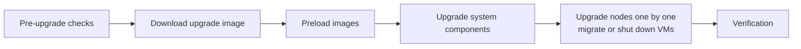

# How to Upgrade Harvester

Author: [nawazdhandala](https://www.github.com/nawazdhandala)

Tags: Harvester, Kubernetes, Virtualization, HCI, Upgrade, Maintenance

Description: A step-by-step guide to upgrading your Harvester HCI cluster to a new version with minimal downtime using rolling upgrades.

## Introduction

Harvester supports rolling upgrades that update nodes one at a time. Live-migratable VMs can continue running during the upgrade process through batch live migration, while non-migratable VMs may need to be shut down depending on the `upgrade-config` setting. The upgrade process updates the Harvester OS, RKE2 Kubernetes version, and system components including Longhorn, KubeVirt, and the Harvester UI. Proper planning and pre-upgrade checks are essential to ensure a smooth upgrade.

## Upgrade Process Overview



## Step 1: Pre-Upgrade Checklist

Before starting the upgrade, verify cluster health:

```bash
# Check all nodes are Ready

kubectl get nodes

# Check no nodes are cordoned
kubectl get nodes -o jsonpath='{range .items[*]}{.metadata.name}: {.spec.unschedulable}{"\n"}{end}'

# Verify all Harvester system pods are running
kubectl get pods -n harvester-system

# Check Longhorn volume states
kubectl get volumes.longhorn.io -n longhorn-system \
    -o jsonpath='{range .items[*]}{.metadata.name}: {.status.state}{"\n"}{end}'

# Ensure all volumes have sufficient replicas
kubectl get volumes.longhorn.io -n longhorn-system \
    -o jsonpath='{range .items[*]}{.metadata.name}: robustness={.status.robustness}{"\n"}{end}'
# All should show: robustness=healthy

# Check there are no degraded or faulted volumes
kubectl get volumes.longhorn.io -n longhorn-system \
    -o jsonpath='{range .items[?(@.status.robustness!="healthy")]}{.metadata.name}: {.status.robustness}{"\n"}{end}'
# No output is expected

# Verify each node has at least 30 GiB free in /usr/local (run on each node)
df -h /usr/local/

# Run the Harvester pre-check script that matches your current version
# https://github.com/harvester/upgrade-helpers/tree/main/pre-check
```

```bash
# Check current Harvester version
kubectl get settings.harvesterhci.io server-version \
    -o jsonpath='{.value}'

# Check supported upgrade paths and version-specific notes
# https://docs.harvesterhci.io/
```

## Step 2: Create VM and Data Backups

Before any upgrade, back up critical VMs:

```bash
# Requires a configured Harvester backup target.
# Harvester can back up Longhorn-backed VM volumes, but not volumes in external storage.

# Create a backup of each critical VM
for VM in $(kubectl get vm -n default -o jsonpath='{range .items[*]}{.metadata.name}{"\n"}{end}'); do
    echo "Creating backup for: ${VM}"
    kubectl apply -f - <<EOF
apiVersion: harvesterhci.io/v1beta1
kind: VirtualMachineBackup
metadata:
  name: ${VM}-pre-upgrade-$(date +%Y%m%d)
  namespace: default
spec:
  source:
    apiGroup: kubevirt.io
    kind: VirtualMachine
    name: ${VM}
  type: backup
EOF
done

# Wait for all backups to complete
kubectl get virtualmachinebackup -n default -w
```

## Step 3: Check Upgrade Compatibility

```bash
# Check the Harvester upgrade documentation for the specific version
# Key compatibility items to verify:
# 1. Supported Harvester upgrade path for the installed version
# 2. Rancher version compatibility and Rancher upgrade order (if integrated)
# 3. Node hardware requirements
# 4. Network compatibility

# For Rancher-integrated clusters, check Rancher support matrix
# https://www.suse.com/suse-harvester/support-matrix/all-supported-versions/
```

## Step 4: Initiate the Upgrade via the UI

1. Log in to the Harvester dashboard
2. Navigate to **Dashboard**
3. If a new version is available, click **Upgrade**
4. Select the upgrade version from the dropdown
5. Optional: enable upgrade logging
6. Click **Start Upgrade**

## Step 5: Initiate the Upgrade via kubectl

```yaml
# harvester-upgrade.yaml
# Trigger a Harvester upgrade to a specific version

apiVersion: harvesterhci.io/v1beta1
kind: Upgrade
metadata:
  name: hvst-upgrade-v1-6-0
  namespace: harvester-system
spec:
  # Replace with a supported target version for your current cluster
  version: v1.6.0
  # Enable UpgradeLog collection
  logEnabled: true
  # Optional: use a specific image URL
  # image: ""
```

```bash
kubectl create -f harvester-upgrade.yaml

# Watch the upgrade progress
kubectl get upgrades -n harvester-system -w

# Get detailed upgrade status
kubectl describe upgrade hvst-upgrade-v1-6-0 -n harvester-system
```

## Step 6: Monitor the Upgrade Progress

```bash
# If logging is enabled, the upgrade creates an "UpgradeLog"
UPGRADE_NAME=$(kubectl -n harvester-system get upgrades \
    -l harvesterhci.io/latestUpgrade=true \
    -o jsonpath='{.items[0].metadata.name}')
kubectl get upgradelogs -n harvester-system \
    -l harvesterhci.io/upgrade=$UPGRADE_NAME

# Follow the upgrade log
UPGRADELOG_NAME=$(kubectl -n harvester-system get upgradelogs \
    -l harvesterhci.io/upgrade=$UPGRADE_NAME \
    -o jsonpath='{.items[0].metadata.name}')
kubectl logs -n harvester-system \
    -l harvesterhci.io/upgradeLog=$UPGRADELOG_NAME \
    --all-containers=true --prefix --tail=-1 --follow

# Check which nodes have been upgraded
kubectl get nodes -o custom-columns=\
'NAME:.metadata.name,KUBELET:.status.nodeInfo.kubeletVersion'

# Watch node upgrades
watch kubectl get nodes
```

During the upgrade, each node goes through these phases:
1. **VMs migrate off or shut down**: Live-migratable VMs are migrated to other nodes, while non-migratable VMs may need to be powered off depending on the `upgrade-config` setting
2. **Node drains**: No new workloads scheduled
3. **RKE2 upgrade**: The node's Kubernetes runtime is upgraded
4. **OS upgrade and reboot**: Harvester OS is updated and the node restarts
5. **Node rejoins**: Node rejoins the cluster
6. **Workloads resume**: Restored VMs and new scheduling can use the upgraded node again

## Step 7: Handle Upgrade Issues

```bash
# Check upgrade jobs by phase
kubectl get jobs -n harvester-system \
    -l harvesterhci.io/upgradeComponent=manifest
kubectl get jobs -n harvester-system \
    -l harvesterhci.io/upgradeComponent=node

# Check logs for a specific stuck job
kubectl logs -n harvester-system jobs/<job-name>

# Broadly inspect upgrade-related pods
kubectl get pods -n harvester-system | grep upgrade

# If a node fails to upgrade:
# 1. Check the node's status
kubectl describe node harvester-node-02

# 2. Check RKE2 logs on the node
ssh rancher@192.168.1.12
sudo journalctl -u rke2-server.service
# Or, on worker nodes:
sudo journalctl -u rke2-agent.service

# 3. If the failure occurs during the node-upgrade phase, do not restart the upgrade
# unless instructed by SUSE support
```

## Step 8: Post-Upgrade Verification

After all nodes complete the upgrade:

```bash
# Verify all nodes are on the new version
kubectl get nodes -o custom-columns=\
'NAME:.metadata.name,KUBELET:.status.nodeInfo.kubeletVersion'

# Check Harvester system version
kubectl get settings.harvesterhci.io server-version \
    -o jsonpath='{.value}'

# Verify all system pods are running
kubectl get pods -n harvester-system
kubectl get pods -n longhorn-system
kubectl get pods -n cattle-system

# Check all VMs are running
kubectl get vmi -A

# Run the verification checklist
echo "=== Post-Upgrade Verification ==="
echo "Node count: $(kubectl get nodes --no-headers | wc -l)"
echo "Running VMs: $(kubectl get vmi -A --no-headers | grep Running | wc -l)"
echo "Healthy volumes: $(kubectl get volumes.longhorn.io -n longhorn-system \
    --no-headers | grep healthy | wc -l)"
echo "System pods (running): $(kubectl get pods -n harvester-system \
    --no-headers | grep Running | wc -l)"
```

## Rollback Considerations

Harvester does not support in-place rollback after a successful upgrade. Before upgrading:
- Back up all VMs to an external backup target
- Export VM disks that are critical
- Document the current configuration

If an upgrade fails partway through:
```bash
# Check the upgrade status for failure details
kubectl get upgrades -n harvester-system -o yaml | grep -A 10 "status:"

# Contact SUSE/Harvester support with upgrade logs
UPGRADE_NAME=$(kubectl -n harvester-system get upgrades \
    -l harvesterhci.io/latestUpgrade=true \
    -o jsonpath='{.items[0].metadata.name}')
UPGRADELOG_NAME=$(kubectl -n harvester-system get upgradelogs \
    -l harvesterhci.io/upgrade=$UPGRADE_NAME \
    -o jsonpath='{.items[0].metadata.name}')
kubectl logs -n harvester-system \
    -l harvesterhci.io/upgradeLog=$UPGRADELOG_NAME \
    --all-containers=true --prefix --tail=-1 > upgrade-debug.log
```

## Conclusion

Upgrading Harvester is designed to be a minimally disruptive process thanks to live migration of live-migratable VMs during node upgrades. The rolling upgrade approach helps keep eligible VM workloads available while the cluster is updated, but non-migratable VMs may still require planned downtime. Always perform pre-upgrade health checks, create backups of critical VMs, and monitor the upgrade progress closely. Testing the upgrade process in a staging environment before applying it to production is strongly recommended for major version upgrades.
