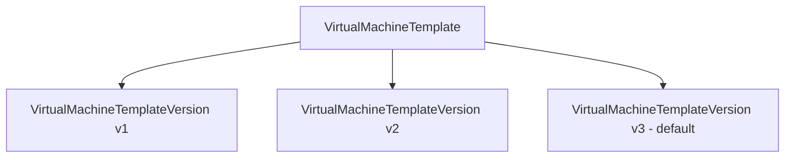

# How to Create VM Templates in Harvester

Author: [nawazdhandala](https://www.github.com/nawazdhandala)

Tags: Harvester, Kubernetes, Virtualization, HCI, VM Templates

Description: Learn how to create and use virtual machine templates in Harvester to standardize VM configurations and accelerate deployments.

## Introduction

VM templates in Harvester allow you to define a standard VM configuration - CPU, memory, network, storage, and cloud-init settings - that can be reused to create multiple VMs consistently. Templates reduce configuration errors, enforce standards, and speed up VM provisioning. Harvester templates also support versioning, so you can update a template while keeping historical versions for rollback.

## Template Architecture

A Harvester VM template consists of two resources:



- **VirtualMachineTemplate**: The container resource that holds metadata
- **VirtualMachineTemplateVersion**: Contains the actual VM spec; multiple versions can exist

## Step 1: Create a Template via the UI

1. Navigate to **Advanced** → **VM Templates**
2. Click **Create**
3. Fill in the template name and description
4. Configure the VM spec just like creating a regular VM:
   - Set CPU and memory
   - Add a boot volume from an image
   - Configure networks
   - Add cloud-init data
5. Click **Create**

The template is now available when creating new VMs - select it in the **Template** dropdown during VM creation.

## Step 2: Create a Template via kubectl

### Create the Template Container

```yaml
# vm-template-ubuntu-web.yaml

# Template container - holds metadata and references to versions

apiVersion: harvesterhci.io/v1beta1
kind: VirtualMachineTemplate
metadata:
  name: ubuntu-web-server
  namespace: default
spec:
  description: "Ubuntu 22.04 LTS web server template - 4 CPU / 8 GB RAM"
  # This will be updated to point to the default version
  defaultVersionId: ""
```

```bash
kubectl apply -f vm-template-ubuntu-web.yaml
```

### Create the Template Version

```yaml
# vm-template-version-v1.yaml
# Template version - contains the full VM specification

apiVersion: harvesterhci.io/v1beta1
kind: VirtualMachineTemplateVersion
metadata:
  name: ubuntu-web-server-v1
  namespace: default
spec:
  # Reference to the parent template
  templateId: default/ubuntu-web-server
  description: "Initial version - Ubuntu 22.04 LTS"
  vm:
    # Kubernetes metadata to apply to the VM
    metadata:
      labels:
        role: web-server
        managed-by: template
      annotations:
        harvesterhci.io/volumeClaimTemplates: |-
          [{
            "metadata": {
              "name": "pvc-rootdisk",
              "annotations": {
                "harvesterhci.io/imageId": ""
              }
            },
            "spec": {
              "accessModes": ["ReadWriteMany"],
              "resources": {
                "requests": {
                  "storage": "20Gi"
                }
              },
              "volumeMode": "Block"
            }
          }]
    spec:
      runStrategy: Halted  # Don't start automatically; let the user decide
      template:
        spec:
          domain:
            # CPU configuration
            cpu:
              cores: 4
              sockets: 1
              threads: 1
            # Memory
            resources:
              requests:
                cpu: 4
                memory: 8Gi
              limits:
                cpu: 4
                memory: 8Gi
            # Machine type
            machine:
              type: q35
            # Device configuration
            devices:
              disks:
                - name: rootdisk
                  bootOrder: 1
                  disk:
                    bus: virtio
                - name: cloudinitdisk
                  disk:
                    bus: virtio
              interfaces:
                - name: default
                  model: virtio
                  masquerade: {}
              # Enable tablet input for better VNC mouse handling
              inputs:
                - name: tablet
                  bus: usb
                  type: tablet
          # Network definitions
          networks:
            - name: default
              pod: {}
          # Volume definitions
          volumes:
            - name: rootdisk
              persistentVolumeClaim:
                claimName: pvc-rootdisk
            - name: cloudinitdisk
              cloudInitNoCloud:
                userData: |
                  #cloud-config
                  # Default cloud-init for web servers
                  packages:
                    - qemu-guest-agent
                    - nginx
                  runcmd:
                    - systemctl enable --now qemu-guest-agent
                    - systemctl enable --now nginx
                  users:
                    - name: ubuntu
                      sudo: ALL=(ALL) NOPASSWD:ALL
                      shell: /bin/bash
```

```bash
kubectl apply -f vm-template-version-v1.yaml

# Optionally set this version as the default for the template
kubectl patch virtualmachinetemplate ubuntu-web-server -n default \
    --type merge \
    -p '{"spec":{"defaultVersionId":"default/ubuntu-web-server-v1"}}'
```

## Step 3: Create a Version 2 (Updated Template)

When you need to update a template, create a new version:

```yaml
# vm-template-version-v2.yaml
# Updated template version with more resources

apiVersion: harvesterhci.io/v1beta1
kind: VirtualMachineTemplateVersion
metadata:
  name: ubuntu-web-server-v2
  namespace: default
spec:
  templateId: default/ubuntu-web-server
  description: "v2 - Increased to 8 CPU / 16 GB RAM for higher traffic"
  vm:
    metadata:
      labels:
        role: web-server
        managed-by: template
      annotations:
        harvesterhci.io/volumeClaimTemplates: |-
          [{
            "metadata": {
              "name": "pvc-rootdisk",
              "annotations": {
                "harvesterhci.io/imageId": ""
              }
            },
            "spec": {
              "accessModes": ["ReadWriteMany"],
              "resources": {
                "requests": {
                  "storage": "20Gi"
                }
              },
              "volumeMode": "Block"
            }
          }]
    spec:
      runStrategy: Halted
      template:
        spec:
          domain:
            cpu:
              cores: 8     # Increased from 4
              sockets: 1
              threads: 1
            resources:
              requests:
                cpu: 8
                memory: 16Gi   # Increased from 8Gi
              limits:
                cpu: 8
                memory: 16Gi
            machine:
              type: q35
            devices:
              disks:
                - name: rootdisk
                  bootOrder: 1
                  disk:
                    bus: virtio
                - name: cloudinitdisk
                  disk:
                    bus: virtio
              interfaces:
                - name: default
                  model: virtio
                  masquerade: {}
              inputs:
                - name: tablet
                  bus: usb
                  type: tablet
          networks:
            - name: default
              pod: {}
          volumes:
            - name: rootdisk
              persistentVolumeClaim:
                claimName: pvc-rootdisk
            - name: cloudinitdisk
              cloudInitNoCloud:
                userData: |
                  #cloud-config
                  packages:
                    - qemu-guest-agent
                    - nginx
                  runcmd:
                    - systemctl enable --now qemu-guest-agent
                    - systemctl enable --now nginx
                  users:
                    - name: ubuntu
                      sudo: ALL=(ALL) NOPASSWD:ALL
                      shell: /bin/bash
```

```bash
kubectl apply -f vm-template-version-v2.yaml

# Optionally promote v2 as the new default
kubectl patch virtualmachinetemplate ubuntu-web-server -n default \
    --type merge \
    -p '{"spec":{"defaultVersionId":"default/ubuntu-web-server-v2"}}'
```

## Creating a VM from a Template

### Via the UI

1. Go to **Virtual Machines** → **Create**
2. In the **Template** dropdown, select `ubuntu-web-server`
3. The template version dropdown will show all available versions
4. Provide the VM name and choose the boot image
5. Click **Create**

### Via kubectl

`kubectl` does not have a native command that expands a Harvester template into a `VirtualMachine` automatically. To stay in the CLI, inspect the template version and use its `spec.vm` section as the starting point for a regular KubeVirt `VirtualMachine` manifest:

```bash
kubectl get virtualmachinetemplateversion ubuntu-web-server-v2 -n default -o yaml
```

```yaml
# vm-from-template.yaml
# Create a VM from the vm.spec section of a template version

apiVersion: kubevirt.io/v1
kind: VirtualMachine
metadata:
  name: web-server-01
  namespace: default
  labels:
    role: web-server
    managed-by: template
  annotations:
    # Replace default/ubuntu-2204-image with your Harvester VM image ID
    harvesterhci.io/volumeClaimTemplates: |-
      [{
        "metadata": {
          "name": "web-server-01-rootdisk",
          "annotations": {
            "harvesterhci.io/imageId": "default/ubuntu-2204-image"
          }
        },
        "spec": {
          "accessModes": ["ReadWriteMany"],
          "resources": {
            "requests": {
              "storage": "20Gi"
            }
          },
          "volumeMode": "Block"
        }
      }]
spec:
  runStrategy: Always
  template:
    spec:
      domain:
        cpu:
          cores: 8
          sockets: 1
          threads: 1
        resources:
          requests:
            cpu: 8
            memory: 16Gi
          limits:
            cpu: 8
            memory: 16Gi
        machine:
          type: q35
        devices:
          disks:
            - name: rootdisk
              bootOrder: 1
              disk:
                bus: virtio
            - name: cloudinitdisk
              disk:
                bus: virtio
          interfaces:
            - name: default
              model: virtio
              masquerade: {}
          inputs:
            - name: tablet
              bus: usb
              type: tablet
      networks:
        - name: default
          pod: {}
      volumes:
        - name: rootdisk
          persistentVolumeClaim:
            claimName: web-server-01-rootdisk
        - name: cloudinitdisk
          cloudInitNoCloud:
            userData: |
              #cloud-config
              packages:
                - qemu-guest-agent
                - nginx
              runcmd:
                - systemctl enable --now qemu-guest-agent
                - systemctl enable --now nginx
              users:
                - name: ubuntu
                  sudo: ALL=(ALL) NOPASSWD:ALL
                  shell: /bin/bash
```

## Listing and Managing Templates

```bash
# List all templates
kubectl get virtualmachinetemplate -n default

# List all template versions
kubectl get virtualmachinetemplateversion -n default

# Delete a non-default template version (keeps other versions)
kubectl delete virtualmachinetemplateversion ubuntu-web-server-v1 -n default

# Delete the entire template and all versions
kubectl delete virtualmachinetemplate ubuntu-web-server -n default
```

## Conclusion

VM templates in Harvester bring consistency and governance to your VM deployments. By defining approved configurations as versioned templates, you ensure that all VMs are created with the right resources, security settings, and software packages. Template versioning gives you the flexibility to evolve your standard configurations over time while maintaining an audit trail. Teams can standardize VM definitions and automate provisioning using the Kubernetes API.
