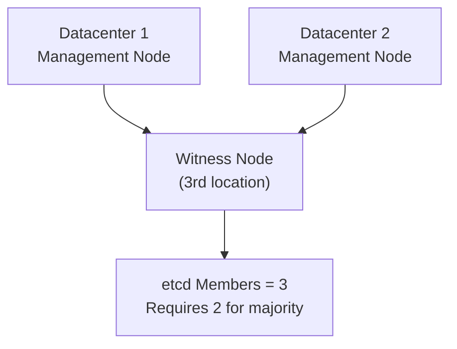

# How to Set Up Harvester Witness Node

Author: [nawazdhandala](https://www.github.com/nawazdhandala)

Tags: Harvester, Kubernetes, Virtualization, HCI, Witness Node, High Availability

Description: Learn how to configure a Harvester witness node to maintain etcd quorum in multi-datacenter deployments without adding full compute nodes.

## Introduction

A witness node in Harvester is a lightweight cluster member that participates in etcd quorum voting without running VM workloads. Witness nodes are valuable for two-datacenter disaster recovery configurations where you need a third node to break ties in quorum voting, but don't want to deploy a full management node in a third location. The witness node is an etcd-only cluster member and does not run the full Kubernetes control plane, KubeVirt, or Longhorn storage components.

## When to Use a Witness Node



**Use witness nodes when:**
- You are building a Harvester cluster with 2 management nodes and 1 witness node
- You need a third etcd voter without adding a third full management node
- The third location does not need to host VM or Longhorn workloads
- Cost of a full third management node is prohibitive

## Witness Node Architecture

A Harvester witness node:
- Runs etcd (participates in consensus voting) and only essential supporting workloads
- Does NOT run control-plane components such as kube-apiserver, kube-scheduler, or kube-controller-manager
- Does NOT run KubeVirt (no VMs)
- Does NOT run Longhorn (no storage)
- Still must meet Harvester witness-node hardware requirements and etcd storage performance guidance

## Prerequisites

- A Harvester deployment that will use 2 management nodes and 1 witness node
- A third server for the witness
- Network connectivity between all nodes
- The cluster join token

## Step 1: Prepare the Witness Node Hardware

Witness nodes consume fewer resources than full management nodes, but they still need to meet Harvester's documented minimums:

```text
Minimum Witness Node Specs:
- CPU:     8 cores minimum
- RAM:     32 GB minimum
- Disk:    180 GB minimum for witness nodes, on fast SSD/NVMe storage
- Network: 1 NIC minimum for the management network
```

## Step 2: Install Harvester on the Witness Node

Boot the server with the Harvester ISO, select **Join an existing Harvester cluster**, and choose the **Witness Role**. If you are automating the install, use a configuration like this:

```yaml
# witness-node-config.yaml

# Configuration for installing the witness node

scheme_version: 1

server_url: https://192.168.1.100:443
token: "your-cluster-token"

install:
  device: /dev/sda
  automatic: true
  mode: join
  role: witness
  management_interface:
    interfaces:
      - name: eth0
    method: static
    ip: 192.168.1.15
    subnet_mask: 255.255.255.0
    gateway: 192.168.1.1

os:
  hostname: harvester-witness-01
  ssh_authorized_keys:
    - ssh-ed25519 AAAAC3NzaC1... admin@host
  ntp_servers:
    - pool.ntp.org
  dns_nameservers:
    - 8.8.8.8
```

## Step 3: Verify the Node Role After Joining

After the node joins the cluster, verify that it came up with the witness role. In Harvester, the witness role must be assigned when the node joins the cluster.

```bash
# On a management node, or omit this if your external workstation already has cluster access
export KUBECONFIG=/etc/rancher/rke2/rke2.yaml

# Verify the node joined with the witness role
kubectl get nodes

# Expected witness role:
# harvester-witness-01    Ready    etcd
```

## Step 4: Verify Witness Node in the Cluster

```bash
export KUBECONFIG=/etc/rancher/rke2/rke2.yaml

# Check all nodes
kubectl get nodes -o wide

# Expected:
# NAME                    STATUS   ROLES
# harvester-node-01       Ready    control-plane,etcd,master   (Management node)
# harvester-node-02       Ready    control-plane,etcd,master   (Management node)
# harvester-witness-01    Ready    etcd                         (Witness node)

# Verify etcd has 3 members
kubectl exec -n kube-system \
    $(kubectl get pods -n kube-system -l component=etcd -o name | head -1) -- \
    etcdctl --endpoints=https://127.0.0.1:2379 \
            --cacert /var/lib/rancher/rke2/server/tls/etcd/server-ca.crt \
            --cert /var/lib/rancher/rke2/server/tls/etcd/server-client.crt \
            --key /var/lib/rancher/rke2/server/tls/etcd/server-client.key \
            member list

# Verify the witness only runs essential system pods
kubectl get pods -A -o wide | grep -F "harvester-witness-01"
```

## Step 5: Verify Workload Isolation

Confirm that VMs and Longhorn data don't land on the witness. If your cluster has only 2 management nodes and 1 witness node, make sure the default StorageClass uses 2 replicas instead of 3 or Longhorn volumes will be degraded.

```bash
# Check that no VMs are scheduled on the witness
kubectl get vmi -A -o wide | grep -F "harvester-witness-01" || \
    echo "No VMIs scheduled on witness"

# Check that no Longhorn replicas are on the witness
kubectl get replicas.longhorn.io -n longhorn-system \
    -o json | jq --arg node "harvester-witness-01" \
    '[.items[] | select(.spec.nodeID == $node)] | length'

# Check the default StorageClass replica count
kubectl get storageclass \
    -o custom-columns=NAME:.metadata.name,REPLICAS:.parameters.numberOfReplicas,DEFAULT:.metadata.annotations.storageclass\\.kubernetes\\.io/is-default-class

# In a 2 management + 1 witness cluster with no worker nodes,
# the default StorageClass should use 2 replicas.
```

## Step 6: Test Quorum with Witness Node

Simulate a node failure to verify the witness maintains quorum:

```bash
# Shutdown one full node (NOT the witness)
# On harvester-node-01:
sudo shutdown -h now

# From a remaining node or external workstation
# Verify the cluster is still operational
kubectl get nodes
# harvester-node-01 should show NotReady
# But the cluster should still function with nodes 02 + witness

# Test that VMs continue running
kubectl get vmi -A

# Test that the Kubernetes API is still ready
kubectl get --raw='/readyz?verbose'

# Verify etcd still has quorum
kubectl exec -n kube-system \
    $(kubectl get pods -n kube-system -l component=etcd -o name | head -1) -- \
    etcdctl --cacert /var/lib/rancher/rke2/server/tls/etcd/server-ca.crt \
            --cert /var/lib/rancher/rke2/server/tls/etcd/server-client.crt \
            --key /var/lib/rancher/rke2/server/tls/etcd/server-client.key \
            endpoint health --cluster
```

## Step 7: Witness Node Monitoring

The witness node should be monitored specifically for etcd health:

```bash
# On a management node, or omit this if your external workstation already has cluster access
export KUBECONFIG=/etc/rancher/rke2/rke2.yaml

ETCD_POD=$(kubectl get pods -n kube-system -l component=etcd \
    --field-selector spec.nodeName=harvester-witness-01 \
    -o name)

kubectl exec -n kube-system "$ETCD_POD" -- \
    etcdctl --cacert /var/lib/rancher/rke2/server/tls/etcd/server-ca.crt \
    --cert /var/lib/rancher/rke2/server/tls/etcd/server-client.crt \
    --key /var/lib/rancher/rke2/server/tls/etcd/server-client.key \
    endpoint health

# Run an etcd performance check
kubectl exec -n kube-system "$ETCD_POD" -- \
    etcdctl --cacert /var/lib/rancher/rke2/server/tls/etcd/server-ca.crt \
    --cert /var/lib/rancher/rke2/server/tls/etcd/server-client.crt \
    --key /var/lib/rancher/rke2/server/tls/etcd/server-client.key \
    check perf
```

## Conclusion

The witness node is an elegant solution to the etcd quorum problem in two-datacenter deployments. By contributing only to etcd quorum without hosting VM or Longhorn data, it allows you to build a supported 2-management-node plus 1-witness-node Harvester cluster with lower resource use than a third full management node. Just remember the key constraints: the witness role must be assigned when the node joins, each cluster can have only one witness node, and clusters with 2 management nodes plus 1 witness node and no workers need a default StorageClass that uses 2 replicas.
