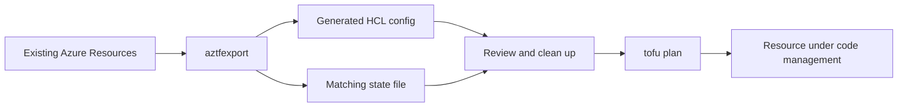

# How to Import Azure Resources into OpenTofu with aztfexport

Author: [nawazdhandala](https://www.github.com/nawazdhandala)

Tags: OpenTofu, Azure, Aztfexport, Import, Migration, Infrastructure as Code

Description: Learn how to use aztfexport to generate OpenTofu/Terraform configuration from existing Azure resources, enabling you to bring manually-created Azure infrastructure under code management.

---

aztfexport (Azure Terraform Export) is Microsoft's official tool for generating Terraform configuration from existing Azure resources. It queries Azure Resource Manager and Azure Resource Graph, and produces HCL configuration with matching state. `aztfexport` itself expects a `terraform` binary on your `PATH`, but you can review the generated files and validate them with OpenTofu afterwards.

## aztfexport Workflow



## Installing aztfexport

```bash
# macOS or Linux (Homebrew)

brew install aztfexport

# Cross-platform (Go toolchain)
go install github.com/Azure/aztfexport@latest

# Verify installation
aztfexport --version
```

## Export by Resource Group

```bash
# Export all resources in a resource group
aztfexport resource-group \
  --output-dir ./imported-azure \
  --non-interactive \
  MyResourceGroup

# In a fresh output directory, this typically creates:
# imported-azure/
# ├── main.tf           - generated resource definitions
# ├── provider.tf       - provider config
# ├── terraform.tf      - required_providers and backend config
# └── terraform.tfstate - matching local state
```

## Export Specific Resources

```bash
# Export a specific resource by resource ID
aztfexport resource \
  --output-dir ./imported-azure \
  --non-interactive \
  "/subscriptions/00000000-0000-0000-0000-000000000000/resourceGroups/my-rg/providers/Microsoft.Compute/virtualMachines/my-vm"

# Export by query (using Azure Resource Graph)
aztfexport query \
  --output-dir ./imported-azure \
  --non-interactive \
  "resourceGroup =~ 'my-production-rg' and type =~ 'microsoft.network/virtualnetworks'"
```

## Review and Clean Generated Configuration

```bash
# After export, review and clean up
cd imported-azure

# 1. Remove resource-specific IDs that should be variables
# 2. Extract common variables (location, resource_group_name)
# 3. Add descriptions to variables
# 4. Remove computed attributes that would cause drift

# Run plan to check for differences
tofu init
tofu plan
```

## Typical Generated Configuration

```hcl
# Generated by aztfexport - review before using
resource "azurerm_virtual_network" "res-0" {
  address_space       = ["10.0.0.0/16"]
  location            = "eastus"
  name                = "my-vnet"
  resource_group_name = "my-production-rg"

  tags = {
    Environment = "production"
    ManagedBy   = "terraform"
  }
}

resource "azurerm_subnet" "res-1" {
  address_prefixes     = ["10.0.1.0/24"]
  name                 = "app-subnet"
  resource_group_name  = "my-production-rg"
  virtual_network_name = azurerm_virtual_network.res-0.name
}
```

## Post-Export Cleanup

```bash
# Rename auto-generated resource names (res-0, res-1) to meaningful names
# Use a sed script or IDE rename
sed -i.bak \
  -e 's/resource "azurerm_virtual_network" "res-0"/resource "azurerm_virtual_network" "main"/g' \
  -e 's/azurerm_virtual_network.res-0/azurerm_virtual_network.main/g' \
  main.tf
rm -f main.tf.bak

# Extract common values to variables
cat > variables.tf << 'EOF'
variable "location" {
  default = "eastus"
}

variable "resource_group_name" {
  default = "my-production-rg"
}
EOF

# Replace hardcoded values
sed -i.bak 's/location            = "eastus"/location            = var.location/g' main.tf
rm -f main.tf.bak

# Run plan to verify no unintended changes
tofu plan
```

## Move State to Remote Backend

```bash
# After cleanup, migrate state to Azure Blob
# Add backend config
cat > backend.tf << 'EOF'
terraform {
  backend "azurerm" {
    resource_group_name  = "tfstate"
    storage_account_name = "mytfstate"
    container_name       = "tfstate"
    key                  = "production.tfstate"
  }
}
EOF

tofu init -migrate-state
```

## Best Practices

- Use `--non-interactive` mode for aztfexport in CI/CD or scripted migrations - it skips prompts.
- Review all generated resources for auto-generated names like `res-0` and rename them to meaningful identifiers before committing.
- Run `tofu plan` immediately after export - any non-empty plan indicates drift between the generated config and actual state.
- Export in phases: networking first, then compute, then PaaS services - this helps manage the complexity.
- Keep the original aztfexport output in a separate git commit for reference before making cleanup changes.
