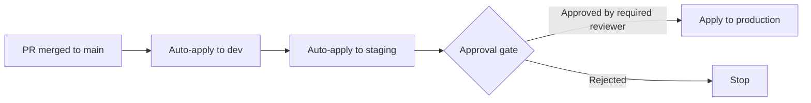

# How to Implement Infrastructure Change Approval Gates with OpenTofu

Author: [nawazdhandala](https://www.github.com/nawazdhandala)

Tags: OpenTofu, Approval Gates, GitHub Environments, Change Management, Security, Infrastructure as Code

Description: Learn how to implement infrastructure change approval gates with OpenTofu using GitHub Environments, required reviewers, and policy checks to prevent unauthorized changes from reaching production.

---

Approval gates ensure that infrastructure changes to production are reviewed and authorized before being applied. GitHub Environments provide a native approval mechanism that pauses CI/CD pipelines until one of the designated reviewers approves. For private or internal repositories, required reviewers and wait timers require GitHub Enterprise.

## Approval Gate Workflow



## GitHub Environments via OpenTofu

```hcl
# github_environments.tf

resource "github_repository_environment" "dev" {
  repository  = var.infra_repo
  environment = "dev"
}

resource "github_repository_environment" "staging" {
  repository  = var.infra_repo
  environment = "staging"

  wait_timer = 5  # minutes; no manual approval required

  deployment_branch_policy {
    protected_branches     = true
    custom_branch_policies = false
  }
}

resource "github_repository_environment" "production" {
  repository  = var.infra_repo
  environment = "production"

  reviewers {
    teams = [
      data.github_team.infrastructure.id,
      data.github_team.security.id,
    ]
    users = [data.github_user.infra_lead.id]
  }

  prevent_self_review = true

  deployment_branch_policy {
    protected_branches     = true
    custom_branch_policies = false
  }
}
```

## CI/CD with Environment Gates

```yaml
# .github/workflows/deploy.yml
name: Deploy Infrastructure
on:
  push:
    branches: [main]

jobs:
  deploy-dev:
    environment: dev
    runs-on: ubuntu-latest
    steps:
      - uses: actions/checkout@v6
      - uses: opentofu/setup-opentofu@v1
      - run: tofu init && tofu apply -auto-approve
        working-directory: environments/dev

  deploy-staging:
    needs: deploy-dev
    environment: staging   # Wait timer only; no manual approval
    runs-on: ubuntu-latest
    steps:
      - uses: actions/checkout@v6
      - uses: opentofu/setup-opentofu@v1
      - run: tofu init && tofu apply -auto-approve
        working-directory: environments/staging

  notify-production-approval:
    needs: deploy-staging
    runs-on: ubuntu-latest
    steps:
      - uses: slackapi/slack-github-action@v3
        with:
          webhook: ${{ secrets.SLACK_WEBHOOK }}
          webhook-type: incoming-webhook
          payload: |
            text: "Production deployment waiting for approval"
            blocks:
              - type: "section"
                text:
                  type: "mrkdwn"
                  text: "*Production deployment pending approval*\nApprove at: ${{ github.server_url }}/${{ github.repository }}/actions/runs/${{ github.run_id }}"

  deploy-production:
    needs: notify-production-approval
    environment: production   # Requires reviewer approval
    runs-on: ubuntu-latest
    steps:
      - uses: actions/checkout@v6
      - uses: opentofu/setup-opentofu@v1
      - name: Enforce production change window
        run: |
          DOW=$(date -u +%u)  # 1=Mon, 7=Sun
          HOUR=$(date -u +%H)

          # Block deploys on weekends and outside business hours
          if [ "$DOW" -ge 6 ] || [ "$HOUR" -lt 9 ] || [ "$HOUR" -ge 18 ]; then
            echo "ERROR: Production deploys blocked outside business hours (Mon-Fri 09:00-18:00 UTC)"
            exit 1
          fi

          echo "Change window check passed"
      - run: tofu init && tofu apply -auto-approve
        working-directory: environments/production
```

## Change Freeze Windows

```yaml
# .github/workflows/deploy.yml - add before the production apply step
- name: Enforce production change window
  run: |
    DOW=$(date -u +%u)  # 1=Mon, 7=Sun
    HOUR=$(date -u +%H)

    # Block deploys on weekends and outside business hours
    if [ "$DOW" -ge 6 ] || [ "$HOUR" -lt 9 ] || [ "$HOUR" -ge 18 ]; then
      echo "ERROR: Production deploys blocked outside business hours (Mon-Fri 09:00-18:00 UTC)"
      exit 1
    fi

    echo "Change window check passed"
```

## Slack Notification for Pending Approvals

```yaml
notify-production-approval:
  needs: deploy-staging
  runs-on: ubuntu-latest
  steps:
    - name: Notify pending approval
      uses: slackapi/slack-github-action@v3
      with:
        webhook: ${{ secrets.SLACK_WEBHOOK }}
        webhook-type: incoming-webhook
        payload: |
          text: "Production deployment waiting for approval"
          blocks:
            - type: "section"
              text:
                type: "mrkdwn"
                text: "*Production deployment pending approval*\nApprove at: ${{ github.server_url }}/${{ github.repository }}/actions/runs/${{ github.run_id }}"
```

## Best Practices

- Add multiple required reviewers for production and enable `prevent_self_review = true` - GitHub Environments still proceed after any one required reviewer approves, so use a custom deployment protection rule if you need a strict two-person gate.
- Restrict production deployments to protected branches only - set `protected_branches = true` and make sure the target branch actually has branch protection rules configured.
- Send Slack notifications when approvals are pending - reviewers shouldn't have to check GitHub manually.
- Implement change freeze windows (weekends, holidays) by adding a pre-apply check that validates business hours.
- Log all approvals with GitHub's built-in deployment history - this creates an audit trail for change management processes.
