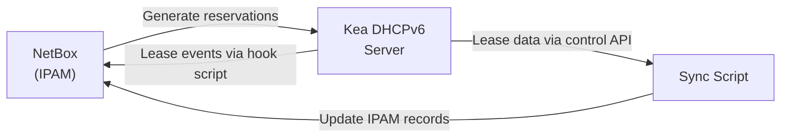

# How to Integrate IPAM with DHCPv6 for IPv6

Author: [nawazdhandala](https://www.github.com/nawazdhandala)

Tags: IPv6, IPAM, DHCPv6, Kea, NetBox, Automation

Description: Integrate IPAM tools with DHCPv6 servers to synchronize address allocations, import lease data, and generate DHCPv6 host reservations from IPAM records.

## Introduction

IPAM-DHCPv6 integration creates bidirectional synchronization: IPAM feeds host reservations to the DHCPv6 server, and the DHCPv6 server feeds lease data back to IPAM. This ensures the IPAM record reflects actual addresses in use and eliminates the manual step of adding DHCPv6 reservations separately from IPAM entries.

## Architecture



## Step 1: Generate Kea Reservations from NetBox

```python
#!/usr/bin/env python3
# netbox_to_kea_reservations.py

# Generate Kea DHCPv6 host reservations from NetBox IPAM records

import pynetbox
import json

nb = pynetbox.api("http://netbox.internal", token="your-token")

def generate_kea_reservations(subnet: str) -> list:
    """Generate Kea host reservation list from NetBox IP addresses."""
    reservations = []

    ip_addresses = nb.ipam.ip_addresses.filter(parent=subnet, status="active")
    for ip in ip_addresses:
        # Only create reservation if a hardware address is known
        if not ip.assigned_object:
            continue

        addr = str(ip.address).split('/')[0]
        description = ip.description or (ip.dns_name or "")

        # Get MAC from assigned interface
        iface = ip.assigned_object
        mac_value = getattr(iface, 'mac_address', None) if iface else None
        mac = str(mac_value) if mac_value else ""

        if mac:
            reservation = {
                "hw-address": mac,
                "ip-addresses": [addr],
                "hostname": str(ip.dns_name).rstrip('.') if ip.dns_name else "",
                "comment": description
            }
            reservations.append(reservation)

    return reservations

# Generate reservations for a specific subnet
subnet = "2001:db8:0001:0001::/64"
reservations = generate_kea_reservations(subnet)

# Output a reservations array for use with a <?include "..."> directive
print(json.dumps(reservations, indent=2))
```

## Step 2: Import Kea Leases into NetBox

This example assumes Kea's `libdhcp_lease_cmds.so` hook library is enabled so the `lease6-get-all` command is available over the control API.

```python
#!/usr/bin/env python3
# kea_leases_to_netbox.py
# Import active Kea DHCPv6 leases into NetBox

import json
import urllib.request
import pynetbox
import ipaddress

nb = pynetbox.api("http://netbox.internal", token="your-token")

def get_kea_leases() -> list:
    """Get DHCPv6 leases from Kea's control API."""
    payload = json.dumps({
        "command": "lease6-get-all",
        "service": ["dhcp6"]
    }).encode()

    req = urllib.request.Request(
        "http://[::1]:8000/",
        data=payload,
        headers={"Content-Type": "application/json"}
    )

    with urllib.request.urlopen(req, timeout=10) as resp:
        response = json.load(resp)
        replies = response if isinstance(response, list) else [response]
        reply = replies[0]

        if reply.get("result") not in (0, 3):
            raise RuntimeError(reply.get("text", "lease6-get-all failed"))

        return reply.get("arguments", {}).get("leases", [])

def sync_leases_to_netbox(leases: list):
    """Create or update NetBox IP address records for active leases."""
    for lease in leases:
        if lease.get("type") != "IA_NA" or lease.get("state") != 0:
            # Only active /128 addresses, not PD or reclaimed leases
            continue

        ip_addr = lease.get("ip-address")
        duid = lease.get("duid", "")
        hostname = lease.get("hostname", "").rstrip(".")

        if not ip_addr:
            continue

        # Normalize address
        normalized = str(ipaddress.ip_address(ip_addr)) + "/128"

        # Check if IP already exists in NetBox
        existing = list(nb.ipam.ip_addresses.filter(address=normalized))

        if existing:
            # Update existing record
            ip_obj = existing[0]
            nb.ipam.ip_addresses.update([{
                "id": ip_obj.id,
                "description": f"DHCPv6 lease | DUID: {duid[:20]}",
                "dns_name": hostname,
                "status": "active"
            }])
        else:
            # Create new record for lease
            nb.ipam.ip_addresses.create({
                "address": normalized,
                "description": f"DHCPv6 lease | DUID: {duid[:20]}",
                "dns_name": hostname,
                "status": "active"
            })
            print(f"Created IPAM record: {normalized} ({hostname})")

leases = get_kea_leases()
print(f"Processing {len(leases)} active leases...")
sync_leases_to_netbox(leases)
print("Sync complete")
```

## Step 3: Hook Script Sync (Real-time)

Configure Kea to run an external hook script when leases change:

```json
// Kea configuration: lease4/6 callouts
// /etc/kea/kea-dhcp6.conf (snippet)
{
  "Dhcp6": {
    "hooks-libraries": [{
      "library": "/usr/local/lib/libdhcp_run_script.so",
      "parameters": {
        "name": "/usr/local/share/kea/scripts/netbox_sync.sh",
        "sync": false
      }
    }]
  }
}
```

```bash
#!/bin/bash
# /usr/local/share/kea/scripts/netbox_sync.sh
# Called by Kea's run_script hook library on lease events

set -eu

NETBOX_URL="http://netbox.internal"
NETBOX_TOKEN="${NETBOX_TOKEN:?set NETBOX_TOKEN in the environment}"

lookup_ip_id() {
    address="$1"

    curl -fsS -G "${NETBOX_URL}/api/ipam/ip-addresses/" \
        -H "Authorization: Token ${NETBOX_TOKEN}" \
        --data-urlencode "address=${address}" \
        --data-urlencode "limit=1" |
        python3 -c 'import json, sys; results = json.load(sys.stdin).get("results", []); print(results[0]["id"] if results else "")'
}

build_payload() {
    address="$1"
    duid="$2"
    hostname="$3"

    ADDRESS="$address" DUID="$duid" HOSTNAME="$hostname" python3 - <<'PY'
import json
import os

print(json.dumps({
    "address": os.environ["ADDRESS"],
    "description": f'DHCPv6 lease | DUID: {os.environ["DUID"][:20]}',
    "dns_name": os.environ["HOSTNAME"],
    "status": "active",
}))
PY
}

upsert_ip() {
    address="$1"
    duid="$2"
    hostname="$3"
    existing_id="$(lookup_ip_id "$address")"
    payload="$(build_payload "$address" "$duid" "$hostname")"

    if [ -n "$existing_id" ]; then
        curl -fsS -X PATCH "${NETBOX_URL}/api/ipam/ip-addresses/${existing_id}/" \
            -H "Authorization: Token ${NETBOX_TOKEN}" \
            -H "Content-Type: application/json" \
            -d "$payload" > /dev/null
    else
        curl -fsS -X POST "${NETBOX_URL}/api/ipam/ip-addresses/" \
            -H "Authorization: Token ${NETBOX_TOKEN}" \
            -H "Content-Type: application/json" \
            -d "$payload" > /dev/null
    fi
}

mark_deprecated() {
    address="$1"
    existing_id="$(lookup_ip_id "$address")"

    if [ -n "$existing_id" ]; then
        curl -fsS -X PATCH "${NETBOX_URL}/api/ipam/ip-addresses/${existing_id}/" \
            -H "Authorization: Token ${NETBOX_TOKEN}" \
            -H "Content-Type: application/json" \
            -d '{"status": "deprecated"}' > /dev/null
    fi
}

case "$1" in
    "leases6_committed")
        i=0
        while [ "$i" -lt "${LEASES6_SIZE:-0}" ]; do
            lease_type="$(eval "echo \${LEASES6_AT${i}_TYPE}")"
            if [ "$lease_type" = "IA_NA" ]; then
                address="$(eval "echo \${LEASES6_AT${i}_ADDRESS}")"
                duid="$(eval "echo \${LEASES6_AT${i}_DUID}")"
                hostname="$(eval "echo \${LEASES6_AT${i}_HOSTNAME}")"
                upsert_ip "${address}/128" "$duid" "$hostname"
            fi
            i=$((i + 1))
        done

        i=0
        while [ "$i" -lt "${DELETED_LEASES6_SIZE:-0}" ]; do
            lease_type="$(eval "echo \${DELETED_LEASES6_AT${i}_TYPE}")"
            if [ "$lease_type" = "IA_NA" ]; then
                address="$(eval "echo \${DELETED_LEASES6_AT${i}_ADDRESS}")"
                mark_deprecated "${address}/128"
            fi
            i=$((i + 1))
        done
        ;;
    "lease6_expire"|"lease6_release")
        if [ "${LEASE6_TYPE}" = "IA_NA" ]; then
            mark_deprecated "${LEASE6_ADDRESS}/128"
        fi
        ;;
esac
```

## Step 4: Run Periodic Reconciliation

```bash
# Crontab entry for periodic IPAM-DHCPv6 sync
# Assumes the relevant Kea subnet6 entry includes:
# "reservations": <?include "/etc/kea/generated-dhcp6-reservations.json"?>
*/30 * * * * /usr/local/bin/kea_leases_to_netbox.py >> /var/log/ipam-sync.log 2>&1
0 2 * * * /usr/local/bin/netbox_to_kea_reservations.py > /etc/kea/generated-dhcp6-reservations.json 2>> /var/log/ipam-sync.log && curl -s -X POST -H "Content-Type: application/json" -d '{ "command": "config-reload", "service": [ "dhcp6" ] }' http://[::1]:8000/ >> /var/log/ipam-sync.log 2>&1
```

## Conclusion

IPAM-DHCPv6 integration requires two synchronization directions: IPAM to DHCPv6 for host reservations (ensuring specific devices get specific addresses), and DHCPv6 to IPAM for lease records (ensuring IPAM reflects dynamically assigned addresses). Use Kea's `run_script` hook for real-time sync on lease events, supplemented by periodic batch reconciliation to catch any missed events. The `lease6-get-all` Kea control API command provides a complete current lease snapshot for batch import.
