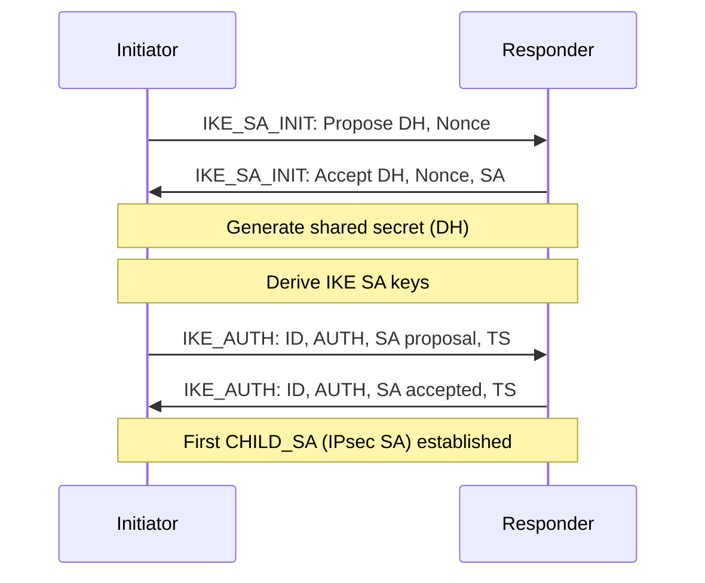

# How to Understand IPsec Security Associations for IPv6

Author: [nawazdhandala](https://www.github.com/nawazdhandala)

Tags: IPv6, IPsec, Security Associations, SPI, SAD

Description: Learn how IPsec Security Associations work in IPv6 networks, including the SAD/SPD databases, SPI identifiers, SA negotiation with IKEv2, and lifetime management.

## Overview

A Security Association (SA) is a one-way logical connection between two IPv6 hosts that defines the cryptographic parameters (algorithm, key, SPI) for IPsec processing. A typical bidirectional IPsec tunnel uses two SAs - one in each direction. Understanding SAs is fundamental to troubleshooting IPsec issues.

## SA Components

For inbound IPsec processing, an SA is commonly identified by three values:

| Component | Description |
|-----------|-------------|
| SPI (Security Parameters Index) | 32-bit value chosen by the receiver |
| Destination IP | IPv6 address of the SA's destination |
| Protocol | AH (51) or ESP (50) |

Together these are commonly shown as the inbound SA selector: `(SPI, dst, protocol)`

## Security Association Database (SAD)

The SAD contains all active SAs. Each entry includes:

```text
SA Parameters:
  SPI:           0xABC123
  Protocol:      ESP
  Src:           2001:db8:1::1
  Dst:           2001:db8:2::1
  Mode:          Tunnel
  Cipher:        AES-256-GCM
  Key:           [256-bit key]
  Auth:          Built-in (GCM)
  Seq Counter:   5 (anti-replay)
  Bitmap:        0xFFFFFFFF (anti-replay window)
  Lifetime:      3600s / 4294967295 bytes
  Elapsed:       45s / 892644 bytes
```

```bash
# View SAD on Linux

ip xfrm state list

# Detailed view
ip -s xfrm state list

# Sample output:
# src 2001:db8:1::1 dst 2001:db8:2::1
#   proto esp spi 0x00abc123 reqid 1 mode tunnel
#   replay-window 64 flag af-unspec
#   aead rfc4106(gcm(aes)) 0x...key...  128
#   anti-replay context: seq 0x5, oseq 0x5, bitmap 0xffffffff
#   lifetime config:
#     limit: soft 0(bytes), hard 0(bytes)
#     limit: soft 3510(use), hard 3600(use)
#   current:
#     892644(bytes), 721(packets), used 42(sec)
```

## Security Policy Database (SPD)

The SPD determines which traffic is subject to IPsec processing:

```bash
# View SPD on Linux
ip xfrm policy list

# Sample output:
# src 2001:db8:100::/48 dst 2001:db8:200::/48
#   dir out priority 0
#   tmpl src 2001:db8:1::1 dst 2001:db8:2::1
#     proto esp spi 0x00000000(0) reqid 1 mode tunnel
```

SPD actions:
- **PROTECT**: Apply IPsec processing
- **BYPASS**: Send without IPsec
- **DISCARD**: Drop the packet

## SA Negotiation with IKEv2



## SA Lifetimes

SAs have both time and byte-based lifetimes:

```bash
# strongSwan: Configure SA lifetimes in swanctl.conf
connections {
    example {
        children {
            my-tunnel {
                # Initiate rekey at 3600s
                rekey_time = 3600s
                # Hard lifetime (force new SA at 7200s)
                life_time  = 7200s
                # Rekey after 1GB
                rekey_bytes = 1000000000
                # Hard byte limit
                life_bytes  = 2000000000
            }
        }
    }
}
```

### SA Rekey vs SA Reauthentication

- **Rekey**: New keys are negotiated while old SA is still valid (smooth transition)
- **Reauthentication**: A new IKE SA is created from scratch and the associated IPsec SAs are recreated (brief interruption possible)

```bash
# strongSwan with charon-systemd: Monitor SA rekey events
journalctl -u strongswan | grep -E 'rekeying|CHILD_SA'
```

## Anti-Replay Protection

ESP includes a sequence number for anti-replay protection:

```bash
# Example anti-replay window shown above: 64 packets
# If a packet arrives with a sequence number outside the window → dropped
# This prevents replay attacks where attacker resends captured ESP packets

# View current sequence numbers
ip -s xfrm state list | grep 'anti-replay context'
# seq = inbound sequence state
# oseq = outbound sequence state

# Example: increase the replay window on an existing SA
ip xfrm state update src 2001:db8:1::1 dst 2001:db8:2::1 proto esp spi 0x00abc123 replay-window 512
```

## SA Monitoring

```bash
# Count SA bytes processed
ip -s xfrm state list | grep -A 1 'current:'
# Shows: bytes/packets since SA was created

# Watch SA expiry
watch -n 5 "ip xfrm state list | grep 'lifetime\|current'"

# strongSwan: Show SA details
swanctl --list-sas --raw | grep -E 'spi|bytes|rekey'
```

## Summary

IPsec SAs use SPIs, and inbound processing commonly inspects the SPI, destination IP, and protocol. The SAD stores active SAs with their keys, algorithms, and counters. The SPD determines which traffic gets IPsec treatment. IKEv2 negotiates SAs in two phases: IKE_SA_INIT (DH exchange) and IKE_AUTH (authentication + first CHILD_SA). SAs have time and byte-based lifetimes with automatic rekeying (strongSwan: `rekey_time`). Monitor SAs with `ip xfrm state list` on Linux or `swanctl --list-sas`. Anti-replay protection uses a sequence number window to prevent replay attacks.
