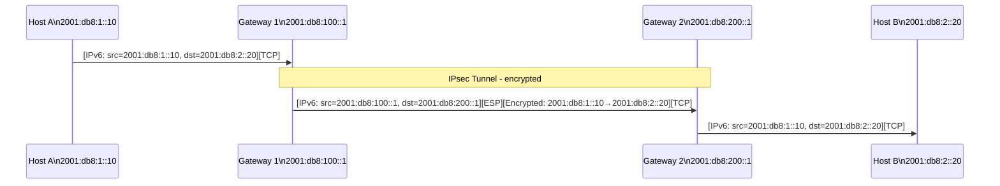

# How to Configure IPsec Tunnel Mode with IPv6 on Linux

Author: [nawazdhandala](https://www.github.com/nawazdhandala)

Tags: IPv6, IPsec, Linux, Tunnel Mode, VPN

Description: Learn how to configure IPsec tunnel mode for IPv6 on Linux to create encrypted gateway-to-gateway VPN tunnels protecting traffic between IPv6 subnets.

## Overview

IPsec tunnel mode for IPv6 encapsulates the entire original IPv6 packet inside a new IPv6 packet with ESP encryption. This is the mode used for gateway-to-gateway (site-to-site) VPNs. Tunnel mode hides the original source and destination addresses - only the outer gateway addresses are visible on the network.

## Architecture



## Topology

```text
Site 1: 2001:db8:1::/48  -  GW1: 2001:db8:100::1
Site 2: 2001:db8:2::/48  -  GW2: 2001:db8:200::1
```

## Method 1: Manual ip xfrm

```bash
# ============================================================

# On Gateway 1 (GW1): 2001:db8:100::1
# ============================================================

# Outbound SA: GW1 → GW2 (encrypts traffic to site2)
ip xfrm state add \
  src 2001:db8:100::1 dst 2001:db8:200::1 \
  proto esp spi 0x1001 mode tunnel \
  aead "rfc4106(gcm(aes))" 0x0102030405060708090a0b0c0d0e0f1001020304 128

# Inbound SA: GW2 → GW1 (decrypts traffic from site2)
ip xfrm state add \
  src 2001:db8:200::1 dst 2001:db8:100::1 \
  proto esp spi 0x2001 mode tunnel \
  aead "rfc4106(gcm(aes))" 0x1112131415161718191a1b1c1d1e1f2011121314 128

# Outbound policy: site1 → site2 (use tunnel)
ip xfrm policy add \
  src 2001:db8:1::/48 dst 2001:db8:2::/48 \
  dir out \
  tmpl src 2001:db8:100::1 dst 2001:db8:200::1 proto esp mode tunnel

# Inbound policy: site2 → site1
ip xfrm policy add \
  src 2001:db8:2::/48 dst 2001:db8:1::/48 \
  dir in \
  tmpl src 2001:db8:200::1 dst 2001:db8:100::1 proto esp mode tunnel

# Forward policy (for decrypted traffic being forwarded through GW1)
ip xfrm policy add \
  src 2001:db8:2::/48 dst 2001:db8:1::/48 \
  dir fwd \
  tmpl src 2001:db8:200::1 dst 2001:db8:100::1 proto esp mode tunnel
```

```bash
# ============================================================
# On Gateway 2 (GW2): 2001:db8:200::1 - mirror configuration
# ============================================================
ip xfrm state add \
  src 2001:db8:200::1 dst 2001:db8:100::1 \
  proto esp spi 0x2001 mode tunnel \
  aead "rfc4106(gcm(aes))" 0x1112131415161718191a1b1c1d1e1f2011121314 128

ip xfrm state add \
  src 2001:db8:100::1 dst 2001:db8:200::1 \
  proto esp spi 0x1001 mode tunnel \
  aead "rfc4106(gcm(aes))" 0x0102030405060708090a0b0c0d0e0f1001020304 128

ip xfrm policy add \
  src 2001:db8:2::/48 dst 2001:db8:1::/48 \
  dir out \
  tmpl src 2001:db8:200::1 dst 2001:db8:100::1 proto esp mode tunnel

ip xfrm policy add \
  src 2001:db8:1::/48 dst 2001:db8:2::/48 \
  dir in \
  tmpl src 2001:db8:100::1 dst 2001:db8:200::1 proto esp mode tunnel

ip xfrm policy add \
  src 2001:db8:1::/48 dst 2001:db8:2::/48 \
  dir fwd \
  tmpl src 2001:db8:100::1 dst 2001:db8:200::1 proto esp mode tunnel
```

## Method 2: strongSwan Tunnel Mode

### /etc/swanctl/conf.d/site-to-site.conf (on GW1; mirror on GW2 with local/remote values swapped)

```text
connections {
    site-to-site {
        version = 2
        local_addrs  = 2001:db8:100::1
        remote_addrs = 2001:db8:200::1

        local {
            auth = psk
            id = 2001:db8:100::1
        }
        remote {
            auth = psk
            id = 2001:db8:200::1
        }

        children {
            site1-to-site2 {
                local_ts  = 2001:db8:1::/48
                remote_ts = 2001:db8:2::/48
                mode = tunnel
                esp_proposals = aes256gcm16-ecp256
                start_action = start
                dpd_action = restart
            }
        }

        proposals = aes256-sha256-ecp256
        dpd_delay = 30s
    }
}

secrets {
    ike-site-to-site {
        id-local  = 2001:db8:100::1
        id-remote = 2001:db8:200::1
        secret = "VeryStrongSharedSecret123!"
    }
}
```

```bash
# Load and initiate
swanctl --load-all
swanctl --initiate --child site1-to-site2

# Status
swanctl --list-sas
ip xfrm policy list
```

## Enable IPv6 Forwarding on Gateways

```bash
# Required on both gateways to forward inter-site traffic
sysctl -w net.ipv6.conf.all.forwarding=1
echo "net.ipv6.conf.all.forwarding = 1" >> /etc/sysctl.d/99-ipv6.conf
```

## Verification

```bash
# Check ESP traffic is flowing
tcpdump -i eth0 'ip6 proto 50' -n -c 10

# Verify routes on GW1
ip -6 route | grep '2001:db8:2::/48'
# Policy-based IPsec still relies on a regular IPv6 route toward GW2

# Ping from Site 1 host to Site 2 host
ping -6 2001:db8:2::20

# Check xfrm counters
ip -s xfrm state list | grep -A 10 'spi 0x1001'
# Look for byte/packet counters incrementing
```

## Summary

IPsec tunnel mode for IPv6 on Linux requires matching SA pairs on both gateways (outbound on one = inbound on the other, same SPI and key), the appropriate policy directions (out, in, and fwd for forwarded traffic), IPv6 forwarding enabled, and regular IPv6 routing so remote-subnet traffic reaches the gateways. Use `aead "rfc4106(gcm(aes))"` for AES-GCM authenticated encryption. strongSwan with swanctl is the recommended production approach - it handles SA negotiation, dead peer detection (DPD), and rekeying automatically. Verify with `swanctl --list-sas`, `ip xfrm policy list`, and `ip -s xfrm state list`.
