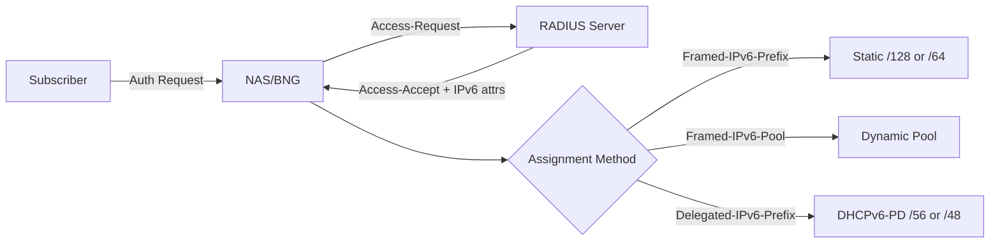

# How to Assign IPv6 Addresses via RADIUS

Author: [nawazdhandala](https://www.github.com/nawazdhandala)

Tags: RADIUS, IPv6, Address Assignment, DHCPv6, FreeRADIUS, AAA, Networking

Description: Implement IPv6 address assignment via RADIUS using static per-user assignments, dynamic pools, and integration with DHCPv6 for complete subscriber IPv6 provisioning.

## IPv6 Assignment Methods via RADIUS



## Method 1: Static Per-User Assignment

```text
# /etc/freeradius/3.0/users

# Fixed IPv6 address per user

alice  Cleartext-Password := "secret"
       Framed-IPv6-Prefix := "2001:db8:100::10/128",
       Framed-IPv6-Route := "2001:db8:100:a00::/56 2001:db8:100::10 1",
       Delegated-IPv6-Prefix := "2001:db8:100:a00::/56",
       DNS-Server-IPv6-Address := "2001:db8::53"
```

```sql
-- SQL database approach
INSERT INTO radreply (username, attribute, op, value) VALUES
('alice', 'Framed-IPv6-Prefix',    ':=', '2001:db8:100::10/128'),
('alice', 'Framed-IPv6-Route',     ':=', '2001:db8:100:a00::/56 2001:db8:100::10 1'),
('alice', 'Delegated-IPv6-Prefix', ':=', '2001:db8:100:a00::/56');
```

## Method 2: Dynamic Pool Assignment

```bash
# /etc/freeradius/3.0/users
# Ask the NAS/BNG to allocate from named IPv6 pools configured on the NAS

bob  Cleartext-Password := "secret"
     Framed-IPv6-Pool := "wan_v6_pool",
     Delegated-IPv6-Prefix-Pool := "pd_v6_pool"
```

```text
# Unlang policy: use named pools only when no static IPv6 values are returned
# /etc/freeradius/3.0/sites-enabled/default

authorize {
    sql

    if (!&reply:Framed-IPv6-Prefix && !&reply:Delegated-IPv6-Prefix) {
        update reply {
            &Framed-IPv6-Pool := "wan_v6_pool"
            &Delegated-IPv6-Prefix-Pool := "pd_v6_pool"
        }
    }
}
```

## Method 3: Group-Based Assignment

```sql
-- radgroupreply: assign WAN and PD pools by user group
INSERT INTO radgroupreply (groupname, attribute, op, value) VALUES
('residential', 'Framed-IPv6-Pool',              ':=', 'residential_wan_v6'),
('residential', 'Delegated-IPv6-Prefix-Pool',    ':=', 'residential_pd_v6'),
('business',    'Framed-IPv6-Pool',              ':=', 'business_wan_v6'),
('business',    'Delegated-IPv6-Prefix-Pool',    ':=', 'business_pd_v6'),
('premium',     'Delegated-IPv6-Prefix',         ':=', '2001:db8:3000::/48');

-- radusergroup: assign users to groups
INSERT INTO radusergroup (username, groupname, priority) VALUES
('alice', 'residential', 1),
('corp1', 'business', 1),
('vip1',  'premium', 1);
```

## DHCPv6 Integration with RADIUS

```bash
# Complete IPv6 provisioning flow:
# 1. PPPoE/IPoE auth → RADIUS → returns Framed-IPv6-Prefix + Delegated-IPv6-Prefix
# 2. BNG assigns WAN address from Framed-IPv6-Prefix
# 3. BNG performs DHCPv6-PD toward CPE using Delegated-IPv6-Prefix

# Kea DHCPv6 with RADIUS integration
# Access-Accept can return Framed-IPv6-Address for stateful DHCPv6,
# Delegated-IPv6-Prefix for DHCPv6-PD, or Framed-Pool to select a Kea pool.
# /etc/kea/kea-dhcp6.conf

{
    "Dhcp6": {
        "hooks-libraries": [
            {
                "library": "libdhcp_host_cache.so"
            },
            {
                "library": "libdhcp_radius.so",
                "parameters": {
                    "dictionary": "/etc/kea/radius/dictionary",
                    "bindaddr": "*",
                    "access": {
                        "servers": [
                            {
                                "name": "2001:db8:0:100::10",
                                "port": 1812,
                                "secret": "secret"
                            }
                        ]
                    }
                }
            }
        ]
    }
}
```

## Framed-IPv6-Route for Routing

```text
# Return Framed-IPv6-Route to install static route at NAS
# Format: <prefix> <nexthop> <metric>

alice  Cleartext-Password := "secret"
       Framed-IPv6-Prefix := "2001:db8:100::10/128",

       # Route for user's delegated prefix via user's WAN address
       Framed-IPv6-Route := "2001:db8:100:a00::/56 2001:db8:100::10 1",

       # Multiple routes are supported
       Framed-IPv6-Route += "2001:db8:2200::/48 :: 1"
```

## RADIUS Change of Authorization (CoA): Update IPv6

```bash
# Change user's IPv6 prefix dynamically via CoA
# RFC 5176 - Disconnect Message and CoA

cat > /tmp/coa-request.txt << EOF
User-Name = "alice"
Acct-Session-Id = "00000042"
NAS-IPv6-Address = 2001:db8:0:1::1
Framed-IPv6-Prefix = 2001:db8:100::20/128
Delegated-IPv6-Prefix = 2001:db8:100:b00::/56
Event-Timestamp = $(date +%s)
EOF

# Send CoA to NAS (not RADIUS server)
radclient -6 -x [2001:db8:0:1::1]:3799 coa testing123 < /tmp/coa-request.txt
# NAS applies new IPv6 prefix to subscriber session
```

## Complete Assignment Verification

```bash
#!/bin/bash
# verify-ipv6-assignment.sh

USERNAME="alice"
RADIUS_SERVER="2001:db8:0:100::10"
SECRET="testing123"

echo "Testing IPv6 assignment for user: ${USERNAME}"

RESPONSE=$(radclient -6 -x "[${RADIUS_SERVER}]:1812" auth "${SECRET}" << EOF
User-Name = "${USERNAME}"
User-Password = "secret"
NAS-IPv6-Address = 2001:db8:0:1::1
NAS-Port = 1
Service-Type = Framed-User
EOF
2>&1)

echo "RADIUS Response:"
echo "${RESPONSE}"

# Extract assigned prefix
PREFIX=$(printf '%s\n' "${RESPONSE}" | sed -n 's/^[[:space:]]*Framed-IPv6-Prefix = //p' | head -n1)
DELEGATED=$(printf '%s\n' "${RESPONSE}" | sed -n 's/^[[:space:]]*Delegated-IPv6-Prefix = //p' | head -n1)

echo ""
echo "WAN Prefix:       ${PREFIX:-NOT_ASSIGNED}"
echo "Delegated Prefix: ${DELEGATED:-NOT_ASSIGNED}"

if [ -z "${PREFIX}" ]; then
    echo "ERROR: No IPv6 prefix assigned"
    exit 1
fi
echo "PASS: IPv6 assignment successful"
```

## Conclusion

RADIUS-based IPv6 address assignment uses three main attributes: `Framed-IPv6-Prefix` for the user's WAN prefix, `Delegated-IPv6-Prefix` for the home network prefix (DHCPv6-PD), and `Framed-IPv6-Route` to install routing table entries on the NAS. Choose static SQL assignments for fixed-address users, named IPv6 pools (`Framed-IPv6-Pool` and `Delegated-IPv6-Prefix-Pool`) for dynamic allocation, or group-based assignments for tiered service. The BNG applies these attributes to create subscriber interfaces and DHCPv6-PD sessions automatically. Use RADIUS CoA (RFC 5176) to change a subscriber's IPv6 prefix dynamically without forcing re-authentication.
