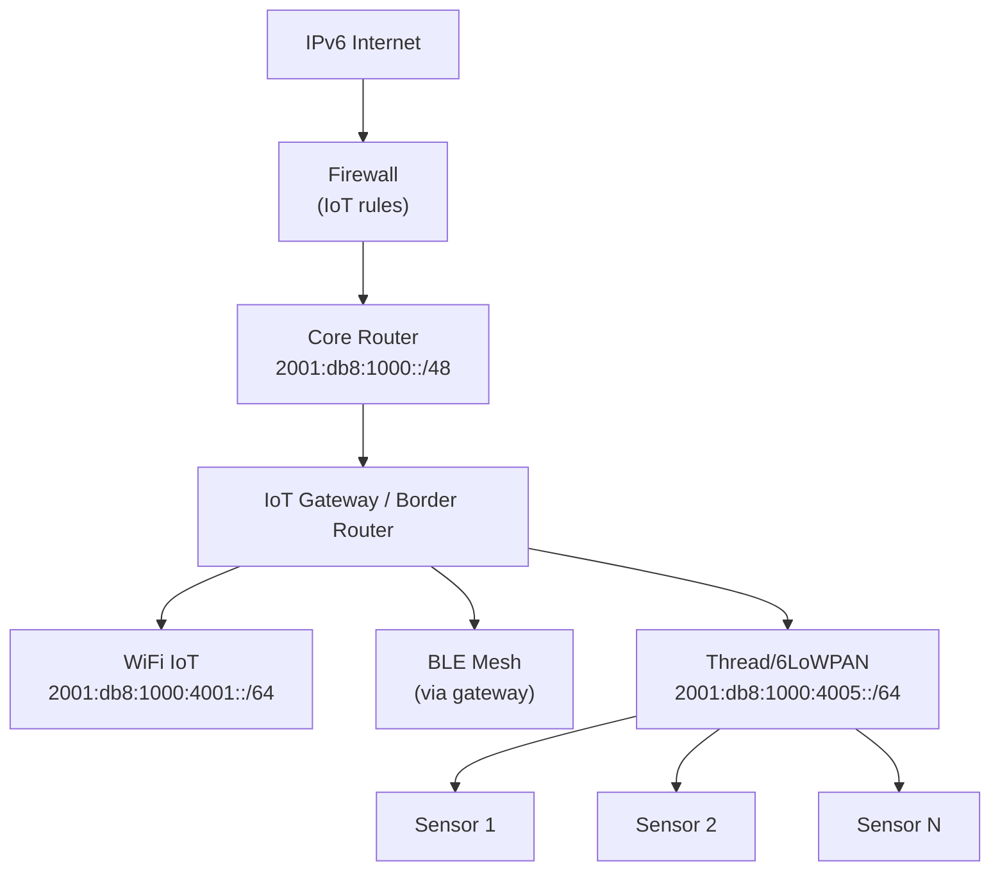

# How to Plan IPv6 Addressing for IoT Networks

Author: [nawazdhandala](https://www.github.com/nawazdhandala)

Tags: IPv6, IoT, 6LoWPAN, Networking, Security

Description: Design an IPv6 addressing plan for IoT networks, covering device segmentation, 6LoWPAN considerations, security zones, and management of large device populations.

## Introduction

IPv6 is uniquely suited for IoT: its vast address space eliminates the NAT complexity that plagues large IPv4 IoT deployments, and protocols like 6LoWPAN enable IPv6 on even the most constrained devices. Planning IPv6 addressing for IoT requires thinking about device segmentation, security isolation, management access, and the unique characteristics of IoT protocols.

## IoT Network Segmentation

IoT devices should be isolated from the main network. A typical IPv6 IoT addressing plan creates dedicated subnets per device category:

```text
Site prefix: 2001:db8:1000::/48

IoT zones (using high subnet numbers):
  2001:db8:1000:4001::/64   Smart lighting
  2001:db8:1000:4002::/64   HVAC and climate control
  2001:db8:1000:4003::/64   Security cameras (CCTV)
  2001:db8:1000:4004::/64   Access control (badge readers)
  2001:db8:1000:4005::/64   Environmental sensors
  2001:db8:1000:4010::/64   Industrial control (SCADA)
  2001:db8:1000:4020::/64   Medical devices
  2001:db8:1000:40ff::/64   Guest IoT / consumer devices
```

## IPv6 for Constrained Devices: 6LoWPAN

6LoWPAN (IPv6 over Low-Power Wireless Personal Area Networks, RFC 4944) adapts IPv6 for IEEE 802.15.4 networks used by Thread and similar IP-based low-power mesh networks:

```text
Key 6LoWPAN features:
  - Header compression (can reduce the IPv6 header to a few bytes on-link)
  - Fragmentation for 127-byte 802.15.4 frame size
  - Mesh addressing for multi-hop sensor networks
  - Typically uses /64 prefixes for SLAAC on a 6LoWPAN link

Addressing:
  - Modified EUI-64 IIDs can be derived from IEEE EUI-64 device identifiers
  - A 6LoWPAN PAN maps to an IPv6 link and typically uses a /64 prefix for SLAAC
  - A border router connects the PAN to the IPv6 network
```

## Network Architecture



## Device Address Assignment

On some IoT links, SLAAC addresses may use interface identifiers derived from an EUI-64 value. That can make devices easier to inventory, but it also exposes a stable hardware-derived identifier:

```python
def device_eui64_address(subnet_prefix, eui64):
    """
    Build an IPv6 address from a /64 subnet prefix and an EUI-64.
    Many IEEE 802.15.4 devices expose a 64-bit extended address.
    """
    import ipaddress

    mac_clean = eui64.replace(":", "").replace("-", "")
    if len(mac_clean) != 16:
        raise ValueError("Expected an 8-byte EUI-64")

    # Flip the U/L bit to form the modified EUI-64 interface identifier.
    first_byte = int(mac_clean[:2], 16) ^ 0x02
    iid = int(f"{first_byte:02x}{mac_clean[2:]}", 16)

    net = ipaddress.IPv6Network(subnet_prefix, strict=False)
    if net.prefixlen != 64:
        raise ValueError("Expected a /64 subnet prefix")

    return str(net.network_address + iid)

# Example: temperature sensor with EUI-64 = 00:11:22:ff:fe:33:44:55

subnet = "2001:db8:1000:4005::/64"
eui64 = "00:11:22:ff:fe:33:44:55"
print(device_eui64_address(subnet, eui64))
# Output: 2001:db8:1000:4005:211:22ff:fe33:4455
```

## IoT Firewall Policy

```bash
# Allow return traffic for permitted sessions
sudo ip6tables -A FORWARD -m conntrack --ctstate ESTABLISHED,RELATED -j ACCEPT

# Isolate IoT subnets from user networks
# Allow IoT → cloud (specific destinations only)
sudo ip6tables -A FORWARD -s 2001:db8:1000:4001::/64 -d <cloud-endpoint>/128 -p tcp --dport 443 -j ACCEPT

# Block IoT → user LAN (IoT should never initiate to users)
sudo ip6tables -A FORWARD -s 2001:db8:1000:4001::/64 -d 2001:db8:1000:1::/64 -j DROP

# Allow management → IoT (sessions initiated from management)
sudo ip6tables -A FORWARD -s 2001:db8:1000:2::/64 -d 2001:db8:1000:4001::/64 -j ACCEPT

# Block all other forwarded traffic from IoT subnets
sudo ip6tables -A FORWARD -s 2001:db8:1000:4000::/52 -j DROP
```

## DHCPv6 for IoT Devices

Some IoT devices do not support SLAAC and require stateful DHCPv6:

```bash
# dnsmasq: DHCPv6 for IoT subnet
cat /etc/dnsmasq.d/iot-dhcpv6.conf

# dhcp-range=2001:db8:1000:4001::100,2001:db8:1000:4001::fff,64,12h
# dhcp-option=option6:dns-server,[2001:db8:1000:1::53]
# dhcp-option=option6:ntp-server,[2001:db8:1000:1::123]

# Example radvd config: enable RA for the IoT subnet (set M flag for stateful only)
# interface eth0.4001 {
#     AdvManagedFlag on;
#     AdvOtherConfigFlag on;
#     prefix 2001:db8:1000:4001::/64 {
#         AdvAutonomous off;  # No SLAAC for tightly controlled IoT
#     };
# };
```

## Conclusion

IPv6's address abundance makes it ideal for IoT deployments where device counts can reach thousands per site. Use dedicated /64 subnets per IoT category to enforce security zones. 6LoWPAN enables IPv6 on resource-constrained sensors, and EUI-64-derived addressing can simplify device identification where the stack uses it. Always isolate IoT subnets from user and server networks with explicit firewall rules, and consider disabling SLAAC in favor of stateful DHCPv6 where strict device control is required.
