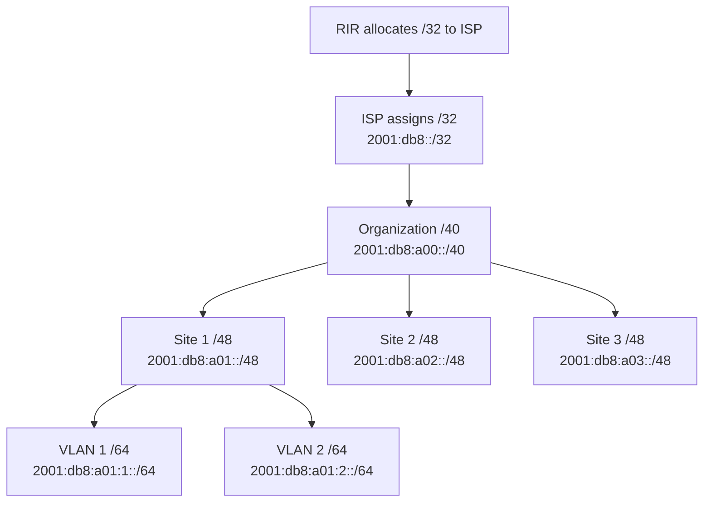

# How to Plan IPv6 Addressing for a Multi-Site Organization

Author: [nawazdhandala](https://www.github.com/nawazdhandala)

Tags: IPv6, Multi-Site, Address Planning, WAN, Enterprise Networking

Description: Design a scalable IPv6 addressing plan for organizations with multiple physical locations using a /32 or /40 ISP allocation with per-site /48 or /56 prefixes.

## Introduction

Multi-site organizations need an IPv6 addressing plan that scales across tens to hundreds of locations while enabling efficient routing, site summarization, and clear operational boundaries. The key is assigning a dedicated prefix block to each site so that routing tables remain manageable and site-specific policies are easy to apply.

## Allocation Strategy



## Recommended Structure

If the organization has a /40 allocation:

```text
/40 → 256 possible /48 allocations (one per site)
/48 per site → 65,536 /64 subnets per site

Site numbering in the low-order byte of the 3rd hextet:
  0x00-0x7f = Primary offices
  0x80-0xbf = Branch offices
  0xc0-0xdf = Remote sites / warehouses
  0xe0-0xef = Cloud VPCs / virtual sites
  0xf0-0xff = Infrastructure (data centers, NOC, etc.)
```

## Example Multi-Site Address Plan

```text
Organization prefix: 2001:db8:a00::/40

Headquarters (Site 0x01):
  Prefix: 2001:db8:a01::/48
  Subnets:
    2001:db8:a01::/64      Management / IT infrastructure
    2001:db8:a01:1::/64    User LAN VLAN 1
    2001:db8:a01:2::/64    User LAN VLAN 2
    2001:db8:a01:10::/64   Servers
    2001:db8:a01:20::/64   DMZ
    2001:db8:a01:f0::/64   WAN / uplink

New York Branch (Site 0x02):
  Prefix: 2001:db8:a02::/48
  Subnets:
    2001:db8:a02:1::/64    User LAN
    2001:db8:a02:10::/64   Servers
    2001:db8:a02:f0::/64   WAN / uplink

London Branch (Site 0x03):
  Prefix: 2001:db8:a03::/48
  Subnets:
    2001:db8:a03:1::/64    User LAN
    2001:db8:a03:f0::/64   WAN / uplink

AWS VPC (Site 0xe1):
  Prefix: 2001:db8:ae1::/48
  Subnets:
    2001:db8:ae1:1::/64    Public subnet AZ-A
    2001:db8:ae1:2::/64    Public subnet AZ-B
    2001:db8:ae1:11::/64   Private subnet AZ-A
    2001:db8:ae1:12::/64   Private subnet AZ-B
```

## Python: Site Prefix Calculator

```python
import ipaddress

def site_prefix(org_prefix_40: str, site_id: int) -> ipaddress.IPv6Network:
    """
    Calculate the /48 prefix for a given site.

    Args:
        org_prefix_40: Organization /40 prefix
        site_id: Site number (0-255)
    """
    network = ipaddress.IPv6Network(org_prefix_40, strict=False)
    if network.prefixlen != 40:
        raise ValueError("org_prefix_40 must be a /40 prefix")
    if not 0 <= site_id <= 255:
        raise ValueError("site_id must be between 0 and 255")
    sites = list(network.subnets(new_prefix=48))
    return sites[site_id]

def site_subnets(site_prefix_48: ipaddress.IPv6Network, count=10):
    """List /64 subnets from a site's /48 prefix."""
    return list(site_prefix_48.subnets(new_prefix=64))[:count]

# Generate site prefixes

org = "2001:db8:a00::/40"
for site_id, site_name in [(0x01, "HQ"), (0x02, "NYC"), (0x03, "LDN"), (0xe1, "AWS")]:
    prefix = site_prefix(org, site_id)
    print(f"{site_name:10s} (Site {site_id:#04x}): {prefix}")
```

## WAN Link Addressing

Point-to-point WAN links between sites should use /127 prefixes:

```text
HQ <-> NYC link:     2001:db8:aff::2/127
HQ <-> London link:  2001:db8:aff::4/127
NYC <-> London link: 2001:db8:aff::6/127
```

Reserve the `2001:db8:aff::/56` block within your /40 for infrastructure links.

## Route Summarization in BGP/OSPF

```bash
# Each site's router advertises only its /48
# A head-end router summarizes aligned site ranges

# Cisco IOS example prefix-list entry for the org aggregate
# ipv6 prefix-list AGGREGATE-ORG permit 2001:db8:a00::/40

# Per-region summarization:
# Primary offices (0x00-0x7f): 2001:db8:a00::/41
# Branch offices (0x80-0xbf):  2001:db8:a80::/42
# Cloud sites (0xe0-0xef):     2001:db8:ae0::/44
```

## Site Commissioning Checklist

```bash
# When adding a new site:
# 1. Assign the next available /48 from the site range
# 2. Document in IPAM system
# 3. Configure on-site router with the /48 prefix
# 4. Set up Router Advertisements for SLAAC and DHCPv6 as needed for stateful assignment
# 5. Advertise the /48 into the WAN routing protocol
# 6. Verify summarization at head-end

# Quick verification
ping -6 -c 3 <new-site-gateway-ipv6>
traceroute -6 <new-site-gateway-ipv6>
```

## Conclusion

Multi-site IPv6 addressing is straightforward when you assign a dedicated /48 per site from a well-structured organizational allocation. Site prefixes double as routing identifiers, enabling clean summarization at regional and head-end routers. Using the higher-order bits of the site number to encode region or type (branch vs. data center vs. cloud) further simplifies access control and routing policy application.
