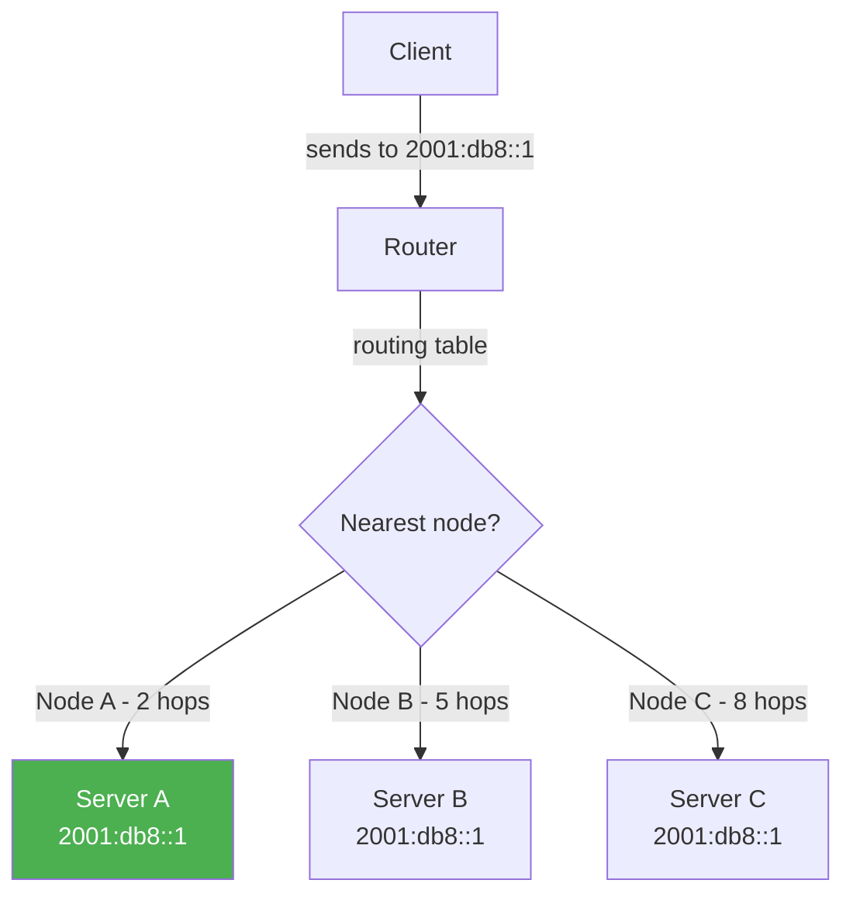

# How to Understand IPv6 Anycast Addresses

Author: [nawazdhandala](https://www.github.com/nawazdhandala)

Tags: IPv6, Networking, Anycast, Routing, High Availability

Description: Understand IPv6 anycast addresses, how they differ from unicast and multicast, and practical use cases including DNS and CDN deployments.

## Introduction

Anycast is one of three addressing modes in IPv6 (alongside unicast and multicast). An anycast address is assigned to multiple interfaces on different nodes; packets sent to an anycast address are delivered to the topologically nearest node that has that address. Unlike multicast, only one node receives the packet - the closest one according to the routing protocol.

## How Anycast Works



All servers advertise the same address, commonly as a /128 host route. The routing protocol (BGP, OSPF) selects the best path, directing traffic to the nearest server automatically.

## Anycast vs Unicast vs Multicast

| Property | Unicast | Anycast | Multicast |
|---|---|---|---|
| Receivers | One specific node | One nearest node | All group members |
| Address assignment | One interface | Multiple interfaces | Group subscription |
| Use case | Point-to-point | Load balancing, HA | Group communication |
| IPv6 requirement | Yes | Yes | Yes |

## Subnet-Router Anycast Address

IPv6 defines a required anycast address for routers on every subnet - the **Subnet-Router Anycast Address**. It is the lowest address in the subnet (all interface ID bits set to zero):

```text
Subnet prefix: 2001:db8:1:2::/64
Subnet-Router anycast: 2001:db8:1:2::
```

Routers must support this address so that a node can send packets to any one of the routers for that subnet without knowing a specific router address.

## Configuring Anycast on Linux

To assign the same IPv6 service address on multiple Linux nodes, add it as a normal /128 address; the anycast behavior comes from routing:

```bash
# Add the same service address on each node
sudo ip -6 addr add 2001:db8::1/128 dev eth0

# Verify the anycast address
ip -6 addr show dev eth0

# Check routing table entries
ip -6 route show

# Remove the address
sudo ip -6 addr del 2001:db8::1/128 dev eth0
```

## BGP Anycast for DNS

The most common real-world use of anycast is DNS. Major public DNS providers such as Cloudflare (2606:4700:4700::1111) and Google (2001:4860:4860::8888) use BGP anycast:

```bash
# Cloudflare's IPv6 DNS anycast addresses
# 2606:4700:4700::1111 and 2606:4700:4700::1001
# These are announced from dozens of PoPs worldwide

# Check the path your traffic takes
traceroute -6 2606:4700:4700::1111

# Measure latency to anycast DNS
ping -6 -c 5 2606:4700:4700::1111
```

## Practical Anycast Use Cases

1. **DNS resolution** - Multiple DNS servers share one address; clients always hit the nearest one
2. **CDN edge nodes** - Content served from the nearest geographic location
3. **Global service ingress** - The same service IP can be announced from multiple sites for low latency and failover
4. **DDoS mitigation** - Distribute attack traffic across many nodes

## Anycast with OSPFv3 (Internal Anycast)

For internal anycast deployments using OSPFv3:

```text
# On each anycast server, add the address as a loopback:
# /etc/network/interfaces (Debian/Ubuntu)
iface lo inet6 static
    address 2001:db8:100::1/128

# Then advertise the same /128 into OSPFv3 from each site
# so routers can choose the nearest path to that address
```

## Limitations and Considerations

- **TCP sessions**: Anycast works well for stateless protocols (UDP/DNS). For TCP, session persistence can be broken if routing changes mid-session.
- **No source address selection**: Hosts cannot distinguish anycast addresses from regular unicast; they send normally.
- **Routing convergence**: If an anycast node fails, routing convergence time determines how quickly traffic shifts.

## Conclusion

IPv6 anycast is a powerful mechanism for building resilient, geographically distributed services. It is most effective for short-lived, stateless interactions like DNS queries. Understanding anycast helps network engineers design high-availability services that automatically route clients to the nearest healthy node without client-side configuration.
