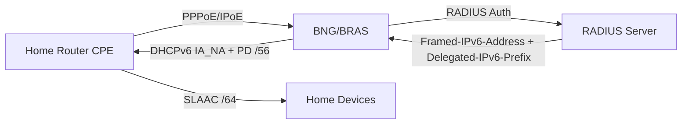

# How to Configure IPv6 for BRAS/BNG Equipment - Equipment

Author: [nawazdhandala](https://www.github.com/nawazdhandala)

Tags: IPv6, BNG, BRAS, Broadband, ISP, DHCPv6, PPPoE

Description: Configure IPv6 on Broadband Network Gateway (BNG) and BRAS equipment for residential subscriber management including PPPoE, DHCPv6, and prefix delegation.

## BNG IPv6 Architecture



## Cisco ASR9K BNG: IPv6 PPPoE

```text
! Cisco ASR9K IOS-XR - IPv6 BNG configuration

! Local DHCPv6 IA_NA pool for WAN /128 addresses
pool vrf default ipv6 WAN_POOL
 prefix-length 128
 address-range 2001:db8:100::1 2001:db8:100::ffff

! Local DHCPv6-PD pool for /56 delegated prefixes
pool vrf default ipv6 PD_POOL
 prefix-length 56
 prefix-range 2001:db8:200:: 2001:db8:200:ff00::

! Configure subscriber dynamic templates
dynamic-template type ppp PPPoE-IPv6
 ppp authentication chap
 ipv6 enable
 dhcpv6 address-pool WAN_POOL

dynamic-template type ipsubscriber IPV6-PD
 dhcpv6 delegated-prefix-pool PD_POOL

! Enable subscriber management
aaa authentication subscriber default group radius
aaa authorization subscriber default group radius
aaa accounting subscriber default group radius

! Verify active subscribers
show subscriber session all detail
show dhcp ipv6 server binding detail
```

## Juniper MX BNG: IPv6 Configuration

```text
# Juniper MX - IPv6 BNG with DHCPv6

set access profile RADIUS_PROFILE authentication-order radius
set access profile RADIUS_PROFILE radius-server 2001:db8::10 secret "radius-shared-secret"

set access address-assignment pool IPV6_POOL family inet6 prefix 2001:db8:100::/64
set access address-assignment pool IPV6_POOL family inet6 range WAN_RANGE low 2001:db8:100::1/128
set access address-assignment pool IPV6_POOL family inet6 range WAN_RANGE high 2001:db8:100::ffff:ffff/128

set access address-assignment pool PD_POOL family inet6 prefix 2001:db8:200::/48
set access address-assignment pool PD_POOL family inet6 range PD_RANGE prefix-length 56

set system services dhcp-local-server dhcpv6 overrides delegated-pool PD_POOL

# Verify

show subscribers detail
show dhcpv6 server statistics
```

## ISC Kea DHCP: BNG DHCPv6 Server

```json
{
    "Dhcp6": {
        "interfaces-config": {
            "interfaces": ["bng0"]
        },
        "lease-database": {
            "type": "mysql",
            "host": "2001:db8::db",
            "name": "kea",
            "user": "kea",
            "password": "kea-password"
        },
        "subnet6": [
            {
                "id": 1,
                "subnet": "2001:db8:100::/64",
                "interface": "bng0",
                "pools": [
                    {"pool": "2001:db8:100::1 - 2001:db8:100::ffff"}
                ],
                "pd-pools": [
                    {
                        "prefix": "2001:db8:200::",
                        "prefix-len": 48,
                        "delegated-len": 56
                    }
                ],
                "option-data": [
                    {"name": "dns-servers", "data": "2001:db8::53"}
                ]
            }
        ]
    }
}
```

## RADIUS Integration for IPv6

```bash
# FreeRADIUS users file - per-subscriber IPv6 assignment
# /etc/freeradius/3.0/users

pppoe_user Cleartext-Password := "password"
    Framed-IPv6-Address = "2001:db8:100::1",
    Delegated-IPv6-Prefix = "2001:db8:200:a0::/56",
    Framed-IPv6-Route = "2001:db8:200:a0::/56 ::",
    DNS-Server-IPv6-Address = "2001:db8::53"
```

## Monitoring BNG Subscribers

```bash
#!/bin/bash
# monitor-bng.sh - BNG subscriber statistics

# Active IPv6 sessions
ACTIVE=$(mysql -u radius -p${PASS} radius \
    -e "SELECT COUNT(*) FROM radacct WHERE acctstoptime IS NULL AND framedipv6address <> ''" \
    -s -N)
echo "Active IPv6 subscribers: ${ACTIVE}"

# Address pool utilization
POOL_USED=$(mysql -u radius -p${PASS} radius \
    -e "SELECT COUNT(DISTINCT framedipv6address) FROM radacct WHERE acctstoptime IS NULL AND framedipv6address <> ''" \
    -s -N)
echo "IPv6 pool entries used: ${POOL_USED}"

# DHCPv6-PD utilization
PD_USED=$(mysql -u radius -p${PASS} radius \
    -e "SELECT COUNT(DISTINCT delegatedipv6prefix) FROM radacct WHERE acctstoptime IS NULL AND delegatedipv6prefix <> ''" \
    -s -N)
echo "Delegated prefixes active: ${PD_USED}"
```

## Conclusion

BNG/BRAS IPv6 configuration combines RADIUS authentication, DHCPv6 for WAN address assignment, and DHCPv6-PD for home prefix delegation. Configure RADIUS to return `Framed-IPv6-Address` (subscriber's WAN /128) and `Delegated-IPv6-Prefix` (home /56 for DHCPv6-PD). On Cisco ASR9K, configure local IPv6 pools with `pool vrf ... ipv6` and reference them from `dhcpv6 address-pool` and `dhcpv6 delegated-prefix-pool` in subscriber dynamic templates. Monitor subscriber session counts and address pool utilization with RADIUS SQL queries and alert when pools exceed 80% utilization.
